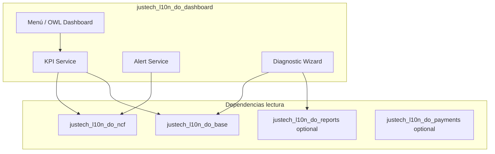

# Arquitectura — justech_l10n_do_dashboard

## Propósito

Módulo **independiente** de UX y monitoreo fiscal. Sprint 1 entrega solo la estructura
(menú, modelo placeholder, seguridad) para evolucionar KPIs sin acoplar lógica a NCF.

## Estado Sprint 1

| Componente | Estado |
|------------|--------|
| Menú Dashboard Fiscal | ✅ Shell |
| Modelo `justech.do.fiscal.dashboard` | ✅ Placeholder |
| KPIs / alertas / OWL | ⏳ Sprint 2+ |
| Integración reports/payments | ⏳ Sprint 3+ |

## Diseño objetivo (roadmap)



## Principios

- Solo **lectura** de datos fiscales en Sprint 2 inicial.
- Widgets parametrizables por empresa (`ir.config_parameter`).
- Sin duplicar lógica de asignación NCF ni exportadores DGII.

## Dependencias actuales

```
justech_l10n_do_base, justech_l10n_do_ncf
```

Ver `diagrams/dependencies.mmd`.
