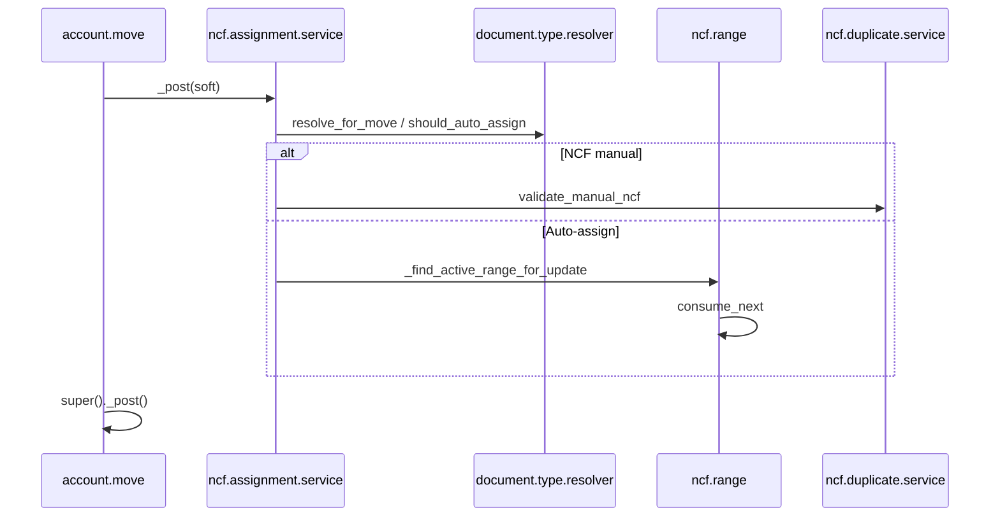

# Arquitectura — justech_l10n_do_ncf

## Propósito

Gestión de rangos NCF, asignación automática al publicar, validación de duplicados
y trazabilidad de consumo — producto Justech desacoplado de implementaciones cliente.

## Capas

| Capa | Ubicación | Responsabilidad |
|------|-----------|-----------------|
| **Services** | `services/` | Resolver tipo doc, duplicados, asignación pre-post |
| **Models** | `models/` | `account.move`, `ncf.range`, `ncf.consumption`, `sale.order` |

## Servicios

| Modelo | Rol |
|--------|-----|
| `justech.do.ncf.document.type.resolver.service` | Resuelve B01/B02/B04/B11… según move_type |
| `justech.do.ncf.duplicate.service` | Valida NCF manual + unicidad posted |
| `justech.do.ncf.assignment.service` | Orquesta locks, rangos y consumo |

## Flujo de asignación (sin cambio funcional Sprint 1)



## Delegación desde modelos

`account.move._justech_*` conserva la API interna existente pero delega en servicios.
Tests en `tests/test_justech_l10n_do_ncf.py` garantizan regresión cero.

## Dependencias

```
justech_l10n_do_base, account_debit_note, sale
```

## Diagramas

- `diagrams/architecture.mmd`
- `diagrams/dependencies.mmd`
