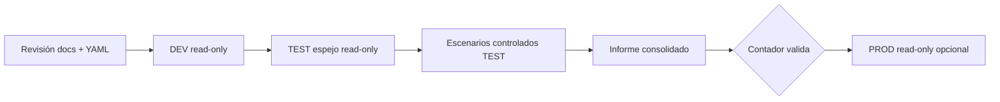
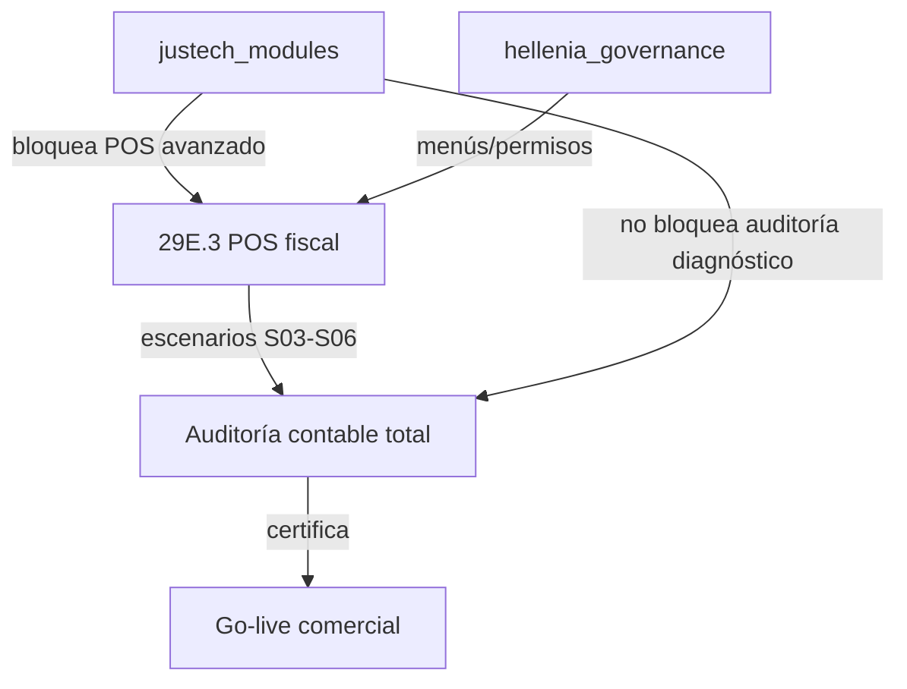

# Plan de auditoría contable total — Hellenia ERP

**Versión:** 1.0 (plan / metodología)  
**Fecha:** 2026-07-03  
**Estado:** **Solo diagnóstico y plan** — sin ejecución, sin cambios TEST/PROD  
**Alcance:** Todo el ERP Hellenia (Odoo 19 Enterprise + custom Justech)  
**Entregable final (post-aprobación):** Informe `ACCOUNTING_TOTAL_AUDIT_REPORT.md` + evidencia JSON

---

## 1. Resumen ejecutivo

Este documento define **cómo** ejecutar una auditoría contable y fiscal integral del sistema Hellenia antes de operación comercial plena. **No sustituye** auditorías previas (Fase 22 PROD, Fase 5 DAFC DEV, Golden Config 3.5); las usa como **línea base documental** hasta que se autorice una corrida nueva en ambiente controlado.

### 1.1 Objetivo

Validar que Hellenia esté **financiera y fiscalmente correcta** para operar: plan de cuentas, diarios, productos, compras, ventas, inventario, POS, impuestos, bancos/caja y reportes financieros.

### 1.2 Veredicto preliminar (documentación histórica — no re-ejecutada)

| Fuente | Ambiente | Fecha | Conclusión |
|--------|----------|-------|------------|
| `PHASE22_FULL_ACCOUNTING_AUDIT.md` | PROD | 2026-07-01 | Integridad núcleo **PASS**; certificación completa **FAIL** (datos smoke) |
| `ACCOUNTING_INTEGRITY_REPORT.md` | PROD | 2026-07-01 | 0 hallazgos críticos estructurales |
| `GO_LIVE_ACCOUNTING_RISK_REPORT.md` | PROD | 2026-07-01 | **NO GO** formatos comerciales |
| `DOMINICAN_ACCOUNTING_CERTIFICATION.md` | DEV | 2026-06-30 | Bloques A/C/D/E/F **PASS** con observaciones |
| `PHASE35_GOLDEN_CONFIGURATION_REPORT.md` | DEV | 2026-06-30 | Parametrización base **completa**; ops sin ejercitar |

**Implicación:** el motor contable núcleo está sano en pruebas limitadas; **faltan escenarios reales** (compras masivas, NC/ND, POS contable, categorías producto GL, cierre período).

---

## 2. Principios de la auditoría

| Principio | Regla |
|-----------|-------|
| **Solo lectura** | Scripts SQL/ORM sin `write`, `create`, `unlink` |
| **No PROD sin aprobación** | Primera corrida completa en **TEST espejo** o **DEV** |
| **Evidencia versionada** | JSON + capturas en `evidence/accounting-total-audit/` |
| **Tres capas de veredicto** | Automático · Configuración · Contador |
| **Fuente de verdad dual** | BD en vivo + `config/company/*.yaml` |
| **Trazabilidad fiscal** | NCF, 606/607/608/623, retenciones, ITBIS |

---

## 3. Ambientes y secuencia de ejecución (post-aprobación)



| Fase | Ambiente | Acción | Requiere aprobación |
|------|----------|--------|---------------------|
| **P0** | Repo | Revisar YAML, scripts, informes previos | No (este documento) |
| **P1** | `hellenia_dev` | Auditoría automática read-only | Sí |
| **P2** | `hellenia_test` | Auditoría automática + paridad vs DEV | Sí |
| **P3** | `hellenia_test` | Escenarios controlados (transacciones lab) | Sí explícita |
| **P4** | `hellenia_prod` | Solo lectura diagnóstico | Sí explícita |
| **P5** | Cualquiera | Correcciones | Por plan de corrección aprobado |

**Restricción actual:** detenerse en **P0**. No ejecutar P1–P4 hasta aprobación explícita.

---

## 4. Estructura del informe final

El entregable `ACCOUNTING_TOTAL_AUDIT_REPORT.md` tendrá:

```markdown
## 1. Resumen ejecutivo (semáforo por área)
## 2. Qué está correcto
## 3. Qué falta (no configurado / no probado)
## 4. Qué está mal configurado
## 5. Riesgos contables (tabla ID, severidad, impacto)
## 6. Riesgos fiscales (tabla ID, severidad, DGII)
## 7. Recomendaciones priorizadas
## 8. Plan de corrección (fases, responsable, esfuerzo)
## 9. Matriz: configuración vs código vs contador
## 10. Anexos (evidencia, queries, capturas)
```

Cada hallazgo usa plantilla:

| Campo | Valor |
|-------|-------|
| **ID** | `ACC-XX` contable / `FISC-XX` fiscal |
| **Área** | 1–10 del checklist |
| **Severidad** | Crítico / Alto / Medio / Bajo / Info |
| **Estado** | OK / Falta / Mal / No probado |
| **Evidencia** | Script, query, doc, captura |
| **Corrección** | Config / Código / Contador / Mixto |
| **Dueño** | Justech / Cliente contador / Conjunto |

---

## 5. Checklist por área (10 dominios)

### 5.1 Plan de cuentas

**Objetivo:** Plan `do` (289 cuentas) correctamente clasificado, nomenclatura profesional en español operativo.

| # | Verificación | Método | Criterio PASS |
|---|--------------|--------|---------------|
| 1.1 | Cuentas activas vs template | ORM `account.account` | Sin cuentas huérfanas deprecadas |
| 1.2 | Clasificación `account_type` | Script agrupación | Activos, pasivos, patrimonio, ingresos, costos, gastos coherentes |
| 1.3 | Nombres en español UI | `name` + traducción `es_DO` | Operador ve español; inglés técnico documentado |
| 1.4 | Cuentas clave existen | Códigos 11030201, 21010200, 11050100, 51010100, 11010201, 11010100 | Mapeo Golden Config |
| 1.5 | ITBIS compras/ventas | 11080101, 2103xxxx | Cuentas pasivo/activo fiscal |
| 1.6 | Cuentas de orden (6xx) | Revisión manual contador | No mezcladas en P&L |
| 1.7 | Duplicados / deprecated | `deprecated=true` | Sin uso en transacciones posted |

**Scripts existentes:** `scripts/certify-phase5-dafc.py` (Bloque A), `scripts/audit-company-config.py`

**Baseline conocido (DEV Fase 5):** Plan **PASS** — nombres en inglés en BD, UI vía `es_DO`. Contador debe validar rubros 4101xxxx por línea de negocio mobiliario/arte.

**Riesgos pre-identificados:**

| ID | Riesgo | Severidad |
|----|--------|-----------|
| ACC-01 | Categorías producto sin cuenta ingreso/costo asignada por contador | Alto |
| ACC-02 | Rubros ingreso genéricos vs segmentación comercial Hellenia | Medio |

---

### 5.2 Diarios contables

**Objetivo:** Diarios para ventas, compras, banco, caja, POS, inventario, ajustes, NC, ND.

| # | Verificación | Diario esperado | Criterio |
|---|--------------|-----------------|----------|
| 2.1 | Ventas | INV (sale) | Secuencia activa |
| 2.2 | Compras | FACTU (purchase) | Secuencia activa |
| 2.3 | Banco | BNK1 (bank) | Vinculado Banco López de Haro |
| 2.4 | Caja | CSH1 (cash) | Golden Config Fase 3.5 |
| 2.5 | POS | POS / CSH1 / BNK1 | Según config `pos.config` |
| 2.6 | Inventario | STJ (general valuation) | Movimientos stock → GL |
| 2.7 | Ajustes | MISCE | Asientos manuales |
| 2.8 | NC / ND | INV / FACTU + NCF | Tipos comprobante B04/B03 |
| 2.9 | Impuestos | CABA, TAX | Criterio caja documentado |
| 2.10 | Diferencial cambio | CAMBI | USD cuenta ahorro |

**Baseline:** DEV certificó 9 diarios incl. STJ, CSH1. `config/company/journals.yaml` documenta 7 + inconsistencia J-02 (caja antes de Fase 8 — **resuelta** con CSH1 en DEV).

**Falta validar:** Diario POS dedicado en TEST con `point_of_sale` instalado; secuencias NCF por diario.

---

### 5.3 Productos

**Objetivo:** Cuenta ingreso, costo/gasto, impuestos, categoría, inventario correctos.

| # | Verificación | Fuente |
|---|--------------|--------|
| 3.1 | `property_account_income_id` por categoría | `product.category` |
| 3.2 | `property_account_expense_id` / COGS | Categoría + producto |
| 3.3 | Impuesto venta 18% ITBIS | `taxes.yaml` |
| 3.4 | Impuesto compra 18% | `taxes.yaml` |
| 3.5 | Tipo producto (`consu`/`product`) | Piezas únicas Hellenia |
| 3.6 | `is_storable` coherente | Inventario valorizado |
| 3.7 | Categorías oficiales 12 niveles | `inventory_categories.yaml` |
| 3.8 | Plantilla import | `product_import_template.csv` |

**Baseline Golden Config:** Estructura categorías **OK**; **productos sin registros masivos** en Fase 3.5. GL por categoría **pendiente contador** (`product_import.yaml`).

**Script propuesto:** `scripts/accounting-audit-products.py` (nuevo, read-only)

---

### 5.4 Compras

**Objetivo:** Compras → cuenta correcta; costos → inventario/COGS; CxP correcta.

| # | Escenario | Validación |
|---|-----------|------------|
| 4.1 | PO → recepción → factura proveedor | Asiento FACTU balanceado |
| 4.2 | ITBIS compras en activo 11080101 | Línea AML correcta |
| 4.3 | CxP 21010200 | Residual = factura |
| 4.4 | Pago proveedor | BNK1/CSH1, conciliación |
| 4.5 | Landed costs (si aplica) | No probado — documentar N/A |
| 4.6 | Retención en compra | Catálogo `hellenia_account` |
| 4.7 | NCF proveedor B11 | `justech_l10n_do_ncf` |

**Baseline PROD Fase 22:** **0 facturas proveedor posted** — área **NO PROBADA** en PROD.

**Baseline DEV Fase 5:** Flujo compra **PASS** laboratorio (FACTU/2026/06/0003).

**Script existente:** `scripts/phase27-purchase-order-audit.py` (campos PO, extender GL)

---

### 5.5 Ventas

**Objetivo:** Ingresos, ITBIS ventas, CxC, NCF correctos.

| # | Verificación | Criterio |
|---|--------------|----------|
| 5.1 | Factura cliente → ingreso 4101xxxx | Por categoría/línea |
| 5.2 | ITBIS 18% pasivo | 2103xxxx |
| 5.3 | CxC 11030201 | Residual coherente |
| 5.4 | NCF B02/B01 asignado pre-post | `justech_l10n_do_ncf` hook |
| 5.5 | Partner con RNC | Obligatorio fiscal |
| 5.6 | Cotización → entrega → factura | Cadena `sale` + `stock` |
| 5.7 | Estado pago vs residual | Sin `in_payment` + residual 0 |

**Baseline PROD:** 6 facturas posted, NCF **PASS**, 1 inconsistencia estado pago INV/00003 (**bajo**).

**Riesgo fiscal:** Partner SMOKE sin RNC — 5 facturas (**FISC-01**, alto).

---

### 5.6 Inventario

**Objetivo:** Valoración, cuentas inventario/COGS, movimientos, relación compras/ventas.

| # | Verificación | Cuenta / modelo |
|---|--------------|-----------------|
| 6.1 | Valuación automática | STJ + `stock.valuation.layer` |
| 6.2 | Cuenta inventario | 11050100 |
| 6.3 | Cuenta COGS | 51010100 |
| 6.4 | Entrada compra | Debe inventario |
| 6.5 | Salida venta | Haber inventario / debe COGS |
| 6.6 | Ajuste inventario | MISCE / STJ |
| 6.7 | Tránsito 11050300 | Si aplica importaciones |
| 6.8 | Reporte valorizado | `stock.quant` × costo |

**Baseline DEV Fase 5:** Delta inventario flujo lab **PASS** (+2 unidades netas).

**Falta:** Valoración con catálogo real mobiliario/arte; método costo (FIFO/AVCO) decisión contador.

---

### 5.7 POS

**Objetivo:** Ingresos POS, caja, tarjeta, transferencia, cierre sesión, diferencias, relación fiscal.

| # | Verificación | Notas |
|---|--------------|-------|
| 7.1 | `pos.config` journals | Efectivo, banco, receivable |
| 7.2 | Sesión apertura/cierre | `pos.session` |
| 7.3 | Diferencia caja | Cuenta pérdida/ganancia caja |
| 7.4 | Pago efectivo → CSH1 | Golden Config |
| 7.5 | Tarjeta/transferencia → BNK1 | Manual sin datáfono |
| 7.6 | Ticket vs factura B02 | `hellenia_pos` política facturación |
| 7.7 | Asiento cierre sesión | `account.move` desde POS |
| 7.8 | Inventario POS | Consumo stock tienda |
| 7.9 | Auditoría POS | `hellenia.pos.audit.log` |

**Baseline:** POS instalado en TEST (29E); **cableado contable completo NO certificado** en informes previos. Fase 29E.3 diseño pendiente aprobación (permisos caja, factura fiscal).

**Riesgo pre-identificado:**

| ID | Riesgo | Severidad |
|----|--------|-----------|
| ACC-POS-01 | POS operativo sin certificación cierre contable E2E | Alto |
| ACC-POS-02 | Menú POS oculto por `hellenia_ui` — ops bloqueada | Medio (operativo) |

---

### 5.8 Impuestos y DGII

**Objetivo:** ITBIS, retenciones, reportes DGII, NCF, NC.

| # | Verificación | Módulo / reporte |
|---|--------------|------------------|
| 8.1 | ITBIS ventas 18% | `account.tax` |
| 8.2 | ITBIS compras 18% | `account.tax` |
| 8.3 | Retenciones ITBIS/GOB | `hellenia.payment.withholding.line` |
| 8.4 | Retención → GL | Phase 22 **PASS** |
| 8.5 | Reporte 607 ventas | `justech_l10n_do_reports` |
| 8.6 | Reporte 606 compras | Idem |
| 8.7 | Reporte 608 anulados | NC certificar |
| 8.8 | Reporte 623 retenciones | P21 gov certificado |
| 8.9 | NCF rangos activos | B02 solo en PROD smoke |
| 8.10 | NC B04 trazabilidad | `dgii_report_audit` |
| 8.11 | Exclusión líneas inválidas | `DGII_EXCLUSION_AUDIT.md` |

**Scripts:** `scripts/phase22-full-accounting-audit.py` (sección DGII), `scripts/uat-audit-reports.py`

**Baseline PROD:** Motor DGII **PASS**; datos legacy 623 incompletos (**medio**); 608 **no ejercitado**.

---

### 5.9 Bancos y caja

**Objetivo:** Cuentas bancarias, caja chica, métodos de pago, conciliación.

| # | Verificación | Fuente |
|---|--------------|--------|
| 9.1 | Cuentas López de Haro DOP/USD | `banks.yaml` |
| 9.2 | Diario BNK1 ↔ cuenta 11010201 | `res.partner.bank` |
| 9.3 | CSH1 ↔ 11010100 | Golden Config |
| 9.4 | Métodos pago | `payment_methods.yaml` |
| 9.5 | Pagos con `move_id` | Phase 22 **PASS** |
| 9.6 | Conciliación bancaria | `account.bank.statement` |
| 9.7 | Caja chica (si aplica) | Documentar N/A o config |
| 9.8 | Cheques | `check_printing` BNK1 |

**Baseline PROD:** Pagos PBNKD **PASS**; conciliación statement **no probada** con extractos reales.

---

### 5.10 Reportes financieros

**Objetivo:** Balance, P&L, CxC, CxP, ventas/compras por tipo, inventario valorizado.

| # | Reporte | Módulo | Validación |
|---|---------|--------|------------|
| 10.1 | Balance general | `account_reports` | Abre + PDF/XLSX |
| 10.2 | Estado de resultados | Idem | Coherente con asientos |
| 10.3 | Balance comprobación | Idem | YTD cuadrado |
| 10.4 | Mayor general | Idem | |
| 10.5 | Libro diario | Idem | |
| 10.6 | Auxiliar clientes / Antigüedad CxC | Idem | vs facturas |
| 10.7 | Auxiliar proveedores / CxP | Idem | sin datos PROD |
| 10.8 | Ventas por tipo/canal | Analítica / custom | POS vs B2B |
| 10.9 | Compras por tipo | Idem | |
| 10.10 | Inventario valorizado | `stock` + reportes | |
| 10.11 | Reportes PDF corporativos | `hellenia_reports` | Visual + fiscal |

**Baseline PROD Fase 22:** UI reportes EE **PASS** (apertura + botones export).

**Contador debe:** Firmar estados formales con cifras reales post-cierre período.

---

## 6. Matriz de corrección: configuración vs código vs contador

| Tema | Configuración Odoo | Código custom | Validación contador |
|------|-------------------|---------------|---------------------|
| Plan cuentas nombres ES | Traducciones `es_DO` | — | Rubros ingreso por línea negocio |
| GL categorías producto | `product.category` properties | Import script | **Sí — obligatorio** |
| Diarios POS | `pos.config` | `hellenia_pos` | Cuenta diferencias caja |
| NCF rangos | Secuencias DGII | `justech_l10n_do_ncf` | Tipos por operación |
| Retenciones | Catálogo impuestos | `hellenia_account` | Tasas legales |
| Partners sin RNC | Datos maestros | — | **Sí — limpieza** |
| Reportes DGII | Parámetros empresa | `justech_l10n_do_reports` | Declaración real |
| Cierre período | `account.fiscal.year` | — | **Sí — mensual** |
| POS permisos caja | — | `hellenia_pos` 29E.3 | Política interna |
| Conciliación bancaria | Statements | — | Extractos reales |
| Módulos bloqueados | — | `justech_modules` (futuro) | Contrato comercial |

---

## 7. Inventario de scripts y herramientas

### 7.1 Reutilizar (read-only)

| Script | Uso en auditoría total |
|--------|------------------------|
| `scripts/phase22-full-accounting-audit.py` | Integridad, CxC, pagos, retenciones, NCF, DGII |
| `scripts/certify-phase5-dafc.py` | Plan, diarios, cuentas clave, flujo lab |
| `scripts/audit-company-config.py` | Paridad YAML vs BD |
| `scripts/validate-phase35-golden-config.py` | Golden Config |
| `scripts/uat-audit-reports.py` | Reportes UI |
| `scripts/phase27-purchase-order-audit.py` | Compras campos |

### 7.2 Crear (post-aprobación)

| Script propuesto | Área |
|------------------|------|
| `scripts/accounting-total-audit.py` | Orquestador único → JSON consolidado |
| `scripts/accounting-audit-products.py` | Productos + categorías GL |
| `scripts/accounting-audit-pos-gl.py` | POS sesiones → asientos |
| `scripts/accounting-audit-inventory-valuation.py` | Stock layers vs GL |
| `scripts/accounting-audit-scenarios.py` | Matriz 18 escenarios go-live |

### 7.3 Formato evidencia

```
evidence/accounting-total-audit/
├── YYYY-MM-DD_dev/
│   ├── accounting-total-audit.json
│   ├── products.json
│   ├── pos-gl.json
│   └── screenshots/
├── YYYY-MM-DD_test/
└── YYYY-MM-DD_prod/   # solo si aprobado
```

---

## 8. Matriz de escenarios controlados (go-live)

Requisito de `GO_LIVE_ACCOUNTING_RISK_REPORT.md` — ejecutar en TEST antes de PROD comercial:

| # | Escenario | Áreas |
|---|-----------|-------|
| S01 | Venta B2B crédito + cobro parcial | 5, 9 |
| S02 | Venta contado transferencia | 5, 9 |
| S03 | Venta POS efectivo ticket | 7, 5 |
| S04 | Venta POS factura B02 | 7, 8 |
| S05 | Factura posterior POS | 7, 8 |
| S06 | Compra inventario B11 + pago | 4, 6 |
| S07 | Compra servicio (sin stock) | 4 |
| S08 | Nota crédito B04 | 5, 8 |
| S09 | Nota débito B03 | 5, 8 |
| S10 | Retención ITBIS 30% | 8 |
| S11 | Retención GOB 5% (P21) | 8 |
| S12 | Devolución inventario | 6 |
| S13 | Ajuste inventario MISCE | 6 |
| S14 | Cierre sesión POS con diferencia | 7 |
| S15 | Cierre período contable | 10 |
| S16 | Export 607 período | 8 |
| S17 | Export 606 período | 8 |
| S18 | Export 608 con NC | 8 |

Cada escenario produce: documentos, asientos, saldos esperados, captura reporte.

---

## 9. Plan de corrección (plantilla — completar tras auditoría)

### Fase C1 — Datos maestros (config, 1–2 semanas)

- Asignar GL por categoría inventario (contador + YAML)
- Limpiar partners duplicados / RNC SMOKE
- Activar rangos NCF adicionales según operación

### Fase C2 — Escenarios TEST (2–3 semanas)

- Ejecutar matriz S01–S18
- Corregir gaps configuración encontrados

### Fase C3 — POS contable (depende 29E.3 + justech_modules)

- Certificar cierre sesión → GL
- Permisos caja y auditoría

### Fase C4 — Código (si auditoría lo exige)

- Fixes en `hellenia_pos`, `hellenia_account`, NCF hooks
- Solo con PR y deploy TEST

### Fase C5 — Sign-off contador

- Glys Nuñez (contadora oficial — `responsibles.yaml`)
- Estados financieros período piloto
- Dictamen go-live comercial

---

## 10. Riesgos pre-identificados (sin re-ejecutar)

### 10.1 Contables

| ID | Riesgo | Sev. | Estado |
|----|--------|------|--------|
| ACC-R1 | PROD es smoke — sin compras/NC/ND masivas | Alto | Documentado Fase 22 |
| ACC-R2 | Categorías producto sin GL definitivo | Alto | Pendiente contador |
| ACC-R3 | POS → GL no certificado E2E | Alto | Pendiente 29E |
| ACC-R4 | Sin cierre período formal | Medio | Pendiente |
| ACC-R5 | INV/00003 payment_state inconsistente | Bajo | Conocido |

### 10.2 Fiscales

| ID | Riesgo | Sev. | Estado |
|----|--------|------|--------|
| FISC-R1 | Facturas con partner sin RNC | Alto | 5 en PROD smoke |
| FISC-R2 | Solo NCF B02 activo | Medio | Config secuencias |
| FISC-R3 | 608 no ejercitado | Medio | Escenario S18 |
| FISC-R4 | 606 sin datos reales | Medio | Escenario S17 |
| FISC-R5 | Datos legacy 623 incompletos | Medio | Exclusión DGII |

---

## 11. Roles y responsabilidades

| Rol | Responsabilidad |
|-----|-----------------|
| **Justech (auditor técnico)** | Scripts, evidencia, informe técnico |
| **Contador Hellenia (Glys Nuñez)** | GL categorías, sign-off estados, tasas |
| **Supervisor (Milagros Martínez)** | Validación operativa POS/inventario |
| **Cliente (aprobaciones)** | Autorizar ambientes, correcciones, go-live |

---

## 12. Cronograma propuesto (post-aprobación)

| Semana | Actividad | Entregable |
|--------|-----------|------------|
| 1 | P1 DEV read-only + scripts nuevos productos/POS | JSON DEV |
| 2 | P2 TEST read-only + paridad DEV/TEST | JSON TEST + gap list |
| 3 | P3 escenarios S01–S10 TEST | Evidencia transaccional |
| 4 | P3 escenarios S11–S18 + informe borrador | Draft report |
| 5 | Revisión contador + plan corrección C1–C5 | Informe final |
| 6+ | Correcciones aprobadas (fuera alcance auditoría) | Tickets / PRs |

---

## 13. Dependencias con otras líneas de trabajo



La auditoría contable **puede iniciarse en paralelo** con diseño Módulos Justech; escenarios POS avanzados (S04–S06, S14) requieren **29E.3** o bypass explícito en TEST.

---

## 14. Criterios de éxito (Definition of Done)

La auditoría total se considera **completa** cuando:

1. Las 10 áreas tienen veredicto OK / Falta / Mal / No probado documentado.
2. Matriz S01–S18 ejecutada en TEST con ≥ 90% PASS.
3. 0 hallazgos **críticos** abiertos en integridad (asientos, NCF dup, retenciones sin GL).
4. Contador firma revisión plan cuentas + categorías producto.
5. Informe final aprobado por cliente antes de correcciones PROD.

---

## 15. Próximo paso

**Esperando aprobación explícita** para:

1. Ejecutar **P1** (DEV read-only) con orquestador `accounting-total-audit.py`
2. Priorizar escenarios según calendario go-live Hellenia
3. Coordinar sesión con contador para GL categorías (bloqueante ACC-R2)

**No ejecutar** scripts en TEST ni PROD hasta confirmación.

---

*Plan v1.0 — referencias: PHASE22, PHASE35, DOMINICAN_ACCOUNTING_CERTIFICATION, GO_LIVE_ACCOUNTING_RISK_REPORT, config/company/*
