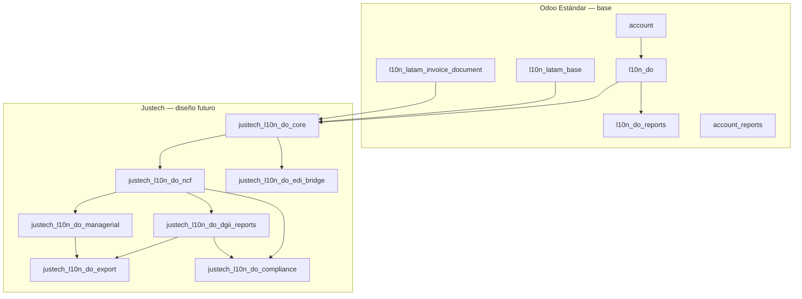
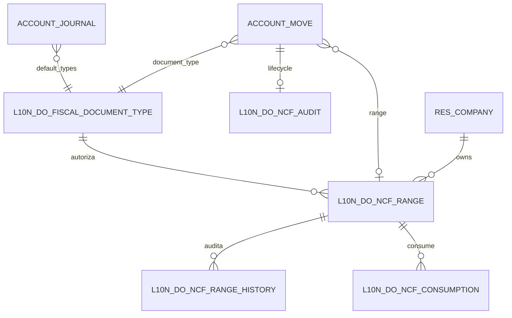
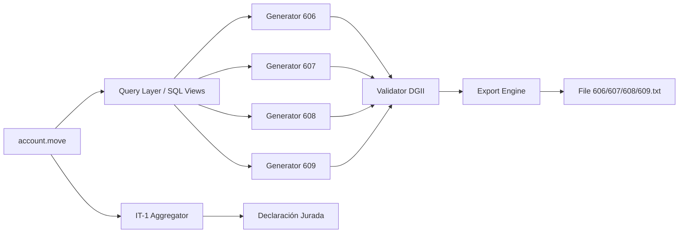

# Arquitectura Fiscal Dominicana (DGII) — Diseño Integral Justech

**Cliente:** Hellenia, S.R.L. — República Dominicana  
**Plataforma:** Odoo 19 Enterprise On-Premise (`19.0-20260619`)  
**Fecha:** 2026-06-30  
**Tipo:** **Diseño arquitectónico únicamente** — sin implementación MVP  
**Alcance:** Toda la estructura tributaria DGII, evolutiva multi-año, sin rediseño de modelo de datos

---

## Declaración de alcance de este documento

| Qué incluye | Qué excluye |
|-------------|-------------|
| Modelo de datos propuesto | Código Python/XML |
| Clasificación MVP → Futuro | Instalación de módulos |
| Catálogo de obligaciones DGII | Configuración en DEV/TEST/PROD |
| Interfaces de integración futuras | Desarrollo eNCF / Infile |
| Diseño `justech_l10n_do_compliance` | Implementación compliance |

**Principio rector:** La arquitectura **no** se limita a libros 606/607/608. Es el **marco completo** de cumplimiento tributario dominicano en Odoo, con entregas incrementales por fase.

**Evidencia base Odoo estándar:** [GAP_ANALYSIS_RD.md](GAP_ANALYSIS_RD.md) v3.0, [ODOO19_OFFICIAL_MODULE_INVENTORY.md](ODOO19_OFFICIAL_MODULE_INVENTORY.md), [DOMINICAN_FISCAL_CERTIFICATION.md](DOMINICAN_FISCAL_CERTIFICATION.md).

---

## Leyenda de clasificación

| Etiqueta | Significado |
|----------|-------------|
| **MVP** | Primera implementación funcional para go-live fiscal tradicional |
| **Fase 2** | Siguiente incremento post-estabilización MVP |
| **Fase 3** | Capacidades avanzadas / sectoriales |
| **Futuro** | Preparación arquitectónica; implementación cuando regulación o negocio lo exija |
| **No aplica** | Fuera del perfil Hellenia o cubierto sin extensión |
| **Pendiente de investigación** | Requiere validación legal/contable antes de diseño detallado |

---

## Resumen ejecutivo de arquitectura

### Mapa de módulos propuesto (diseño — no implementar aún)



| Módulo propuesto | Responsabilidad | Fase diseño |
|------------------|-----------------|-------------|
| `justech_l10n_do_core` | Extensiones `res.company`, `res.partner`, `account.journal`, `account.move`, tipos identificación RD, hooks LATAM | MVP |
| `justech_l10n_do_ncf` | Tipos NCF, rangos, secuencias, consumo, anulación, auditoría | MVP |
| `justech_l10n_do_dgii_reports` | Motores 606/607/608/609, IT-1, IR-17, anexos, validaciones DGII | MVP (606-608) + fases |
| `justech_l10n_do_managerial` | Reportes gerenciales fiscales | Fase 2 |
| `justech_l10n_do_export` | Capa unificada CSV/Excel/TXT/XML/PDF | MVP (CSV/TXT) + fases |
| `justech_l10n_do_compliance` | Monitoreo, alertas, dashboard cumplimiento | Fase 2 (diseño completo ahora) |
| `justech_l10n_do_edi_bridge` | Puente eNCF / DGII WS / Infile (stubs) | Futuro |

**Decisión arquitectónica clave:** Reutilizar el patrón `l10n_latam.document.type` donde sea posible (compatible con evolución Odoo saas-19.3+), extendiendo con tablas RD-específicas para rangos DGII, historial y compliance — **sin duplicar** la numeración en un modelo paralelo incompatible.

### Principios de diseño del modelo de datos

1. **Fuente única de verdad:** Todo NCF emitido se deriva de `account.move` confirmado; tablas auxiliares son índice/auditoría, no duplican montos.
2. **Inmutabilidad fiscal:** NCF asignado + factura publicada = registro append-only en historial; correcciones vía NC/ND o anulación formal (608).
3. **Extensibilidad eNCF:** Campos `ecf_*`, `dgii_*`, `infile_*` reservados desde MVP (nullable) en mismas entidades.
4. **Período fiscal DGII:** Entidad `l10n_do.fiscal.period` desacopla generación de reportes del cierre contable.
5. **Multi-compañía / multi-sucursal:** `company_id` obligatorio; `branch_id` opcional (nullable) preparado desde MVP.
6. **Trazabilidad:** Toda transición de estado NCF y exportación DGII genera `mail.message` + tabla de auditoría dedicada.

---

## 1. Administración de Comprobantes Fiscales

### 1.1 Modelo conceptual



### 1.2 Entidades propuestas

#### `l10n_do.fiscal.document.type` — Tipos NCF

| Atributo | Tipo | Descripción |
|----------|------|-------------|
| `code` | Char(2) | Código DGII: 01, 02, 03, 04, 11, 13, 14, 15, 16… |
| `prefix` | Char(3) | Prefijo impreso: B01, B02, E31 (futuro) |
| `name` | Char | Nombre legal DGII |
| `series` | Char(1) | Serie: B, E, F… |
| `is_sale_document` | Boolean | Documento de venta |
| `is_purchase_document` | Boolean | Documento de compra (B11, B13) |
| `requires_vat` | Boolean | Exige RNC receptor (B01) |
| `allows_consumer` | Boolean | Consumidor final (B02) |
| `is_debit_note` / `is_credit_note` | Boolean | B03 / B04 |
| `internal_type` | Selection | invoice / debit / credit / purchase / minor_expense / gov / export |
| `active` | Boolean | |
| `country_id` | Many2one | DO fijo |
| `l10n_latam_document_type_id` | Many2one | Puente a `l10n_latam.document.type` si framework instalado |

**Clasificación:** Catálogo maestro **MVP** (B01, B02, B03, B04, B11, B13 mínimo Hellenia).

**Tipos adicionales:** B12, B14, B15, B16 → **Fase 2** según operación. E31–E34 → **Futuro** (misma tabla, `series='E'`).

#### `l10n_do.ncf.range` — Rangos autorizados DGII

| Atributo | Tipo | Descripción |
|----------|------|-------------|
| `name` | Char | Referencia interna |
| `document_type_id` | Many2one | Tipo NCF |
| `company_id` | Many2one | Compañía |
| `branch_id` | Many2one | Sucursal (nullable — **Futuro**) |
| `journal_ids` | Many2many | Diarios autorizados |
| `authorization_number` | Char | Número autorización DGII |
| `sequence_start` | Integer | Secuencia inicial (8 dígitos) |
| `sequence_end` | Integer | Secuencia final |
| `current_sequence` | Integer | Próximo disponible |
| `date_from` / `date_to` | Date | Vigencia DGII (hasta 2 años calendario — NG 06-2018) |
| `state` | Selection | draft / active / depleted / expired / cancelled |
| `remaining_count` | Integer | Computed |
| `consumption_pct` | Float | Computed — alertas |
| `dgii_authorization_date` | Date | Fecha autorización portal |

**Clasificación:** CRUD rangos + activación **MVP**. Sucursal **Futuro**.

#### `l10n_do.ncf.range.history` — Historial de rangos

| Atributo | Tipo |
|----------|------|
| `range_id` | Many2one |
| `event_type` | Selection: created / activated / reassigned / depleted / expired / cancelled / adjusted |
| `user_id` | Many2one |
| `timestamp` | Datetime |
| `old_values` / `new_values` | Json |
| `reason` | Text |

**Clasificación:** **MVP** (auditoría obligatoria).

#### `l10n_do.ncf.consumption` — Consumo de rangos

| Atributo | Tipo |
|----------|------|
| `range_id` | Many2one |
| `move_id` | Many2one → `account.move` |
| `ncf` | Char(11) |
| `sequence_number` | Integer |
| `consumption_date` | Datetime |
| `state` | Selection: consumed / voided / replaced |

**Clasificación:** **MVP** — generado al confirmar factura.

#### Extensiones `account.move` — NCF emitidos

| Campo | Tipo | Descripción |
|-------|------|-------------|
| `l10n_do_document_type_id` | Many2one | Tipo comprobante |
| `l10n_do_ncf` | Char(11) | NCF completo (B0100000001) |
| `l10n_do_ncf_range_id` | Many2one | Rango origen |
| `l10n_do_ncf_state` | Selection | pending / assigned / voided / replaced |
| `l10n_do_ncf_void_reason` | Selection + Text | Motivo anulación (608) |
| `l10n_do_ncf_void_date` | Date | |
| `l10n_do_origin_ncf` | Char | NCF referenciado (NC/ND) |
| `l10n_do_income_type` | Selection | Clasificación ingresos DGII — **Fase 2** (requerido eNCF) |
| `l10n_do_payment_type` | Selection | Forma pago DGII — **Fase 2** |
| `l10n_do_ecf_uuid` | Char | **Futuro** eNCF |
| `l10n_do_dgii_status` | Selection | **Futuro** — pending/sent/accepted/rejected |
| `l10n_do_infile_track_id` | Char | **Futuro** |

**Clasificación campos core:** **MVP**. Campos eNCF: **Futuro** (columnas reservadas).

#### `l10n_do.ncf.audit` — Auditoría completa NCF

Registro append-only de eventos: asignación, reimpresión, anulación, cambio tipo, bloqueo, override admin.

**Clasificación:** **MVP**.

### 1.3 Funcionalidades y clasificación

| Funcionalidad | Clasificación | Notas |
|---------------|---------------|-------|
| Tipos NCF (catálogo) | **MVP** | Datos semilla B01–B04, B11, B13 |
| Rangos NCF | **MVP** | Alta manual desde autorización DGII |
| Secuencias fiscales | **MVP** | Integradas a rango + tipo + diario |
| Historial de rangos | **MVP** | |
| Consumo de rangos | **MVP** | Al `action_post` de `account.move` |
| NCF emitidos | **MVP** | Campo en factura + consumption |
| NCF anulados | **MVP** | Flujo anulación + alimenta 608 |
| NCF vencidos | **MVP** | Job detecta `date_to` pasado |
| NCF agotados | **MVP** | `current_sequence > sequence_end` |
| Auditoría completa | **MVP** | |
| Reasignaciones | **Pendiente de investigación** | NG 06-2018 — validar si DGII permite reasignar rango entre diarios |
| Alertas vencimiento | **MVP** | 30/15/7 días — compliance |
| Alertas agotamiento | **MVP** | Umbral 90%/95%/100% |
| Bloqueos inconsistencias | **MVP** | NCF fuera de rango, duplicado, tipo incorrecto |
| Config por compañía | **MVP** | `res.company` settings |
| Config por diario | **MVP** | Tipos permitidos, rango default |
| Config por sucursal | **Futuro** | `res.branch` o equivalente |

### 1.4 Reglas de negocio NCF (diseño)

| Regla | Descripción |
|-------|-------------|
| RN-NCF-01 | Un NCF solo se asigna en `account.move` de tipo `out_invoice`, `out_refund`, `in_invoice` según tipo documento |
| RN-NCF-02 | B01 requiere `partner.vat` (RNC) válido |
| RN-NCF-03 | B02 no requiere RNC; monto umbral consumidor final → **Pendiente de investigación** (límites DGII vigentes) |
| RN-NCF-04 | B04/B03 deben referenciar NCF origen no anulado |
| RN-NCF-05 | No reutilizar secuencia consumida |
| RN-NCF-06 | Rango debe estar `active` y en vigencia |
| RN-NCF-07 | Anulación marca `voided` y excluye de 607; incluye en 608 |
| RN-NCF-08 | NC/ND no reasignan NCF del documento origen |

### 1.5 Configuración por capa

| Capa | Modelo | Campos clave |
|------|--------|--------------|
| Compañía | `res.company` | `l10n_do_ncf_enabled`, `l10n_do_default_b01_journal_id`, `l10n_do_default_b02_journal_id`, `l10n_do_ncf_alert_days`, `l10n_do_rnc` |
| Diario | `account.journal` | `l10n_do_use_documents`, `l10n_do_document_type_ids`, `l10n_do_default_document_type_id`, `l10n_do_ncf_range_ids` |
| Sucursal | `l10n_do.branch` (**Futuro**) | Rangos y diarios por sucursal |

---

## 2. Declaraciones y Reportes Oficiales DGII

### 2.1 Arquitectura del motor de reportes



**Modelo contenedor:** `l10n_do.dgii.report.run`

| Campo | Tipo |
|-------|------|
| `report_type` | Selection: 606/607/608/609/it1/ir17/ir3/ir2/anexo_a/… |
| `period_id` | Many2one → `l10n_do.fiscal.period` |
| `company_id` | Many2one |
| `state` | draft / computed / validated / exported / submitted |
| `line_ids` | One2many → `l10n_do.dgii.report.line` |
| `validation_log` | Text |
| `export_file_id` | Many2one → `ir.attachment` |

**Líneas:** `l10n_do.dgii.report.line` con `raw_data` JSON + campos indexados para búsqueda.

---

### 2.2 Libros fiscales — fichas técnicas

#### Formato 606 — Compras de bienes y servicios

| Aspecto | Detalle |
|---------|---------|
| **Objetivo** | Informar compras/gastos, crédito ITBIS, retenciones a proveedores |
| **Base legal** | Norma General 07-2018; [DGII — Formato 606](https://dgii.gov.do/cicloContribuyente/obligacionesTributarias/remisionInformacion/Paginas/formatoEnvioDatos.aspx) |
| **Plazo** | Día **15** del mes siguiente |
| **Datos origen** | `account.move` (in_invoice, in_refund), `res.partner`, impuestos, retenciones |
| **Modelos** | `account.move`, `account.move.line`, `account.tax`, `res.partner`, `l10n_do.ncf.*` |
| **Campos requeridos** | RNC proveedor, tipo ID, NCF, NCF modificado, fecha comprobante, fecha pago, monto facturado, ITBIS, retención ISR, retención ITBIS, tipo bienes/servicios, etc. |
| **Validaciones** | RNC válido; NCF formato 11; montos cuadran con asiento; retenciones coherentes |
| **Reglas** | Solo compras del período; notas de crédito proveedor con signo; exclusiones según DGII |
| **Dependencias** | `justech_l10n_do_ncf`, impuestos `l10n_do`, partners con RNC |
| **Formato salida** | TXT estructurado DGII + CSV/Excel interno |
| **Estado** | **MVP** |

> **Nota DGII:** El 606 debe ser **pre-validado** por la institución antes del IT-1 para aceptar adelantos como crédito — diseñar workflow `validated_by_dgii` en report run (**Fase 2** integración; **MVP** flag manual).

#### Formato 607 — Ventas de bienes y servicios

| Aspecto | Detalle |
|---------|---------|
| **Objetivo** | Informar ventas y operaciones con NCF emitidos |
| **Base legal** | NG 07-2018; obligatorio para quienes emiten NCF |
| **Plazo** | Día **15** del mes siguiente |
| **Datos origen** | `account.move` (out_invoice, out_refund) confirmados con NCF |
| **Modelos** | `account.move`, `l10n_do.fiscal.document.type`, `res.partner` |
| **Campos requeridos** | RNC/cédula cliente, tipo ID, NCF, NCF modificado, fecha, monto gravado, ITBIS, tipo ingreso, etc. |
| **Validaciones** | NCF asignado; B01 con RNC; totales = suma líneas |
| **Dependencias** | NCF MVP operativo |
| **Formato salida** | TXT DGII |
| **Estado** | **MVP** |

#### Formato 608 — Comprobantes anulados

| Aspecto | Detalle |
|---------|---------|
| **Objetivo** | Reportar NCF anulados en el período con motivo |
| **Base legal** | NG 07-2018 |
| **Plazo** | Día **15** |
| **Datos origen** | `account.move` con `l10n_do_ncf_state=voided` |
| **Campos** | NCF anulado, fecha, motivo anulación |
| **Validaciones** | NCF previamente reportado o emitido; motivo obligatorio |
| **Estado** | **MVP** |

#### Formato 609 — Pagos al exterior

| Aspecto | Detalle |
|---------|---------|
| **Objetivo** | Informar pagos a no residentes / exterior |
| **Base legal** | NG 07-2018 |
| **Plazo** | Día **15** |
| **Datos origen** | Pagos `account.payment` + partners extranjeros + retenciones |
| **Modelos** | `account.payment`, `res.partner` (país ≠ DO), `account.move` vinculados |
| **Estado** | **Fase 2** (si Hellenia tiene operaciones exterior — **Pendiente de investigación** perfil Hellenia) |

---

### 2.3 Declaraciones juradas — fichas técnicas

#### IT-1 — ITBIS mensual

| Aspecto | Detalle |
|---------|---------|
| **Objetivo** | Liquidación ITBIS del período |
| **Base legal** | Ley 11-92; [DGII — Declaraciones PJ](https://dgii.gov.do/cicloContribuyente/obligacionesTributarias/declaracionPagoImpuestos/Paginas/declaracionesJuradasPJ.aspx) |
| **Plazo** | Día **20** del mes siguiente |
| **Datos origen** | Tax report `l10n_do.tax_report` + agregaciones 606/607 |
| **Modelos** | `account.report` (estándar), extensiones `l10n_do.dgii.it1.line` |
| **Automatización** | Casillas derivables de movimientos — **MVP** soporte datos; presentación portal → **manual** |
| **Estado** | **MVP** (cálculo soporte) / presentación DGII **manual** |

#### IR-17 — Retenciones y retribuciones complementarias

| Aspecto | Detalle |
|---------|---------|
| **Objetivo** | Declarar retenciones ISR/ITBIS efectuadas |
| **Plazo** | Día **10** del mes siguiente (fuente DGII fechas pago) |
| **Datos origen** | Retenciones en compras/ventas, `account.tax` negativos |
| **Estado** | **Fase 2** |

#### IR-3 — Anticipo ISR

| Aspecto | Detalle |
|---------|---------|
| **Objetivo** | Anticipos mensuales ISR personas jurídicas |
| **Plazo** | Días 1–15 según calendario DGII |
| **Datos origen** | Parámetros contables, ingresos, configuración anticipo |
| **Estado** | **Fase 3** — **Pendiente de investigación** (% anticipo Hellenia) |

#### IR-17 mensual

| Aspecto | Detalle |
|---------|---------|
| **Nota** | IR-17 **es** la declaración mensual de retenciones — no confundir con IR-3 |
| **Estado** | **Fase 2** |

#### IR-2 — Declaración jurada anual ISR

| Aspecto | Detalle |
|---------|---------|
| **Plazo** | 120 días post cierre fiscal |
| **Datos origen** | Estados financieros, mayor, ajustes fiscales |
| **Estado** | **Fase 3** — soporte datos desde Odoo; ajustes fiscales **manual** |

#### Declaraciones juradas adicionales

| Formulario | Descripción | Estado |
|------------|-------------|--------|
| IR-1 | Personas físicas | **No aplica** (persona jurídica) |
| ACT | Activos imponibles | **Pendiente de investigación** |
| ISC | Impuesto selectivo consumo | **No aplica** salvo rubro |
| IT-H | Anexo hotelero | **No aplica** Hellenia |
| DJ-70 | Retiros, remesas, dividendos | **Fase 3** |
| Declaraciones informativas varias | Según sector | **Pendiente de investigación** |

#### Anexos

| Anexo | Descripción | Estado |
|-------|-------------|--------|
| Anexo A | **Pendiente de investigación** — identificar anexo vigente IT-1/IR | **Pendiente de investigación** |
| Anexo B | Idem | **Pendiente de investigación** |
| Otros anexos DGII | Catálogo en `l10n_do.dgii.form.catalog` (tabla diseño) | **Fase 3** |

> **Acción investigación:** Crear catálogo maestro `l10n_do.dgii.form.catalog` con referencia URL DGII por formulario — alimentación gradual sin cambio de esquema.

#### Formatos 623 / 624 — Retenciones

| Formato | Descripción | Estado |
|---------|-------------|--------|
| **623** | Retenciones renta pagos exterior / servicios | **Fase 2** — **Pendiente de investigación** vigencia exacta |
| **624** | Retenciones ITBIS | **Fase 2** — **Pendiente de investigación** |

---

### 2.4 Matriz resumen reportes DGII

| Código | Nombre | MVP | Fase 2 | Fase 3 | Futuro | N/A |
|--------|--------|:---:|:------:|:------:|:------:|:---:|
| 606 | Compras | ✅ | | | | |
| 607 | Ventas | ✅ | | | | |
| 608 | Anulados | ✅ | | | | |
| 609 | Pagos exterior | | ✅ | | | |
| IT-1 | ITBIS | ✅¹ | | | | |
| IR-17 | Retenciones | | ✅ | | | |
| IR-3 | Anticipo ISR | | | ✅ | | |
| IR-2 | ISR anual | | | ✅ | | |
| 623/624 | Retenciones info | | ✅ | | | |
| Anexos | Varios | | | ✅ | | |
| e-CF XML | Factura electrónica | | | | ✅ | |

¹ MVP = soporte de datos y casillas; envío portal DGII manual.

---

### 2.5 Retenciones — arquitectura

| Tipo | Origen Odoo | Reporte destino | Estado |
|------|-------------|-----------------|--------|
| Retención ISR compras | `account.tax` purchase negative | 606, IR-17 | **MVP** datos / **Fase 2** reporte |
| Retención ITBIS compras | Idem | 606, IR-17 | **MVP** datos / **Fase 2** reporte |
| Retención ISR ventas | `account.tax` sale (ej. -5% Gov) | 607 | **MVP** datos |
| Percepciones | **Pendiente de investigación** | — | **Pendiente de investigación** |
| Anticipos ISR | Pagos anticipados | IR-3 | **Fase 3** |

**Diseño:** Tabla puente `l10n_do.withholding.entry` vinculada a `account.move.line` + `report_type` tags para mapeo 606/IR-17 — evita recalcular desde cero.

---

## 3. Reportes Gerenciales

Diseño en módulo `justech_l10n_do_managerial` — vistas SQL materializadas + `account.report` custom.

| Reporte | Fuente | Clasificación |
|---------|--------|---------------|
| Ventas por período | `account.move` out_invoice | **Fase 2** |
| Compras por período | `account.move` in_invoice | **Fase 2** |
| ITBIS cobrado | Líneas tax sale | **MVP** (vista básica) / **Fase 2** (dashboard) |
| ITBIS pagado | Líneas tax purchase | **MVP** / **Fase 2** |
| ITBIS pendiente | Cobrado − pagado − retenciones | **Fase 2** |
| Retenciones aplicadas | Withholding purchase | **Fase 2** |
| Retenciones recibidas | Withholding sale | **Fase 2** |
| NCF emitidos | `l10n_do.ncf.consumption` | **MVP** |
| NCF utilizados | Idem | **MVP** |
| NCF anulados | voided | **MVP** |
| NCF vencidos | ranges expired | **MVP** |
| Rangos disponibles | ranges active | **MVP** |
| Rangos agotados | depleted | **MVP** |
| Rangos próximos a vencer | computed | **MVP** |
| Alertas fiscales | compliance engine | **Fase 2** |
| Auditoría fiscal | audit tables | **MVP** (lista) / **Fase 2** (UI avanzada) |
| Indicadores cumplimiento | KPI % | **Fase 2** |

---

## 4. Exportaciones — arquitectura unificada

### 4.1 Modelo `l10n_do.export.job`

| Campo | Tipo |
|-------|------|
| `source_model` | Char — report run, move, etc. |
| `source_id` | Integer |
| `format` | Selection: csv / xlsx / txt / xml / pdf |
| `dgii_format` | Boolean — aplica validación estricta TXT |
| `file_id` | Many2one attachment |
| `state` | pending / done / error |
| `checksum` | Char — integridad |

### 4.2 Estrategia por formato

| Formato | Uso | Clasificación |
|---------|-----|---------------|
| **TXT** | Envío DGII 606-609 | **MVP** |
| **CSV** | Análisis, importación, respaldo | **MVP** |
| **Excel** | Gerencial, auditoría | **Fase 2** |
| **XML** | e-CF, intercambio | **Futuro** |
| **PDF** | Factura impresa, reportes | **MVP** (factura) / **Fase 2** (libros) |

**Patrón:** Strategy pattern — `l10n_do.export.writer` abstracto; implementaciones por formato. Registro en `l10n_do.export.format.registry` sin migración de BD al añadir formatos.

---

## 5. Preparación para Integraciones Futuras

### 5.1 Modelo `l10n_do.integration.endpoint`

| Campo | Descripción |
|-------|-------------|
| `provider` | dgii / infile / other |
| `environment` | demo / test / production |
| `base_url` | URL servicio |
| `credentials_ref` | Referencia `ir.config_parameter` encriptados |
| `active` | |

### 5.2 Modelo `l10n_do.integration.log` (append-only)

| Campo | Descripción |
|-------|-------------|
| `direction` | outbound / inbound |
| `operation` | rnc_lookup / ncf_validate / ecf_send / status_poll / … |
| `request_payload` | Text/Json |
| `response_payload` | Text/Json |
| `http_status` | |
| `move_id` | Nullable |
| `retry_count` | |
| `state` | success / error / pending |

### 5.3 DGII — servicios web (diseño)

| Capacidad | Estado | Módulo |
|-----------|--------|--------|
| Consulta RNC | **Futuro** | `justech_l10n_do_edi_bridge` |
| Consulta NCF | **Futuro** | Idem |
| Validación comprobantes | **Futuro** | Idem |
| Recepción respuestas / acuses | **Futuro** | Idem |
| Sincronización estados | **Futuro** | Idem |

**Stub MVP:** Campo `partner.vat` validado offline con algoritmo RNC + flag `l10n_do_rnc_validated` manual — **MVP**.

### 5.4 eNCF (diseño)

| Capacidad | Estado |
|-----------|--------|
| Facturación electrónica E31–E34 | **Futuro** |
| Eventos electrónicos | **Futuro** |
| Acuses | **Futuro** |
| Estados aceptación/rechazo | **Futuro** |

**Puente:** `justech_l10n_do_edi_bridge` delegará a `l10n_do_edi` cuando exista en build Odoo; hasta entonces stubs + campos reservados en `account.move`.

### 5.5 Infile (diseño)

Ver [INFILE-REQUIREMENTS.md](INFILE-REQUIREMENTS.md). Arquitectura:

```
account.move → justech_l10n_do_edi_bridge → infile.api.client → DGII
                      ↓
              l10n_do.integration.log
```

| Capacidad | Estado |
|-----------|--------|
| Autenticación | **Futuro** |
| Envío / recepción | **Futuro** |
| Reintentos con backoff | **Futuro** |
| Logs / auditoría | **Futuro** (modelo diseñado) |

---

## 6. Cumplimiento y Monitoreo Fiscal

### 6.1 Módulo diseñado: `justech_l10n_do_compliance`

**No implementar en MVP.** Diseño completo para Fase 2.

### 6.2 Modelo `l10n_do.compliance.rule`

| Campo | Tipo |
|-------|------|
| `code` | Char — unique |
| `name` | Char |
| `severity` | info / warning / critical |
| `domain` | Text — safe_eval sobre modelos |
| `check_method` | Char — método Python registrado |
| `active` | Boolean |
| `phase` | Selection — mvp / phase2 / … |

### 6.3 Modelo `l10n_do.compliance.alert`

| Campo | Tipo |
|-------|------|
| `rule_id` | Many2one |
| `company_id` | Many2one |
| `resource_ref` | Reference |
| `message` | Text |
| `state` | open / acknowledged / resolved |
| `assigned_user_id` | Many2one |

### 6.4 Reglas de cumplimiento diseñadas

| Código | Descripción | Severidad | Fase |
|--------|-------------|-----------|------|
| CMP-001 | Rango próximo a vencer (≤30 días) | warning | MVP |
| CMP-002 | Rango agotado | critical | MVP |
| CMP-003 | NCF duplicado | critical | MVP |
| CMP-004 | NCF fuera de rango autorizado | critical | MVP |
| CMP-005 | Factura venta sin NCF | critical | MVP |
| CMP-006 | Tipo B01 sin RNC cliente | critical | MVP |
| CMP-007 | NC sin NCF origen | warning | MVP |
| CMP-008 | ITBIS descuadrado vs tax report | warning | Fase 2 |
| CMP-009 | Diferencia 607 vs contabilidad | warning | Fase 2 |
| CMP-010 | RNC proveedor inválido | warning | MVP |
| CMP-011 | RNC cliente inválido | warning | MVP |
| CMP-012 | Declaración 606 no generada | warning | Fase 2 |
| CMP-013 | Declaración 607 no generada | warning | Fase 2 |
| CMP-014 | IT-1 pendiente período cerrado | critical | Fase 2 |
| CMP-015 | NCF anulado no en 608 | critical | MVP |

### 6.5 Dashboard de cumplimiento (diseño UI)

- KPI: % cumplimiento, alertas abiertas por severidad
- Widget: rangos activos / vencimiento
- Widget: próximos vencimientos DGII (calendario 606/607/608 día 15, IT-1 día 20, IR-17 día 10)
- Lista: alertas críticas sin resolver
- Enlace: drill-down a factura / rango / report run

**Cron diseñado:** `l10n_do.compliance.cron` — ejecución diaria + pre-vencimiento reportes (días 12–14 del mes).

---

## 7. Investigación Funcional y Legal

### 7.1 ¿Qué obligaciones fiscales debe cumplir una empresa dominicana dentro de Odoo?

| Obligación | En Odoo (diseño) | Automatizable | Manual |
|------------|------------------|:-------------:|:------:|
| Emitir NCF en ventas/compras según operación | `justech_l10n_do_ncf` | ✅ | Config rangos DGII |
| Llevar contabilidad formal | `l10n_do` + `account` | ✅ | Cierre/revisión contador |
| Determinar ITBIS cobrado/pagado | Impuestos + tax report | ✅ | |
| Retener ISR/ITBIS según operación | Posiciones fiscales + taxes | ✅ | Validación tasas |
| Enviar formatos 606-609 | `justech_l10n_do_dgii_reports` | ✅ generación | Envío portal DGII |
| Declarar y pagar IT-1 | Soporte cálculo | ✅ cálculo | Pago bancario |
| Declarar IR-17 retenciones | Fase 2 | ✅ | Pago |
| Anticipos ISR (IR-3) | Fase 3 | Parcial | |
| ISR anual IR-2 | Fase 3 | Soporte datos | Ajustes fiscales |
| Facturación electrónica (Ley 32-23) | Futuro eNCF | Futuro | Migración planificada |
| Conservar documentación | Adjuntos Odoo | ✅ | Política archivo |

### 7.2 ¿Qué reportes exige actualmente la DGII?

**Confirmado (fuente DGII):**

- Mensual día **15:** 606, 607, 608, 609 (si aplica)
- Mensual día **20:** IT-1 (ITBIS)
- Mensual día **10:** IR-17 (retenciones)
- Anual:** IR-2 (120 días post cierre)
- Libro de ventas de solución fiscal — **Pendiente de investigación** formato exacto post e-CF

### 7.3 ¿Qué declaraciones requieren información del ERP?

| Declaración | Datos ERP principales |
|-------------|----------------------|
| IT-1 | Ventas gravadas, compras, crédito fiscal, retenciones |
| 606/607/608/609 | Detalle transacciones |
| IR-17 | Retenciones del período |
| IR-2 | Ingresos, costos, deducciones, balance |

### 7.4 ¿Qué puede automatizarse vs. manual?

| Automatizable en Odoo | Permanece manual |
|-----------------------|------------------|
| Asignación NCF | Solicitud rangos DGII (portal) |
| Cálculo ITBIS/retenciones | Decisiones exenciones especiales |
| Generación TXT 606-608 | Submit portal DGII (MVP) |
| Alertas cumplimiento | Interpretación sanciones |
| Validación RNC formato | Validación jurídica contratos |
| Reportes gerenciales | ISR anual ajustes fiscales |
| e-CF envío (futuro) | Contrato Infile, certificación |

### 7.5 ¿Qué contemplar ahora para evitar rediseños?

| Decisión arquitectónica hoy | Evita en futuro |
|-----------------------------|-----------------|
| Campos eNCF nullable en `account.move` | Migración e-CF |
| Tabla `l10n_do.fiscal.document.type` unificada B/E | Duplicar tipos |
| `l10n_do.integration.log` genérico | Log DGII vs Infile separados |
| `l10n_do.fiscal.period` | Re-corte reportes históricos |
| `branch_id` nullable | Multi-sucursal |
| Export strategy pattern | Nuevos formatos DGII |
| Compliance rules data-driven | Nuevas reglas sin deploy |
| Puente `l10n_latam.document.type` | Upgrade Odoo 19.3+ |

### 7.6 Brecha Odoo estándar vs. arquitectura propuesta

| Capacidad | Odoo 19.0 estándar | Arquitectura Justech |
|-----------|-------------------|----------------------|
| Plan contable RD | ✅ `l10n_do` | Hereda |
| Impuestos ITBIS/retenciones | ✅ | Hereda |
| Tipos NCF B01–B13 | ❌ | `justech_l10n_do_ncf` |
| Rangos DGII | ❌ | `l10n_do.ncf.range` |
| 606/607/608 | ❌ | `justech_l10n_do_dgii_reports` |
| eNCF | ❌ (sin `l10n_do_edi`) | `justech_l10n_do_edi_bridge` **Futuro** |
| Compliance dashboard | ❌ | `justech_l10n_do_compliance` **Fase 2** |

---

## 8. Roadmap de implementación (referencia — no ejecutar)

| Fase | Entregables | Módulos |
|------|-------------|---------|
| **MVP** | NCF operativo, 606/607/608 TXT, alertas básicas, export CSV/TXT | core, ncf, dgii_reports, export |
| **Fase 2** | 609, IR-17, gerencial, Excel, compliance UI | managerial, compliance |
| **Fase 3** | IR-2/IR-3, anexos, 623/624 | dgii_reports ext |
| **Futuro** | eNCF, Infile, DGII WS | edi_bridge |

---

## 9. Referencias

| Fuente | URL |
|--------|-----|
| DGII — Formatos envío datos | https://dgii.gov.do/cicloContribuyente/obligacionesTributarias/remisionInformacion/Paginas/formatoEnvioDatos.aspx |
| DGII — Declaraciones personas jurídicas | https://dgii.gov.do/cicloContribuyente/obligacionesTributarias/declaracionPagoImpuestos/Paginas/declaracionesJuradasPJ.aspx |
| DGII — Fechas pago impuestos | https://dgii.gov.do/cicloContribuyente/obligacionesTributarias/declaracionPagoImpuestos/Paginas/PagodeImpuesto.aspx |
| DGII — Tipos comprobantes | https://dgii.gov.do/cicloContribuyente/facturacion/comprobantesFiscales/Paginas/tiposComprobantes.aspx |
| NG 06-2018 Comprobantes Fiscales | https://dgii.gov.do/legislacion/normasGenerales/Documents/NG%20sobre%20Comprobantes%20Fiscales/Norma06-18.pdf |
| GAP Analysis Hellenia | [GAP_ANALYSIS_RD.md](GAP_ANALYSIS_RD.md) |
| Inventario módulos Odoo 19 | [ODOO19_OFFICIAL_MODULE_INVENTORY.md](ODOO19_OFFICIAL_MODULE_INVENTORY.md) |
| Infile (futuro) | [INFILE-REQUIREMENTS.md](INFILE-REQUIREMENTS.md) |

---

## 10. Items pendientes de investigación (backlog legal)

| ID | Tema | Responsable sugerido |
|----|------|---------------------|
| INV-01 | Umbral monto B02 vs detalle consumidor final | Contador Hellenia |
| INV-02 | Aplicabilidad formato 609 a Hellenia | Contador |
| INV-03 | Catálogo exacto Anexos IT-1/IR-2 vigentes | Contador + DGII |
| INV-04 | Formatos 623/624 — vigencia y campos 2025/2026 | Contador |
| INV-05 | Reasignación rangos NCF entre diarios | DGII / asesor |
| INV-06 | Libro ventas electrónico post Ley 32-23 | DGII |
| INV-07 | Percepciones ITBIS — aplicabilidad | Contador |
| INV-08 | Calendario migración e-CF sector Hellenia | DGII |

---

**Versión:** 1.0  
**Mantenido por:** Justech — Arquitectura Fiscal  
**Estado:** Diseño aprobado para guía de desarrollo — **sin código MVP**
