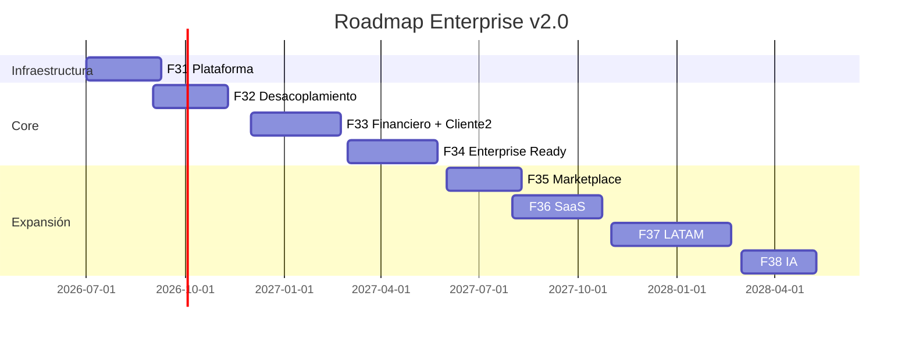

# Justech ERP — Roadmap Enterprise F31–F40

**Versión:** 2.0 · **Fase 31 replanteada**  
**Fecha:** 2026-07-05

> **Cambio principal:** F31 = infraestructura plataforma. Desacoplamiento fiscal pospuesto a F32.

---

## Resumen ejecutivo

| Métrica | Hoy | Post-F31 | F34 Target |
|---------|----:|---------:|-----------:|
| Score producto | 76 | ~80 | ≥92 |
| Plataforma | 0/3 módulos | 3/3 | 3/3 |
| Madurez | 2.8/5 | 3.5/5 | 4.5/5 |

---

## F31 — Infraestructura plataforma (10 sem · ~480h)

| Campo | Valor |
|-------|-------|
| **Objetivo** | justech_modules + governance + admin + integración piloto |
| **Dependencias** | Blueprint F30.2 aprobado |
| **Horas** | 480 |
| **Gate** | Plataforma operativa DEV/TEST · 3 módulos plataforma |

| Sprint | Entregable | h |
|--------|------------|--:|
| **F31.1** | justech_modules | 120 |
| **F31.2** | hellenia_governance | 160 |
| **F31.3** | justech_admin | 120 |
| **F31.4** | Integración piloto Hellenia | 80 |

**NO incluye:** withholding, desacoplamiento fiscal, POS, marketplace, IA.

Detalle: `ERP_INFRASTRUCTURE_ROADMAP.md`

---

## F32 — Desacoplamiento core (10 sem · ~444h)

| Campo | Valor |
|-------|-------|
| **Objetivo** | Extraer legacy hellenia_* · módulos funcionales integrados plataforma |
| **Dependencias** | Gate F31 |
| **Gate** | Core sin hellenia_account en fiscal · require_active en todos |

| Entregable | h |
|------------|--:|
| justech_withholding (nace con hooks) | 120 |
| Desacoplar justech_l10n_do_reports | 80 |
| justech_report_design standalone | 60 |
| hellenia_ux refactor | 80 |
| hellenia_ui → governance completo | 40 |
| hellenia_pos → justech_pos_fiscal | 40 |
| Archivar skeletons | 24 |

---

## F33 — Arquitectura financiera + cliente #2 (12 sem · ~560h)

| Campo | Valor |
|-------|-------|
| **Objetivo** | Modelo financiero implementado · segundo cliente greenfield |
| **Dependencias** | Gate F32 |
| **Gate** | Score ≥88 · implementador externo OK |

| Entregable | h |
|------------|--:|
| Plan cuentas + flujos GL certificados | 200 |
| Playbook onboarding | 60 |
| Segundo cliente piloto | 120 |
| justech_api REST v1 read | 120 |
| Cierre periodo certificación | 60 |

Ver: `ERP_FINANCIAL_ARCHITECTURE.md`

---

## F34 — Enterprise Ready (12 sem · ~560h)

| Campo | Valor |
|-------|-------|
| **Objetivo** | ERP Ready = **SÍ** · POS Enterprise |
| **Dependencias** | Gate F33 + contador sign-off |
| **Gate** | Score ≥92 · S01–S18 PROD |

| Entregable | h |
|------------|--:|
| POS Enterprise (sobre plataforma) | 160 |
| Certificación S01–S18 | 80 |
| Health dashboard producto | 60 |
| Tests ≥75% LOC core | 120 |
| 3 clientes PROD referencia | 140 |

---

## F35 — Marketplace (10 sem · ~480h)

| Campo | Valor |
|-------|-------|
| **Objetivo** | Catálogo + instalación controlada módulos |
| **Dependencias** | Gate F34 |
| **Gate** | 3 módulos publicados · 1 partner |

Ver: `ERP_MARKETPLACE_ARCHITECTURE.md`

---

## F36 — SaaS + Observability (12 sem · ~640h)

| Campo | Valor |
|-------|-------|
| **Objetivo** | Provisioning K8s · Grafana fleet |
| **Dependencias** | F34 · partnership Odoo eval |
| **Gate** | 1 tenant SaaS canary 30d |

Ver: `ERP_SAAS_ARCHITECTURE.md` · `ERP_OBSERVABILITY_ARCHITECTURE.md`

---

## F37 — Expansión fiscal LATAM (12–16 sem · ~800h)

e-CF RD · feasibility PR/PA · `justech_fiscal_engine` abstract

---

## F38 — IA (10 sem · ~520h)

**Solo implementación** — arquitectura preparada desde F31 (placeholders admin).

Ver: `ERP_AI_ARCHITECTURE.md`

---

## F39 — Automatización avanzada (8 sem · ~400h)

AI draft quotations · DGII pre-check · impl copilot

---

## F40 — Plataforma Enterprise plena (ongoing)

10+ tenants · multi-region · self-service · score ≥95

---

## Timeline

---

## Gates resumen v2.0

| Fase | Gate | Score |
|------|------|------:|
| **F31** | 3 módulos plataforma + piloto integrado | ~80 |
| **F32** | Core desacoplado + hooks plataforma | ~84 |
| **F33** | Financiero + cliente #2 | ~88 |
| **F34** | **ERP Ready SÍ** | ≥92 |
| F35–F40 | Expansión | ≥95 |

---

## Primer desarrollo real

**Sprint F31.1 — justech_modules** (post-aprobación arquitectura v2.0)

---

## Referencias

- Infraestructura: `ERP_INFRASTRUCTURE_ROADMAP.md`
- Plataforma: `ERP_PLATFORM_ARCHITECTURE.md`
- Productización: `ERP_PRODUCTIZATION_PLAN.md`
