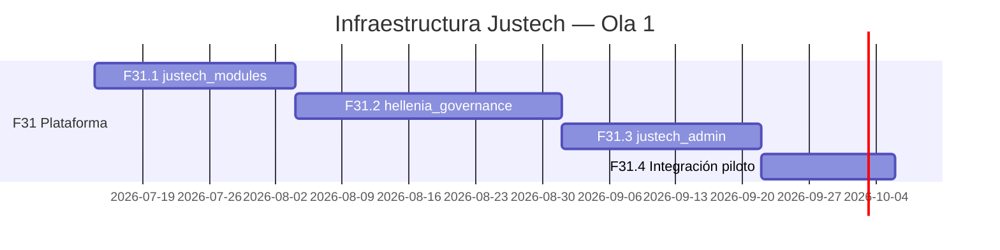

# Justech ERP — Roadmap de Infraestructura

**Versión:** 1.0 · **Fase 31 replanteada**  
**Fecha:** 2026-07-05  
**Estado:** Secuencia oficial de construcción

---

## 1. Principio

**Infraestructura completa antes de funcionalidad.**

Este roadmap cubre exclusivamente la **plataforma Justech**. El roadmap enterprise completo (`ERP_ENTERPRISE_ROADMAP.md`) incluye olas posteriores (desacoplamiento, financiero, POS, marketplace).

---

## 2. Secuencia de construcción

---

## 3. Sprints detallados

### Sprint F31.1 — justech_modules (3 sem · 120h)

| Entregable | Criterio aceptación |
|------------|---------------------|
| Modelos catálogo + licencia | CRUD funcional DEV |
| API is_active, require_active, get_feature, validate_license | Tests T-01–T-08 pass |
| post_init register hook | Módulo test registra en catálogo |
| Manifest extension justech_register | Documentado |
| Vistas básicas administración | Sin justech_admin aún |

**Gate F31.1:** Módulo instalable DEV · API usable · tests green

---

### Sprint F31.2 — hellenia_governance (4 sem · 160h)

| Entregable | Criterio aceptación |
|------------|---------------------|
| Modelos permisos, roles, políticas | CRUD funcional |
| API has_permission, require_permission, audit | Tests pass |
| Registro automático desde justech_register | Permisos + menús |
| Migración HIDE_MENU_XMLIDS → DB policies | hellenia_ui deprecado path |
| Sincronización res.groups | Puente permisos |
| Callback license activation → enable_feature | Integración JM |

**Gate F31.2:** Permisos funcionales operativos · menús editables UI · sin licencias en governance

**Prerequisito:** F31.1 completado

---

### Sprint F31.3 — justech_admin (3 sem · 120h)

| Entregable | Criterio aceptación |
|------------|---------------------|
| OWL app Centro de Control | Menú Justech visible |
| Dashboard salud read-only | Widgets H-01 subset |
| Sección Licencias | CRUD delegado JM |
| Sección Gobernanza | Embed HG views |
| Sección Sistema | SMTP, companies, config |
| Placeholders marketplace/IA | Disabled state |

**Gate F31.3:** Admin usable por super admin · cero lógica negocio en admin

**Prerequisito:** F31.2 completado

---

### Sprint F31.4 — Integración piloto Hellenia (2 sem · 80h)

| Entregable | Criterio aceptación |
|------------|---------------------|
| Registrar módulos existentes en catálogo | 13 módulos custom mapeados |
| Licencia trial Hellenia DEV | Features mapeadas |
| Migrar 3 permisos fiscales críticos | void_ncf, export_607, manage_ncf_range |
| Migrar menús hellenia_ui top 10 | Políticas governance |
| Evidencia JSON + checklist | evidence/phase31-platform-architecture/ |
| Regression TEST smoke | Sin romper fiscal existente |

**Gate F31 (cierre infraestructura):** Plataforma operativa DEV/TEST · Hellenia piloto integrado

**Prerequisito:** F31.3 completado

---

## 4. Post-infraestructura (no iniciar antes de Gate F31)

| Ola | Fase | Contenido | Horas |
|-----|------|-----------|------:|
| 2 | F32 | Desacoplamiento core (withholding, reports…) | 444 |
| 3 | F33 | Arquitectura financiera implementada | 200 |
| 4 | F34 | POS Enterprise | 160 |
| 5 | F35 | Marketplace | 320 |
| 6 | F36+ | IA (solo arquitectura hasta F35) | TBD |

---

## 5. Matriz dependencias sprints

| Sprint | Depende de | Bloquea |
|--------|------------|---------|
| F31.1 | Blueprint aprobado | F31.2, todo licenciable |
| F31.2 | F31.1 | F31.3, permisos en funcional |
| F31.3 | F31.2 | F31.4, operación admin |
| F31.4 | F31.3 | F32 desacoplamiento |
| F32+ | Gate F31 | Cliente #2, venta masiva |

---

## 6. Ambientes

| Sprint | DEV | TEST | PROD |
|--------|-----|------|------|
| F31.1 | ✅ | — | ❌ |
| F31.2 | ✅ | ✅ smoke | ❌ |
| F31.3 | ✅ | ✅ | ❌ |
| F31.4 | ✅ | ✅ regression | ❌ hasta aprobación |

---

## 7. Rollback por sprint

| Sprint | Rollback |
|--------|----------|
| F31.1 | Desinstalar justech_modules |
| F31.2 | Desinstalar governance; restaurar hellenia_ui |
| F31.3 | Desinstalar admin; usar views JM/HG directas |
| F31.4 | Revert registry entries; BD backup pre-migration |

---

## 8. Riesgos infraestructura

| ID | Riesgo | Prob | Impacto | Mitigación |
|----|--------|------|---------|------------|
| I-01 | F31.1 delay bloquea todo | Media | Alto | Scope mínimo API |
| I-02 | Governance scope creep | Alta | Alto | No licencias en HG v1 |
| I-03 | Admin god module | Media | Alto | Lint: no business models |
| I-04 | Legacy modules ignore API | Alta | Medio | F31.4 registration + F32 enforcement |
| I-05 | Hellenia regression TEST | Media | Alto | Backup + smoke S01 subset |

---

## 9. Horas totales Ola 1

| Sprint | Horas |
|--------|------:|
| F31.1 | 120 |
| F31.2 | 160 |
| F31.3 | 120 |
| F31.4 | 80 |
| **Total infraestructura** | **480** |

---

## 10. Próximo paso

**Aprobar arquitectura v2.0** → iniciar **Sprint F31.1 justech_modules** en DEV.

---

## Referencias

- `ERP_PLATFORM_ARCHITECTURE.md`
- `JUSTECH_MODULES_ARCHITECTURE.md`
- `HELLENIA_GOVERNANCE_ARCHITECTURE.md`
- `JUSTECH_ADMIN_ARCHITECTURE.md`
- `ERP_ENTERPRISE_ROADMAP.md`
