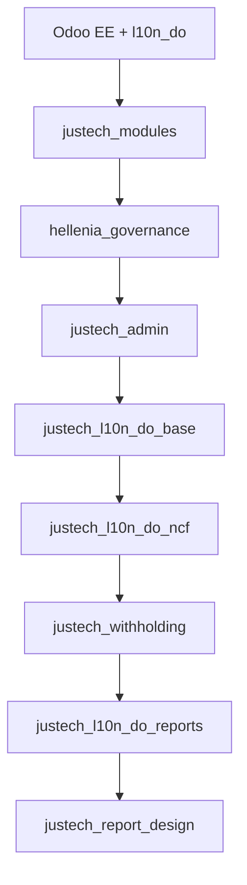

# Justech ERP — Catálogo Oficial de Módulos

**Versión:** 2.0 · **Fase 31 replanteada**

---

## Capa PLATAFORMA (construir primero)

| Código | Módulo | Sprint | Versión | Dependencias | Obligatorio | Estado | Responsable |
|--------|--------|--------|---------|--------------|:-----------:|--------|-------------|
| **JT-PLT-001** | `justech_modules` | F31.1 | — | base, mail | **Sí** | DISEÑO | Justech |
| **JT-PLT-002** | `hellenia_governance` | F31.2 | — | justech_modules | **Sí** | DISEÑO | Justech |
| **JT-PLT-003** | `justech_admin` | F31.3 | — | modules, governance | **Sí** | DISEÑO | Justech |

### JT-PLT-001 — justech_modules

**Descripción:** Motor licencias, catálogo módulos, features, activación, claves.  
**API:** `is_active()`, `require_active()`, `get_feature()`, `validate_license()`  
**NO maneja:** permisos, menús, panel admin  
**Doc:** `JUSTECH_MODULES_ARCHITECTURE.md`

### JT-PLT-002 — hellenia_governance

**Descripción:** Permisos funcionales, roles, políticas, menús, auditoría operativa.  
**API:** `has_permission()`, `require_permission()`, `enable_feature()`, `audit()`  
**NO maneja:** licencias, claves, catálogo comercial  
**Doc:** `HELLENIA_GOVERNANCE_ARCHITECTURE.md`

### JT-PLT-003 — justech_admin

**Descripción:** Centro de Control ERP — shell UI sin lógica negocio.  
**Consume:** justech_modules + hellenia_governance  
**Doc:** `JUSTECH_ADMIN_ARCHITECTURE.md`

---

## CORE Odoo Enterprise

| Código | Módulo | Obligatorio | Licencia |
|--------|--------|:-----------:|----------|
| ODOO-001 | account | Sí | Odoo EE |
| ODOO-002 | sale_management | Sí | Odoo EE |
| ODOO-003 | purchase | Sí | Odoo EE |
| ODOO-004 | stock | Sí | Odoo EE |
| ODOO-005 | l10n_do | Sí (RD) | Odoo EE |
| ODOO-006 | account_reports | Sí | Odoo EE |
| ODOO-007 | point_of_sale | No | Odoo EE |

---

## CORE JUSTECH (post-plataforma F32+)

| Código | Módulo | Versión | Feature code | Licencia | Estado |
|--------|--------|---------|--------------|----------|--------|
| JT-CORE-001 | justech_l10n_do_base | 19.0.1.4.2 | fiscal_base | Incluido | PROD |
| JT-CORE-002 | justech_l10n_do_ncf | 19.0.1.5.2 | fiscal_ncf | Incluido | PROD |
| JT-CORE-003 | justech_withholding | — | fiscal_withholding | Incluido | **F32** |

**Nota:** withholding **no iniciar** hasta Gate F31 (plataforma completa).

---

## LICENCIABLES (registrar en F31.4, desacoplar F32+)

| Código | Módulo | Feature code | Tier min | Estado |
|--------|--------|--------------|----------|--------|
| JT-LIC-001 | justech_l10n_do_reports | dgii_reports | STD | PROD |
| JT-LIC-002 | justech_report_design | report_design | STD | PROD |
| JT-LIC-003 | hellenia_pos → justech_pos | pos_fiscal | PRO | DEV |
| JT-LIC-004 | hellenia_ux → justech_ux | ux_fiscal | STD | PROD |
| JT-LIC-005 | justech_api | api_connect | PRO | F34 |
| JT-LIC-006 | justech_marketplace | marketplace | ENT | F35 |

---

## LEGACY (no desarrollar — migrar)

| Código | Módulo | Destino | Fase |
|--------|--------|---------|------|
| JT-LEG-001 | hellenia_account | justech_withholding | F32 |
| JT-LEG-002 | hellenia_reports | deprecar | F32 |
| JT-LEG-003 | hellenia_ui | hellenia_governance | F31.2 |
| JT-LEG-004 | hellenia_base | archivar | F31.4 |
| JT-LEG-005 | hellenia_inventory | archivar | F31.4 |

---

## Orden instalación greenfield (target post-F31)

---

## Feature codes registry (catálogo inicial)

| Feature code | Módulo | Licencia required |
|--------------|--------|:-----------------:|
| platform_core | justech_modules | No (always on) |
| governance | hellenia_governance | No (always on) |
| admin_panel | justech_admin | No (always on) |
| fiscal_base | justech_l10n_do_base | Sí |
| fiscal_ncf | justech_l10n_do_ncf | Sí |
| fiscal_withholding | justech_withholding | Sí |
| dgii_reports | justech_l10n_do_reports | Sí |
| report_design | justech_report_design | Sí |
| pos_fiscal | hellenia_pos | Sí |
| ux_fiscal | hellenia_ux | Sí |
| api_connect | justech_api | Sí |
| marketplace | justech_marketplace | Sí |

---

## CSV

`evidence/phase31-platform-architecture/module_catalog_v2.csv`
