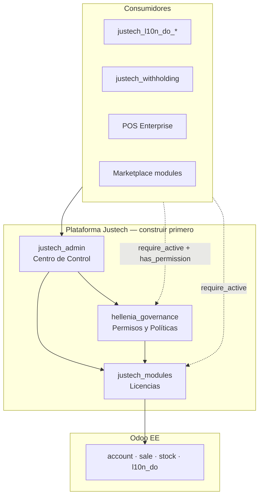
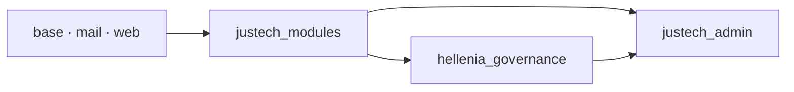
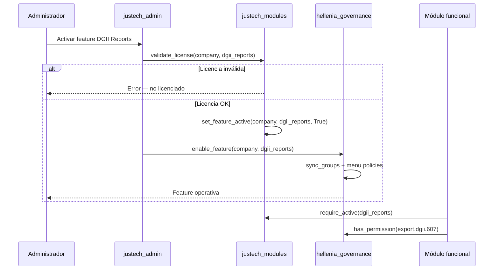
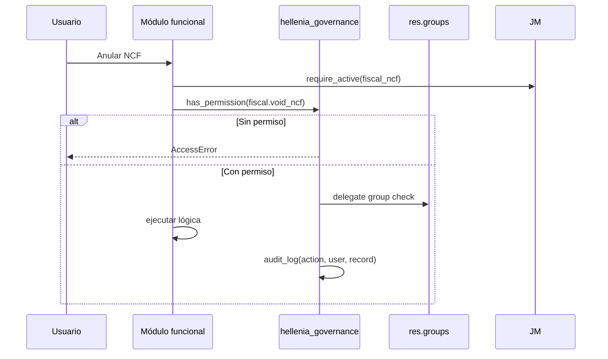

# Justech ERP — Arquitectura de Plataforma

**Versión:** 1.0 · **Fase 31 replanteada** · Definitiva  
**Fecha:** 2026-07-05  
**Estado:** Pendiente aprobación → Sprint F31.1

---

## 1. Visión

Justech ERP es una **plataforma comercial** sobre Odoo Enterprise. Tres capas de infraestructura preceden a cualquier módulo funcional:



---

## 2. Principio rector

> **Infraestructura primero. Funcionalidad después. Integración nativa desde el nacimiento.**

Un módulo funcional futuro (`justech_withholding`, `justech_reports`, POS) **debe**:
1. Registrarse en `justech_modules` al instalarse
2. Declarar permisos en `hellenia_governance`
3. Ser administrable desde `justech_admin`
4. Usar `require_active('feature.code')` antes de ejecutar lógica licenciada
5. Usar `has_governance_permission('perm.code')` antes de acciones sensibles

---

## 3. Matriz de responsabilidades

| Responsabilidad | justech_modules | hellenia_governance | justech_admin |
|-----------------|:---------------:|:-----------------:|:-------------:|
| Catálogo módulos Justech | ✅ dueño | ❌ | 🔍 consume |
| Features comerciales | ✅ dueño | ❌ | 🔍 consume |
| Claves activación | ✅ dueño | ❌ | 🔍 consume |
| Licencias por empresa | ✅ dueño | ❌ | 🔍 consume |
| Validación licencia | ✅ dueño | ❌ | 🔍 consume |
| Dependencias módulo (comercial) | ✅ dueño | ❌ | 🔍 consume |
| Versiones módulo (comercial) | ✅ dueño | ❌ | 🔍 consume |
| Permisos funcionales | ❌ | ✅ dueño | 🔍 consume |
| Roles de negocio | ❌ | ✅ dueño | 🔍 consume |
| Políticas por empresa | ❌ | ✅ dueño | 🔍 consume |
| Menús visibilidad | ❌ | ✅ dueño | 🔍 consume |
| Auditoría operativa | ❌ | ✅ dueño | 🔍 consume |
| Accesos por usuario | ❌ | ✅ dueño | 🔍 consume |
| Panel UI unificado | ❌ | ❌ | ✅ dueño |
| Healthchecks dashboard | ❌ | ❌ | ✅ dueño |
| SMTP / branding config UI | ❌ | ❌ | ✅ orquesta |
| Backups (trigger UI) | ❌ | ❌ | ✅ orquesta |
| Marketplace UI | ❌ | ❌ | ✅ orquesta |
| IA UI (futuro) | ❌ | ❌ | ✅ orquesta |
| APIs externas UI | ❌ | ❌ | ✅ orquesta |
| Lógica negocio fiscal | ❌ | ❌ | ❌ |

**Leyenda:** ✅ dueño = modelo y lógica · 🔍 consume = lectura/escritura delegada · ❌ = prohibido

---

## 4. Dependencias entre módulos plataforma



| Módulo | depends | Prohibido depender de |
|--------|---------|----------------------|
| `justech_modules` | base, mail | governance, admin, hellenia_*, fiscal |
| `hellenia_governance` | justech_modules, base, mail, web | justech_admin, fiscal |
| `justech_admin` | justech_modules, hellenia_governance, web | hellenia_account, l10n_do_* |

**Sin dependencias circulares:** DAG estricto unidireccional.

---

## 5. Flujo de activación de feature



**Regla:** Licencia (JM) es prerrequisito. Gobernanza (HG) es segundo paso. Admin (JA) orquesta ambos.

---

## 6. Flujo de permisos



---

## 7. Flujo de administración

`justech_admin` es **shell OWL** — no duplica modelos:

| Sección panel | Fuente datos | Acción |
|---------------|--------------|--------|
| Licencias | justech_modules | CRUD delegado |
| Módulos / Features | justech_modules | CRUD delegado |
| Permisos / Roles | hellenia_governance | CRUD delegado |
| Menús | hellenia_governance | CRUD delegado |
| Empresas | res.company | Vista nativa embebida |
| Health / Diagnóstico | scripts + ir.logging | Agregación |
| Estado ERP | ERP_HEALTH_DASHBOARD | Read-only widgets |

---

## 8. Registro automático de módulos

Al instalar cualquier módulo Justech con manifest flag:

```python
# En __manifest__.py del módulo funcional (futuro)
"justech_register": {
    "code": "justech_l10n_do_reports",
    "feature_code": "dgii_reports",
    "license_required": True,
    "dependencies": ["justech_l10n_do_ncf"],
    "permissions": ["export.dgii.606", "export.dgii.607"],
    "menus": ["justech_l10n_do_reports.menu_dgii_root"],
}
```

Hook en `justech_modules`:
```python
# post_load / post_init_hook
def register_module(env, module_name):
    manifest = get_manifest(module_name)
    if "justech_register" in manifest:
        env["justech.module.registry"].register_from_manifest(manifest)
        env["hellenia.governance.registry"].register_from_manifest(manifest)
```

---

## 9. Localizaciones y países futuros

| Concern | Módulo | Mecanismo |
|---------|--------|-----------|
| País disponible comercialmente | justech_modules | `justech.localization` + license tier |
| País activo por empresa | justech_modules | `justech.company.localization` |
| Permisos fiscales por país | hellenia_governance | Permisos namespaced `do.fiscal.*`, `pr.fiscal.*` |
| UI admin país | justech_admin | Sección Localizaciones |

**Namespace:** `justech_l10n_{iso_country}` — cada uno registra en modules al instalar.

---

## 10. Validación arquitectónica (10 preguntas)

### 1. ¿Es correcta la separación?

**Sí.** Tres preguntas distintas → tres módulos:
- **¿Pagado?** → justech_modules
- **¿Permitido operativamente?** → hellenia_governance  
- **¿Dónde lo administro?** → justech_admin

### 2. ¿Hay responsabilidades duplicadas?

**En v1.0 sí** (governance mezclaba panel + licencias). **v2.0 resuelve:**
- Governance **no** maneja licencias
- Admin **no** tiene modelos propios de negocio
- Modules **no** maneja permisos ni menús

**Riesgo residual:** auditoría en modules (licencia) vs governance (operación) — **intencional**, dominios distintos.

### 3. ¿Qué debe vivir en cada módulo?

Ver §3 matriz. Resumen:
- **modules:** licencias, features, catálogo, activación comercial
- **governance:** permisos, roles, políticas, menús, auditoría operativa
- **admin:** UI shell, health, orquestación, diagnóstico

### 4. ¿APIs públicas por módulo?

| Módulo | API |
|--------|-----|
| justech_modules | `is_active()`, `require_active()`, `get_feature()`, `validate_license()`, `register_module()` |
| hellenia_governance | `has_permission()`, `require_permission()`, `get_role()`, `enable_feature()`, `audit()` |
| justech_admin | Sin API Python pública — solo UI |

### 5. ¿Cómo evitar dependencias circulares?

- DAG: `justech_modules` ← `hellenia_governance` ← `justech_admin`
- Módulos funcionales dependen de **modules + governance**, nunca de admin
- Admin nunca importado por modules ni governance
- Registro bidireccional vía hooks, no imports cruzados

### 6. ¿Registro automático nuevos módulos?

Manifest key `justech_register` + post_init hook en justech_modules → propaga a governance registry.

### 7. ¿Localizaciones futuras?

Modelo `justech.localization` en modules; permisos namespaced en governance; sección admin.

### 8. ¿Países futuros?

Feature por país licenciable; empresa activa un país; instala namespace `justech_l10n_XX`.

### 9. ¿Licencias futuras?

Tiers extensibles; features granulares; add-ons; trial; grace period — todo en modules.

### 10. ¿Qué cambiar antes de escribir código?

1. Aprobar esta arquitectura v2.0
2. Renombrar `justech_core` → absorber utilidades compartidas plataforma (opcional)
3. Eliminar referencias a "panel único governance" como licenciador
4. Actualizar backlog: JB-001 antes que JB-032
5. Congelar desacoplamiento fiscal hasta F31.3 completado

---

## 11. Riesgos

| Riesgo | Mitigación |
|--------|------------|
| Admin se convierte en "god module" | Prohibir lógica negocio; solo orquestación |
| Governance crece con licencias | Separación estricta v2.0 |
| Módulos legacy ignoran require_active | Lint CI + decorator obligatorio D-15 |
| Performance checks licencia | Cache ir.config + invalidación en write |
| Nombre hellenia_governance confunde | Renombrar a `justech_governance` en F32 eval (breaking) |

---

## 12. Recomendaciones

1. **Aprobar arquitectura** antes de Sprint F31.1
2. Implementar **justech_modules** completo antes de tocar governance
3. **justech_admin** solo con widgets read-only hasta modules+governance estables
4. Migrar `hellenia_ui` HIDE_MENU_XMLIDS en F31.2, no antes
5. Todo módulo funcional existente adopta hooks en F32 (no F31)

---

## Referencias

- `JUSTECH_MODULES_ARCHITECTURE.md`
- `HELLENIA_GOVERNANCE_ARCHITECTURE.md`
- `JUSTECH_ADMIN_ARCHITECTURE.md`
- `ERP_INFRASTRUCTURE_ROADMAP.md`
