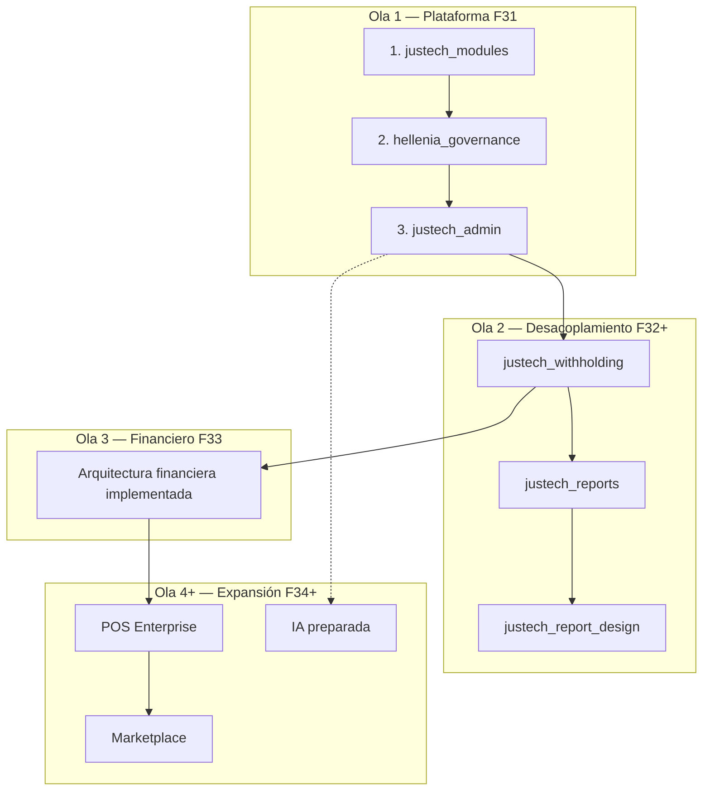

# Justech ERP — Plan Maestro de Productización

**Versión:** 2.0 · **Fase 31 replanteada** · **Read-only**  
**Fecha:** 2026-07-05  
**Estado:** ARQUITECTURA DE PLATAFORMA DEFINITIVA — pendiente aprobación para Sprint F31.1

> **Cierre etapa documentación:** Fases 30, 30.1, 30.2 completadas.  
> **Fase 31 replanteada:** infraestructura de producto **antes** de módulos funcionales.

---

## Cambio fundamental vs F31 v1.0

| F31 v1.0 (obsoleto) | F31 v2.0 (oficial) |
|---------------------|-------------------|
| Desacoplamiento fiscal primero | **Plataforma primero** |
| justech_withholding P0 | **justech_modules** F31.1 |
| Governance en F32 | **hellenia_governance** F31.2 |
| Sin panel unificado | **justech_admin** F31.3 |
| POS / Marketplace / IA en roadmap temprano | Posponidos post-infraestructura |

**Regla principal:** Ningún módulo funcional nuevo hasta tener licencias + gobernanza + administración.

**Motivo:** Si `justech_withholding` nace antes de `justech_modules`, habrá que refactorizarlo para licencias, permisos y admin. La infraestructura primero garantiza que todo módulo futuro nazca integrado.

---

## Índice maestro

| # | Capa | Documento |
|---|------|-------------|
| 0 | Plataforma (visión) | `ERP_PLATFORM_ARCHITECTURE.md` |
| 1 | Licencias | `JUSTECH_MODULES_ARCHITECTURE.md` |
| 2 | Gobernanza | `HELLENIA_GOVERNANCE_ARCHITECTURE.md` |
| 3 | Administración | `JUSTECH_ADMIN_ARCHITECTURE.md` |
| 4 | Infraestructura roadmap | `ERP_INFRASTRUCTURE_ROADMAP.md` |
| 5 | Core funcional | `ERP_CORE_ARCHITECTURE.md` |
| 6 | Catálogo módulos | `ERP_MODULE_CATALOG.md` |
| 7 | Roadmap enterprise | `ERP_ENTERPRISE_ROADMAP.md` |
| 8 | Constitución | `JUSTECH_ERP_BLUEPRINT.md` |

---

## Orden oficial de implementación

| # | Componente | Sprint | Horas est. | Bloquea |
|---|------------|--------|----------:|---------|
| 1 | **justech_modules** | F31.1 | 120 | Todo lo licenciable |
| 2 | **hellenia_governance** | F31.2 | 160 | Permisos, menús, roles |
| 3 | **justech_admin** | F31.3 | 120 | Panel operativo |
| 4 | Desacoplamiento core | F32 | 444 | Cliente #2 |
| 5 | Arquitectura financiera | F33 | 200 | Certificación contable |
| 6 | POS Enterprise | F34 | 160 | Venta retail |
| 7 | Marketplace | F35 | 320 | Partners |
| 8 | IA | F36+ | — | Solo arquitectura preparada |

---

## Qué NO iniciar todavía

- ❌ `justech_withholding`
- ❌ Desacoplamiento fiscal (`justech_l10n_do_reports` ↔ `hellenia_account`)
- ❌ `justech_reports` / refactor reportes
- ❌ POS Enterprise
- ❌ Marketplace implementación
- ❌ IA implementación

---

## Separación de responsabilidades (3 pilares)

| Pilar | Módulo | Pregunta que responde |
|-------|--------|----------------------|
| **Comercial** | `justech_modules` | ¿Está licenciado y activo comercialmente? |
| **Operativo** | `hellenia_governance` | ¿Quién puede hacer qué, dónde y cuándo? |
| **Administrativo** | `justech_admin` | ¿Cómo veo y gestiono todo desde un solo lugar? |

Ver matriz completa: `ERP_PLATFORM_ARCHITECTURE.md` §3

---

## Primer desarrollo real (post-aprobación)

**Sprint F31.1 — `justech_modules`**

Entregables:
- Modelos: catálogo, features, licencias, activación
- API: `is_active()`, `require_active()`, `get_feature()`, `validate_license()`
- Registro automático de módulos al instalar
- Tests + documentación
- Ambiente: **DEV únicamente**

---

## Validación arquitectónica (resumen)

| # | Pregunta | Respuesta |
|---|----------|-----------|
| 1 | ¿Separación correcta modules/governance/admin? | **Sí** — ver § separación |
| 2 | ¿Duplicaciones? | Resueltas en v2.0 — admin no duplica lógica |
| 3 | ¿Qué vive en cada módulo? | Ver matriz responsabilidades |
| 4 | ¿APIs públicas? | Documentadas por módulo |
| 5 | ¿Dependencias circulares? | DAG estricto: modules → governance → admin |
| 6 | ¿Registro automático módulos? | Hook `post_init` → `justech.module.registry` |
| 7 | ¿Localizaciones futuras? | Namespace `justech_l10n_{country}` + registro en modules |
| 8 | ¿Países futuros? | Feature flag por país en modules; permisos en governance |
| 9 | ¿Licencias futuras? | Extensible en `justech.license.tier` |
| 10 | ¿Qué cambiar antes de código? | Aprobar esta arquitectura v2.0 |

Detalle completo: `ERP_PLATFORM_ARCHITECTURE.md` §10

---

## Auditoría repositorio (sin cambio)

15 módulos custom · 137 Python · 81 XML · Hellenia = piloto #1

Desacoplamiento sigue siendo necesario — **pero después de plataforma**.

Ver: `ERP_CORE_DECOUPLING_PLAN.md` (orden post-F31.3)

---

## Restricciones

- No escribir código en esta fase
- No crear módulos · no instalar · no tocar DEV/TEST/PROD
- No commit · no push · no merge

---

## Referencias

- Plataforma: `ERP_PLATFORM_ARCHITECTURE.md`
- Infraestructura: `ERP_INFRASTRUCTURE_ROADMAP.md`
- Blueprint: `JUSTECH_ERP_BLUEPRINT.md`
- Evidencia F31 v1: `evidence/phase31-productization/` (histórico)
- Evidencia F31 v2: `evidence/phase31-platform-architecture/`
