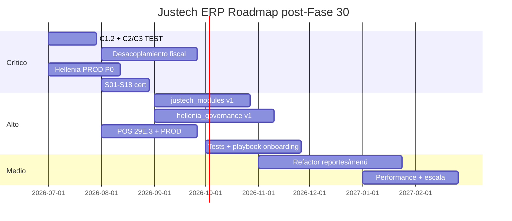

# Justech ERP — Roadmap estratégico post-certificación Fase 30

**Fecha:** 2026-07-09 (actualizado post Fase A fiscal)  
**Base:** Score 79/100 · ERP Ready **NO**  
**Horizonte:** 6–12 meses · Hellenia = piloto · Justech = producto

---

## Hito cerrado — Fase A fiscal integración (2026-07-09)

| Entrega | Estado | Evidencia |
|---------|--------|-----------|
| Fiscal Data Provider (`justech_dev`) | ✅ Estable | `evidence/fiscal-integration/FDP-deploy-20260709/` |
| Reportes 606 corregidos (NCF Adel/e-CF) | ✅ 0 errores NCF | 606/202606: 90→0 errores NCF |
| Clasificador DGII parametrizable `19.0.1.16.1` | ✅ 28/28 checks | `CLASSIFIER-closure-final/` |
| 606/202606 período completo | ✅ 90 válidos, 0 errores | CDT→X, ISC→W, ITBIS→N |
| Histórico financiero | ✅ Intacto | 2255/947/677/1504 NCF Adel |
| Adel (`l10n_do_accounting`) | ✅ Activo en dev | Motor operativo histórico |
| Motor NCF Justech | ⛔ **Desactivado** | `justech_do_fiscal_enabled=0` todas las empresas |

**Rama:** `feature/fiscal-integration-phase-a` — commit `91b0123` — **merge pendiente aprobación propietario**.

### Gate antes de activar motor NCF Justech

Ver checklist completo: `evidence/fiscal-integration/NCF_MOTOR_GATE_CHECKLIST.md`

| Bloque | Pendiente crítico (P0) |
|--------|------------------------|
| Lab | Matriz B01–B15 + duplicados v2.0 en `justech_ncf_lab` |
| Backfill | 1.504 NCF → metadatos Justech sin tocar GL |
| Coexistencia | Modo `parallel` documentado y probado |
| Reportes | 607/623 certificación con volumen real |
| Gobernanza | Merge rama + sign-off contador 606/202606 |
| Producción | `justgroup.app` — **prohibido** hasta P0 completo |

**Próximo paso recomendado:** aprobación de merge + piloto NCF en lab aislado (no activar motor en `justech_dev` operativo aún).

---

## Principios de priorización

1. **Cerrar blockers comerciales** antes de nuevas features.
2. **Desacoplar** Justech de Hellenia en capa fiscal.
3. **Certificar piloto** antes de segundo cliente.
4. **Productizar** gobernanza, onboarding, licencias.
5. **No promover PROD** sin sign-off contador (C5/C6).

---

## CRÍTICO — Correcciones (0–8 semanas)

| ID | Item | Tipo | Owner | Dependencia |
|----|------|------|-------|-------------|
| C-01 | Ejecutar C1.2 partners sin RNC TEST | Corrección datos | Justech + contador | C1 aprobado |
| C-02 | ITBIS 5 productos sin impuesto | Config | Operaciones | — |
| C-03 | 15 facturas TEST sin NCF (C3) | Corrección | Justech | C1.2 |
| C-04 | Desacoplar `justech_l10n_do_reports` → módulo retenciones Justech genérico | Refactor | Justech dev | Diseño AR |
| C-05 | Hellenia PROD P0: rangos NCF DGII reales | Config | Contador + Justech | Aprobación |
| C-06 | Hellenia PROD P0: usuarios ROLE_MATRIX | Config | Justech | — |
| C-07 | Hellenia PROD P0: SMTP operativo | Config | Infra | — |
| C-08 | Limpiar facturas smoke PROD | Corrección | Contador | Backup |
| C-09 | Pre-post guard RNC obligatorio (excepto CF) | Código | Justech | C1.2 plan |
| C-10 | Escenarios controlados S01–S18 TEST | Certificación | QA + contador | C1–C3 |

---

## ALTO — Mejoras producto (2–4 meses)

| ID | Item | Tipo | Owner |
|----|------|------|-------|
| A-01 | Implementar `justech_modules` v1 (licencias) | Nueva funcionalidad | Justech |
| A-02 | Implementar `hellenia_governance` v1 (panel features) | Nueva funcionalidad | Justech |
| A-03 | POS Phase 29E.3 — caja, arqueo, permisos | Nueva funcionalidad | Justech |
| A-04 | POS PROD `pos.config` + certificación sesión→GL | Config + cert | Justech + contador |
| A-05 | Consolidar reportes: deprecar path hellenia_reports QWeb masivo | Refactor | Justech |
| A-06 | Tests hellenia_account, hellenia_ux, hellenia_pos (≥75% LOC) | Calidad | Justech |
| A-07 | ACL `hellenia_ui.menu.customizer` | Seguridad | Justech |
| A-08 | Cierre período + conciliación bancaria certificación | Certificación | Contador |
| A-09 | i18n `es_DO.po` módulos custom (TD-009) | Mejora | Justech |
| A-10 | Playbook onboarding cliente Justech ERP | Documentación | Producto |
| A-11 | DGII 608/609 certificación volumen TEST | Certificación | QA |
| A-12 | Eliminar/archivar módulos esqueleto del SKU comercial | Refactor | Producto |

---

## MEDIO — Refactorizaciones y deuda (4–8 meses)

| ID | Item | Tipo |
|----|------|------|
| M-01 | Extraer retenciones de hellenia_account → `justech_withholding` |
| M-02 | Mover menú customizer a gobernanza (eliminar hardcode XMLIDs) |
| M-03 | Reducir `_inherit` account.move a pipeline documentado |
| M-04 | Optimizar export DGII O(n²) → batch SQL |
| M-05 | Índices PostgreSQL moves/partners para escala |
| M-06 | Unificar post_init hooks en installer único |
| M-07 | B03 E2E + in_refund NCF (TD-011, TD-012) |
| M-08 | RNC dígito verificador DGII (TD-020) |
| M-09 | Cron rangos NCF expired (TD-019) |
| M-10 | Documentar upgrade path Odoo 19→20 |

---

## BAJO — Nuevas funcionalidades / expansión (8–12 meses)

| ID | Item | Tipo |
|----|------|------|
| B-01 | API REST Justech (webhooks factura/NCF) |
| B-02 | Conector n8n templates |
| B-03 | eNCF / `l10n_do_edi` evaluación |
| B-04 | Multi-company 10 tenants stress test |
| B-05 | Dashboard ejecutivo Justech |
| B-06 | Integración Microsoft 365 playbook cliente |
| B-07 | Huawei / storage — evaluación requisitos |
| B-08 | CI pipeline certificación automática (FISC-01=0) |
| B-09 | Segundo cliente piloto no-Hellenia |
| B-10 | Frontend platform shell (si aplica producto) |

---

## Roadmap por área (visual)

---

## Separación por tipo de trabajo

| Tipo | Count | % esfuerzo est. |
|------|------:|----------------:|
| Correcciones | 10 | 25% |
| Mejoras | 12 | 35% |
| Refactorizaciones | 10 | 25% |
| Nuevas funcionalidades | 10 | 15% |

---

## Gates de re-certificación

| Gate | Trigger | Target score |
|------|---------|-------------|
| **Fase 31** | C1–C10 cerrados + PROD piloto 30 días | ≥ 85/100 |
| **Fase 32** | justech_modules + governance v1 | ≥ 88/100 |
| **Fase 33** | Segundo cliente instalado | ≥ 90/100 |
| **ERP Ready SÍ** | Todos gates + contador sign-off | ≥ 92/100 |

---

## Qué NO hacer hasta ERP Ready

- Vender instalación genérica sin playbook.
- Promover stack skeleton (hellenia_base, justech_core) como módulos producto.
- Merge fiscal a main sin desacoplamiento.
- Instalar POS en clientes sin 29E.3 + certificación GL.
- Declarar DGII PROD con datos UAT/smoke.

---

## Referencias

- `docs/ERP_JUSTECH_ENTERPRISE_CERTIFICATION.md`
- `docs/ERP_SCORECARD.md`
- `evidence/c1-partners-rnc-diagnostic-test/C1.2_CORRECTION_PLAN_TEST.md`
- `docs/HELLENIA_GOVERNANCE_ARCHITECTURE.md`
## Roadmap F31–F36 (Blueprint oficial)

| Fase | Objetivo | Semanas | Horas | Gate |
|------|----------|--------:|------:|------|
| **F31** | Productización fiscal + PROD piloto | 8–10 | ~380 | Score ≥82 |
| **F32** | Gobernanza + POS + documentación | 10–12 | ~520 | Score ≥86 |
| **F33** | Segundo cliente + API + reportes | 10–12 | ~560 | Score ≥90 |
| **F34** | **Enterprise Ready** | 12 | ~560 | Score ≥92; ERP Ready SÍ |
| **F35** | e-CF + expansión PR/PA eval | 12+ | ~400 | Feasibility países |
| **F36** | Cloud SaaS + IA opcional | 16+ | ~600 | Multi-tenant ready |

Detalle completo: `docs/ERP_ENTERPRISE_EVOLUTION_PLAN.md` · Backlog ampliado: `evidence/phase30-2-product-blueprint/product_backlog.csv` (JB-001–035)

---

## Referencias Fase 30.1

- `docs/ERP_MATURITY_MODEL.md`
- `docs/ERP_ENTERPRISE_EVOLUTION_PLAN.md`
- `evidence/phase30-enterprise-certification-extended/EXECUTIVE_REPORT.md`

## Referencias Fase 30.2 Blueprint

- `docs/JUSTECH_ERP_BLUEPRINT.md` — **Constitución producto**
- `docs/ERP_PRODUCT_VISION.md`
- `docs/ERP_CORE_ARCHITECTURE.md`
- `docs/ERP_DEVELOPMENT_STANDARD.md`
- `evidence/phase30-2-product-blueprint/EXECUTIVE_BLUEPRINT.md`

---

## Referencias Fase 31 Productización

- `docs/ERP_PRODUCTIZATION_PLAN.md` v2.0 — **Plan maestro replanteado**
- `docs/ERP_PLATFORM_ARCHITECTURE.md` — **Arquitectura plataforma definitiva**
- `docs/JUSTECH_MODULES_ARCHITECTURE.md` — Sprint F31.1
- `docs/HELLENIA_GOVERNANCE_ARCHITECTURE.md` v2.0 — Sprint F31.2
- `docs/JUSTECH_ADMIN_ARCHITECTURE.md` — Sprint F31.3
- `docs/ERP_INFRASTRUCTURE_ROADMAP.md` — Secuencia construcción
- `docs/ERP_MODULE_CATALOG.md` v2.0
- `docs/ERP_ENTERPRISE_ROADMAP.md` v2.0 — F31–F40
- `evidence/phase31-platform-architecture/EXECUTIVE_REPORT.md`

> F31 v1.0 (desacoplamiento primero) obsoleto. Ver evidencia histórica: `evidence/phase31-productization/`

---

*Roadmap Fase 30 original. Evolución producto ampliada en ERP_ENTERPRISE_EVOLUTION_PLAN.md y ERP_ENTERPRISE_ROADMAP.md (F31–F40)*
