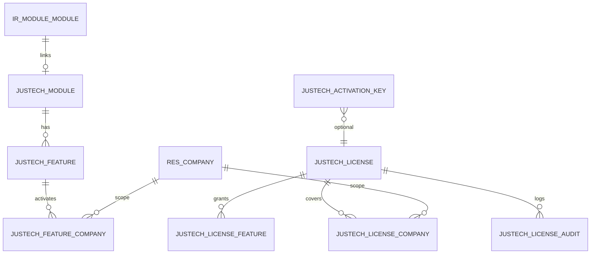
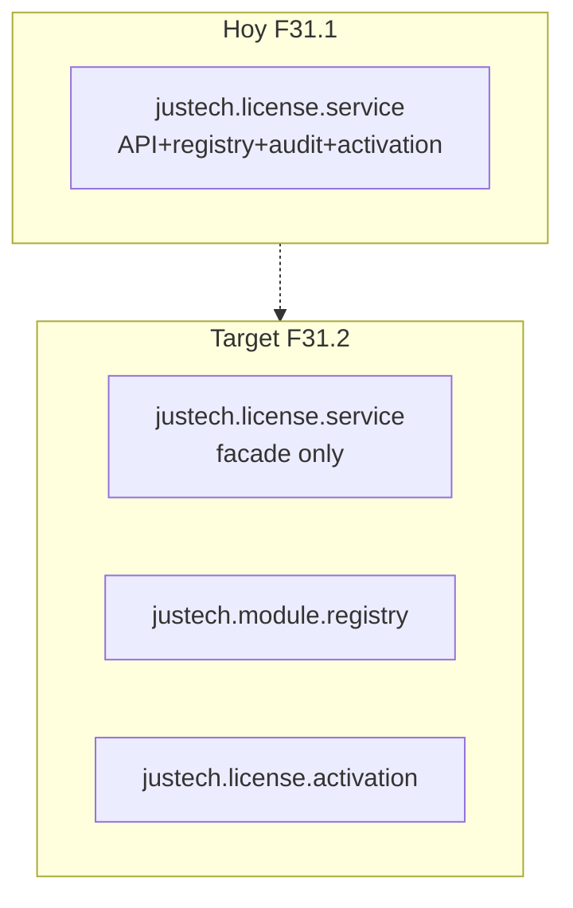

# F31.1 — Revisión Arquitectónica: justech_modules

**Versión:** 1.0 · **Fecha:** 2026-07-05  
**Alcance:** Semana 1 implementada · DEV PASS 9/9 · **Sin commit**  
**Revisor:** Fase 31.1 Architecture Review (read-only)

> Pregunta central: ¿Puede `justech_modules` convertirse en la base de **todo** el ERP durante los próximos años **sin rediseño mayor**?

---

## Veredicto ejecutivo

## **NO APROBADO** (como base definitiva de plataforma — pre-commit)

El módulo es un **MVP sólido de Semana 1**: API usable, separación correcta vs governance, DEV validado.  
Para ser la **constitución comercial de 10 años**, requiere **correcciones P0** antes del primer commit y **modelos P1** antes de F31.2.

---

## 1. Modelos

### 1.1 Inventario implementado vs diseño

| Modelo | Implementado | Diseño F31 | Estado |
|--------|:------------:|:----------:|--------|
| `justech.module` | ✅ | ✅ | OK base |
| `justech.feature` | ✅ | ✅ | OK base |
| `justech.feature.company` | ✅ | ✅ | OK — activación por empresa |
| `justech.license` | ✅ | ✅ | Parcial |
| `justech.license.feature` | ✅ | ✅ | OK |
| `justech.license.company` | ✅ | ✅ | OK |
| `justech.activation.key` | ✅ | ✅ | Sin integración API |
| `justech.license.audit` | ✅ | ✅ | OK append-only |
| `justech.license.service` | ✅ AbstractModel | ✅ | God-service risk |
| `justech.module.dependency` | ❌ | ✅ | **Falta P0** |
| `justech.module.version` | ❌ | ✅ | Falta P1 |

### 1.2 Relaciones (diagrama actual)



**Normalización:** Aceptable para MVP. Tablas puente (`license.feature`, `license.company`, `feature.company`) correctas.

**Problema de doble estado:** La activación vive en `justech.feature.company.is_active`, pero el grant vive en `justech.license.feature`. Pueden desincronizarse si alguien edita licencia sin pasar por `action_activate()`.

### 1.3 Nombres

| Aspecto | Evaluación |
|---------|------------|
| Prefijo `justech.*` | ✅ Correcto — producto |
| `hellenia_*` ausente | ✅ |
| `license.service` vs `modules.registry` | ⚠️ Nombre mezcla dominio licencia + registro |

**Recomendación:** Mantener `justech.license.service` como fachada pública; extraer registro a `justech.module.registry` en F31.1b.

### 1.4 Índices y restricciones SQL

| Tabla | Índices | Constraints | Gap |
|-------|---------|-------------|-----|
| `justech.module` | `code` | UNIQUE(code) | ✅ |
| `justech.feature` | `code`, `module_id` | UNIQUE(code) | ✅ |
| `justech.feature.company` | `company_id`, `feature_id` | UNIQUE(company, feature) | ✅ |
| `justech.license` | `license_key`, `state` | ❌ UNIQUE(license_key) | **P0** |
| `justech.activation.key` | `key`, `state` | UNIQUE(key) | ✅ |
| `justech.license.audit` | parcial | ninguno | ⚠️ crecimiento ilimitado |

### 1.5 Performance — hallazgos críticos

```python
# justech_license_service.py L211-221
licenses = self.env["justech.license"].search([("state", "=", "active")])
for license_rec in licenses:
    ...
    else:
        return license_rec  # ← licencia sin companies = GLOBAL
```

| Escala | ¿Aguanta sin cambios? | Notas |
|--------|:---------------------:|-------|
| 100 empresas (1 BD holding) | ⚠️ | OK si 1 licencia; falla lógica multi-licencia |
| 1000 clientes (1000 BD) | ✅ | 1 licencia/BD — tenant implícito = database |
| 500 módulos | ✅ | ~500 rows, index code |
| 5000 features | ✅ | ~5000 rows, index code |
| 5000 features × 100 companies activations | ⚠️ | 500K rows `feature.company` — OK con índices |
| Audit 7 años | ❌ | Sin retención/partición — millones rows |

**Bug P0:** Licencia activa **sin** `company_line_ids` aplica a **cualquier** empresa que consulte primero — incorrecto para multi-licencia en una BD.

**Bug P0:** `_get_active_license_for_company` es **O(n)** sobre todas las licencias activas — no escala con marketplace/SaaS en single-DB.

---

## 2. API pública

### 2.1 API implementada

| Método | Público | Usado por | Evaluación |
|--------|:-------:|-----------|------------|
| `is_active(feature_code, company)` | ✅ | Módulos funcionales | OK — core |
| `require_active(feature_code, company)` | ✅ | Python/controllers | OK |
| `get_feature(feature_code)` | ✅ | UI, governance | OK |
| `validate_license(key, feature, company)` | ✅ | Admin, activación | Parcial |
| `register_from_manifest()` | ⚠️ semi | post_init hooks | Debe ser estable |
| `register_platform_seed()` | interno | post_init | OK |
| `_set_feature_company_active()` | ❌ privado | license.action_activate | **Debe ser público** |

### 2.2 ¿Son suficientes 4 APIs?

**Para Semana 1:** Sí — mínimo viable.

**Para plataforma 10 años:** **No.** Faltan métodos públicos documentados:

| Método propuesto | Propósito | Prioridad |
|------------------|-----------|-----------|
| `activate_feature(code, company)` | Admin/governance callback | **P0** |
| `deactivate_feature(code, company)` | Admin | **P0** |
| `register_module(manifest)` | Alias estable registro | P1 |
| `is_module_licensed(module_code, company)` | Check a nivel módulo | P1 |
| `check_dependencies(feature_code)` | DAG comercial | **P0** (modelo dependency) |
| `list_features(company, active_only)` | justech_admin | P1 |
| `get_license_summary(company)` | Dashboard | P1 |
| `redeem_activation_key(key, company)` | Claves JT-* | P1 |
| `enforce_seats()` | max_users / max_companies | **P0** |

### 2.3 Semántica `is_active()` — ambigüedad

Flujo actual:
1. `always_on` → True (sin licencia)
2. `_company_has_valid_license` → requiere licencia activa
3. `_feature_granted_to_company` → feature en licencia
4. `_feature_is_active_for_company` → flag `feature.company`

**Problema:** Features con `license_required=False` pero no `always_on` pasan paso 2 aunque no necesiten licencia comercial (solo governance). Definir matriz explícita en doc.

---

## 3. Responsabilidades mezcladas

| Responsabilidad | ¿Dónde vive? | ¿Correcto? |
|-----------------|--------------|:----------:|
| Catálogo módulos/features | service `_upsert_*` + modelos | ⚠️ Mejor registry |
| Validación licencia | service | ✅ |
| Activación feature/company | service `_set_*` + license `_sync_*` | ⚠️ Duplicado |
| Registro manifest | service | ⚠️ OK temporal |
| Auditoría | service `_audit` sudo | ✅ |
| Dependencias comerciales | **no implementado** | ❌ |
| Cache | removido semana 1 | ⚠️ OK defer |
| UI menú | views propias | ⚠️ Temporal hasta justech_admin |

**God-service risk:** `justech.license.service` tiene ~280 LOC mezclando API + registro + auditoría + lookup. **Aceptable Semana 1** si se divide en F31.1b.



---

## 4. Escalabilidad 100 empresas / 1000 clientes / 500 módulos / 5000 features

| Dimensión | Veredicto | Condición |
|-----------|-----------|-----------|
| 500 módulos | ✅ | Con UNIQUE(code) |
| 5000 features | ✅ | Con índices |
| 100 empresas en 1 BD | ⚠️ | Requiere fix multi-licencia + seats |
| 1000 clientes (1000 BD) | ✅ | Modelo tenant-per-DB |
| 1000 clientes SaaS pooled | ❌ | Falta `justech.tenant` |
| 5000 features × activación | ⚠️ | Necesita cache (ormcache v2) |

**Conclusión:** Escala **catalogo** sí. Escala **licenciamiento multi-tenant single-DB** no — requiere `tenant_id` antes de F36 SaaS.

---

## 5. ¿Tablas que deben dividirse?

| Tabla actual | ¿Dividir? | Propuesta |
|--------------|:---------:|-----------|
| `justech.license` | No ahora | Extraer `justech.subscription` en F35 billing |
| `justech.license.audit` | Sí (futuro) | Partición mensual / archivo frío |
| `justech.feature.company` | No | Correcta |
| `justech.module` + version Char | Sí (P1) | `justech.module.version` historial |

---

## 6. Modelos faltantes (evaluación — no implementar)

| Modelo | Necesario | Fase | Razón |
|--------|:---------:|------|-------|
| `justech.module.dependency` | **Sí P0** | F31.1b | Diseñado; sin él no hay DAG comercial |
| `justech.module.version` | Sí P1 | F31.2 | Marketplace, rollback |
| `justech.module.release` | Sí P2 | F35 | Marketplace firmado |
| `justech.tenant` | **Sí P1** | F33 | SaaS / multi-tenant lógico |
| `justech.installation` | Sí P1 | F33 | On-prem registry |
| `justech.customer.subscription` | Sí P2 | F35 | Billing externo |
| `justech.customer.plan` | Sí P2 | F35 | SKUs comerciales |
| `justech.feature.flag` | Opcional | F38 | IA / rollout gradual |
| `justech.license.history` | Opcional | P2 | Si audit no basta |
| `justech.localization` | **Sí P1** | F32 | Países licenciables |

---

## 7. Campos faltantes

| Modelo | Campo | Prioridad |
|--------|-------|-----------|
| `justech.license` | `tenant_id` / `installation_uuid` | P1 |
| `justech.license` | `license_key_hash` (no plain) | **P0** |
| `justech.license` | UNIQUE SQL `license_key` | **P0** |
| `justech.license` | `odoo_edition` (community/enterprise) | P1 |
| `justech.license` | `deployment_mode` (saas/on_prem/hybrid) | P1 |
| `justech.module` | `odoo_version_min`, `odoo_version_max` | P1 |
| `justech.module` | `manifest_checksum` | P2 |
| `justech.feature` | `tier_minimum` | P1 |
| `justech.feature` | `depends_feature_ids` | **P0** |
| `justech.feature.company` | `deactivated_at`, `reason` | P2 |
| `justech.license.audit` | `correlation_id` | P1 |

---

## 8. Campos que sobran o son redundantes

| Campo | Evaluación |
|-------|------------|
| `justech.license.feature_ids` (computed M2M) | OK — solo UI |
| `justech.license.company_ids` (computed M2M) | OK — solo UI |
| `mail` dependency | **Sobra** en manifest Semana 1 — sin uso |
| Seed duplicado XML + `post_init_hook` | **Redundante** — elegir una fuente |
| `justech.feature.active` | Confunde con `feature.company.is_active` — renombrar a `archived` |

---

## 9. Seguridad

| Aspecto | Estado | Gap |
|---------|--------|-----|
| Grupos Odoo 19 `privilege_id` | ✅ | — |
| ACL manager/user/system | ✅ | — |
| ir.rule `feature.company` | ✅ | — |
| ir.rule `license.company` | ✅ | — |
| ir.rule `justech.license` | ❌ | Licencias visibles globalmente |
| ir.rule `justech.module/feature` | ❌ | Catálogo global (OK) |
| Audit create via sudo | ✅ | Intencional |
| Audit immutability | ⚠️ | UI delete=0 pero ACL manager tiene unlink en otros modelos |
| `license_key` en plain text | ❌ | **P0 seguridad** |

**Riesgo:** Usuario `license_manager` puede leer/editar todas las licencias sin scope company — aceptable en single-tenant, **no** en holding multi-cliente.

---

## 10. AbstractModel vs Servicio vs Registry

| Patrón | Pros | Contras | Veredicto |
|--------|------|---------|-----------|
| **AbstractModel** (actual) | Idiomático Odoo, `env[]` access | Tiende a god-object | ✅ Facade OK |
| **Registry model** | Separación registro/catálogo | +1 modelo | **Recomendado F31.1b** |
| **Python service puro** | Testable | No Odoo-native | ❌ No |

**Recomendación:** Mantener `justech.license.service` como **facade pública estable**. Mover registro a `justech.module.registry` AbstractModel. **No cambiar signatures** post-commit.

---

## 11. Dependencias circulares

| Tipo | Riesgo | Estado |
|------|--------|--------|
| Módulo Odoo `depends` | justech_modules → base only | ✅ |
| Modelo `justech.license` → `service` → `feature.company` | ✅ unidireccional |
| Futuro governance → modules → governance | ⚠️ | Evitar callbacks bidireccionales; usar bus/event |
| Feature deps A→B→A | ❌ no implementado | Validar DAG en dependency model |

---

## 12. Integración futura (sin modificar código actual)

| Sistema | Integración | ¿Compatible hoy? | Cambio mínimo |
|---------|-------------|:----------------:|---------------|
| **hellenia_governance** | `enable_feature()` llama `is_active()` luego activa permisos | ⚠️ | Exponer `activate_feature()` público |
| **justech_admin** | CRUD delegado + dashboard | ✅ | Consume API existente |
| **Marketplace** | version, release, signature | ❌ | +module.version, +release |
| **IA** | feature flags / always_on | ⚠️ | +feature.flag o metadata JSON |
| **Localizaciones** | `justech.localization` licenciable | ❌ | +modelo P1 |
| **Países** | feature code `do.*`, `pr.*` | ✅ | Convención naming |

**Extensión sin romper API:** Añadir campos nullable + nuevos modelos; **no cambiar** signatures `is_active`, `require_active`, `get_feature`, `validate_license`.

---

## 13. Modos de despliegue

| Modo | Soportado hoy | Gap |
|------|:-------------:|-----|
| **On-premise dedicated** | ✅ | tenant = BD implícito |
| **Odoo Enterprise** | ✅ | No valida edición EE |
| **Odoo Community** | ⚠️ | No distingue; funciona técnicamente |
| **SaaS pooled** | ❌ | Sin tenant_id |
| **Multi-tenant single DB** | ❌ | Bug licencia global |
| **White-label** | ⚠️ | Sin branding (OK en admin) |
| **Hybrid** | ❌ | Sin installation model |

---

## 14. Cambios obligatorios antes del primer commit (P0)

| # | Cambio | Esfuerzo |
|---|--------|--------|
| P0-01 | UNIQUE constraint `justech.license.license_key` | 5 min |
| P0-02 | Fix `_get_active_license_for_company` — nunca fallback global; error si ambiguo | 2h |
| P0-03 | Implementar `justech.module.dependency` + `check_dependencies()` | 8h |
| P0-04 | API pública `activate_feature()` / `deactivate_feature()` | 4h |
| P0-05 | Enforzar `max_companies` en activación | 2h |
| P0-06 | Eliminar seed duplicado (XML **o** hook, no ambos) | 1h |
| P0-07 | Documentar contrato API semver (`API_VERSION = 1`) | 1h |
| P0-08 | ir.rule o domain default en `justech.license` por company | 2h |
| P0-09 | Tests T-05 dependencias + T-06 multi-licencia + T-08 cache plan | 4h |
| P0-10 | Excluir `justech_modules_test` del commit producto (DEV-only marker) | 5 min |

**Total P0 estimado:** ~24h (3 días) — **F31.1b antes de commit**

---

## 15. Cambios recomendados F31.2 (post-commit, pre-governance)

| # | Cambio |
|---|--------|
| P1-01 | `justech.tenant` + `installation_uuid` |
| P1-02 | `justech.module.version` |
| P1-03 | Split `justech.module.registry` |
| P1-04 | `redeem_activation_key()` integrado |
| P1-05 | ormcache con invalidación correcta (Odoo 19 pattern) |
| P1-06 | Retención audit (cron archive) |
| P1-07 | Remover dependencia `mail` si no usada |

---

## 16. Lo que está bien (mantener)

1. Separación modules vs governance vs admin — **correcta**
2. Prefijo `justech.*` — **correcto**
3. `depends: [base]` only — **correcto**
4. Feature codes estables — **correcto**
5. Tablas puente normalizadas — **correcto**
6. `JustechLicenseError` — **correcto**
7. Manifest extension `justech_register` — **correcto**
8. Tests DEV 9/9 — **buena base**
9. Odoo 19 `privilege_id` — **correcto**

---

## Referencias

- Implementación: `custom/justech_modules/`
- Diseño: `docs/JUSTECH_MODULES_ARCHITECTURE.md`
- Plataforma: `docs/ERP_PLATFORM_ARCHITECTURE.md`
- Evidencia DEV: `evidence/phase31-1-justech-modules/f31_1_result.json`
