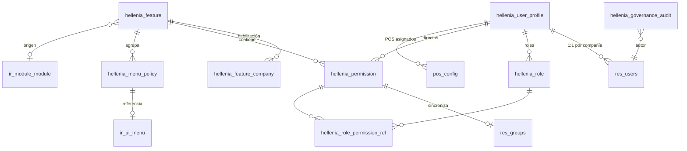
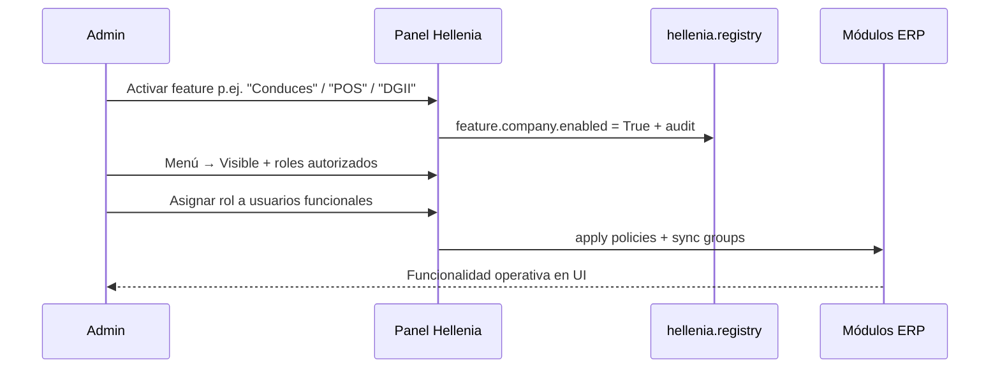
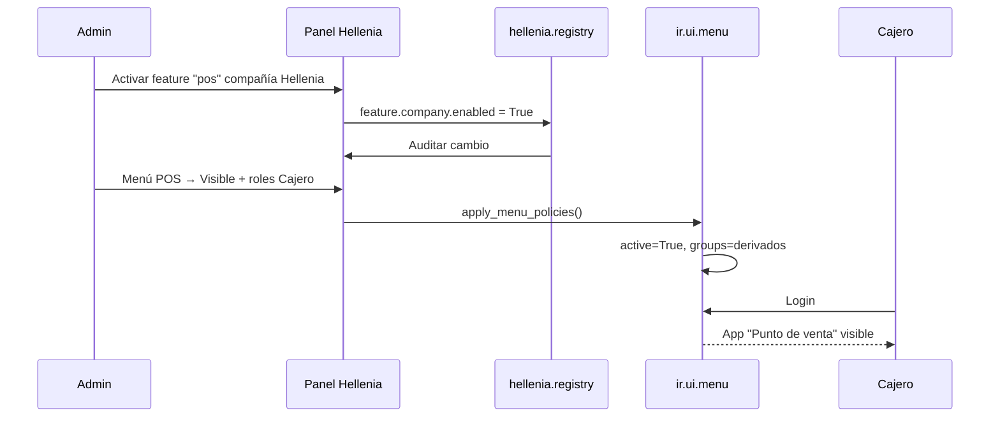

# Arquitectura de Administración Centralizada — Hellenia

**Versión:** 1.1 (diseño)  
**Fecha:** 2026-07-03  
**Estado:** Propuesta oficial — **sin implementación**  
**Alcance:** **Todo el ERP Hellenia** — Odoo Enterprise + ecosistema Justech (`custom/`)  
**Principio rector:** *Ninguna personalización operativa depende de código, XML ni constantes hardcodeadas para activarse o desactivarse.*

---

## 0. Alcance ERP completo (clarificación v1.1)

`hellenia_governance` **no es un módulo orientado al POS**. Es el **panel general de gobierno funcional de todo Hellenia**: la capa administrativa única desde la cual un responsable de negocio controla el ERP completo, sin intervención técnica.

### 0.1 Dominios cubiertos

| Dominio ERP | Ejemplos de gobierno desde el panel |
|-------------|-------------------------------------|
| **Ventas** | Cotizaciones, pedidos, equipos comerciales, descuentos, términos |
| **Facturación** | Facturas cliente/proveedor, notas crédito/débito, políticas fiscales |
| **Contactos** | Alta/edición clientes, RNC, tipos identificación, crédito |
| **Compras** | Órdenes, recepciones, aprobaciones, proveedores |
| **Inventario** | Almacenes, movimientos, entregas, existencias negativas |
| **Contabilidad** | Diarios, pagos, conciliación, cierre periodos |
| **Conduces** | Emisión, impresión, vinculación venta/entrega |
| **Reportes** | PDF/QWeb corporativos, reportes operativos, exportaciones |
| **NCF** | Rangos, consumo, tipos comprobante, asignación |
| **DGII** | 606–609, 623, revisión, aprobación, historial |
| **Retenciones** | Catálogo, aplicación en pagos, cálculo |
| **Auditoría** | Fiscal, POS, consumo NCF, anulados, trazabilidad |
| **POS** | Sesiones, ticket, factura fiscal, conversión tardía |
| **Menús** | Visibilidad, etiquetas, usuarios/grupos autorizados |
| **Usuarios** | Perfiles funcionales, empresa, sucursal, asignaciones |
| **Roles** | Bundles de permisos de negocio por puesto |
| **Permisos funcionales** | Acciones atómicas documentadas con riesgo |
| **Personalizaciones futuras** | Cualquier módulo Justech nuevo se registra aquí |

POS es **un dominio más** dentro del catálogo. El incidente del menú POS ilustra un fallo sistémico (configuración en código) que este diseño elimina para **todos** los dominios.

### 0.2 Qué gobierna vs qué no

| Gobierna (UI admin) | No gobierna (permanece técnico/infra) |
|---------------------|---------------------------------------|
| Habilitar/deshabilitar funcionalidades de negocio | Instalar/desinstalar módulos Odoo (`Apps`) |
| Menús visibles y accesos | Código fuente, Docker, backups |
| Permisos y roles funcionales | Licencia Enterprise |
| Políticas por compañía | `config/*.env`, Traefik, PostgreSQL |
| Auditoría de cambios operativos | Neutralización de BD TEST |

---

## 1. Resumen ejecutivo

Hellenia acumula personalizaciones distribuidas en 13 módulos custom sobre Odoo Enterprise (Ventas, Compras, Inventario, Contabilidad, POS, fiscal DO, reportes). Hoy la configuración operativa está **fragmentada en todo el ERP**:

| Patrón actual | Ejemplo | Problema |
|---------------|---------|----------|
| Listas Python hardcodeadas | `HIDE_MENU_XMLIDS` en `hellenia_ui` | Ocultó POS estando instalado |
| `post_init_hook` irreversible | QR desactivado en todas las compañías | No administrable |
| Campos sueltos en modelos nativos | `res.company.justech_do_fiscal_enabled`, `pos.config.hellenia_invoicing_policy` | Sin catálogo unificado |
| Grupos Odoo técnicos | `group_justech_do_fiscal_manager` | El admin de negocio no entiende permisos |
| Sin `res.config.settings` | Config fiscal abre formulario de compañía | UX inconsistente |
| Instalar módulo = habilitar función | `point_of_sale` instalado pero app oculta | Confusión operativa |

**Solución propuesta:** módulo hub **`hellenia_governance`** — **Centro de Gobierno Funcional Hellenia** — que centraliza para **todo el ERP**: features, menús, permisos de negocio, roles, perfiles de usuario, políticas por compañía y auditoría. Los demás módulos **registran** capacidades al instalarse; el administrador **controla** el ERP desde una sola interfaz.

---

## 2. Objetivos y no-objetivos

### 2.1 Objetivos

1. **Un solo panel** para gobernar todo Hellenia: Ventas, Compras, Inventario, Contabilidad, Fiscal DO, Reportes, POS, Conduces, Retenciones, Auditoría y personalizaciones futuras.
2. Activar/desactivar cualquier funcionalidad Justech **y** políticas nativas relevantes por compañía, sin XML ni código.
3. Administración de **todos los menús** del ERP editable (visible/oculto, usuarios, grupos, motivo).
4. Permisos de **negocio** documentados en todo el ERP (qué hace, qué afecta, riesgos) — no solo POS ni fiscal.
5. Roles y perfiles funcionales de usuario (empresa, almacén, POS, diarios, sucursal) sin editar grupos Odoo manualmente.
6. Auditoría completa de cambios de gobernanza en cualquier dominio.
7. Extensible a futuras personalizaciones sin rediseño arquitectónico.

### 2.2 No-objetivos (v1)

- Reemplazar el sistema de seguridad nativo de Odoo (se **integra**, no se sustituye).
- Desinstalar módulos automáticamente al desactivar una feature (solo oculta/bloquea; desinstalación sigue siendo acción técnica explícita).
- Gestionar licencias Enterprise ni configuración de infraestructura Docker.
- Panel para personalizaciones de terceros fuera de `custom/`.

---

## 3. Decisión de módulo

### 3.1 Nombre y ubicación

| Opción | Veredicto |
|--------|-----------|
| Ampliar `hellenia_base` | ❌ Demasiado genérico; hoy es esqueleto sin semántica |
| Ampliar `hellenia_ui` | ❌ Mezclaría presentación con gobernanza; `hellenia_ui` quedaría como consumidor |
| **Nuevo `hellenia_governance`** | ✅ Hub dedicado, dependencia clara, evolución independiente |

### 3.2 Dependencias propuestas

```
hellenia_base
    └── hellenia_governance
            ├── (consumido por) hellenia_ui
            ├── (consumido por) hellenia_pos
            ├── (consumido por) hellenia_account
            ├── (consumido por) justech_l10n_do_*
            └── ...
```

`hellenia_governance` depende de: `base`, `mail`, `hellenia_base`.  
Opcionalmente `web` para assets OWL del panel.

### 3.3 Relación con `hellenia_ui`

| Responsabilidad | Antes | Después |
|-----------------|-------|---------|
| Etiquetas ES de menús | `hellenia_ui` | `hellenia_ui` (presentación) |
| Ocultar apps | Python hardcodeado | **`hellenia_governance`** (políticas UI) |
| Reorganizar Contabilidad | Python hardcodeado | Políticas + reglas declarativas en DB |
| Integrar menús Justech | Python hardcodeado | Registro automático al instalar módulo fiscal |

`hellenia_ui` pasa a **aplicar** políticas definidas en gobernanza, no a definirlas.

---

## 4. Principios de diseño

### 4.1 Configuración como datos, no como código

```
┌─────────────────┐     registra      ┌──────────────────────┐
│ Módulo feature  │ ────────────────► │ Catálogo (DB)         │
│ (pos, ncf, …)   │   al instalar     │ hellenia.feature      │
└─────────────────┘                   │ hellenia.permission   │
                                      └──────────┬───────────┘
                                                 │
                                      admin edita│
                                                 ▼
                                      ┌──────────────────────┐
                                      │ Panel Administración │
                                      │ Hellenia             │
                                      └──────────┬───────────┘
                                                 │ aplica
                                                 ▼
                                      ┌──────────────────────┐
                                      │ Runtime enforcement  │
                                      │ menús · permisos · UI│
                                      └──────────────────────┘
```

### 4.2 Registro declarativo por módulo (única excepción en código)

Cada módulo feature expone un hook Python **de registro**, no de configuración:

```python
# Ejemplo conceptual — NO implementar aún
def _register_hellenia_governance(env):
    env['hellenia.registry'].register_feature({...})
    env['hellenia.registry'].register_permissions([...])
    env['hellenia.registry'].register_menus([...])
```

- El hook **declara qué existe**, no **cómo está configurado**.
- La configuración (activo/inactivo, visible/oculto) vive en DB y se edita en UI.
- Prohibido: tuplas `HIDE_*`, defaults operativos en constantes, `<function>` XML que oculte menús.

### 4.3 Instalación ≠ habilitación

| Concepto | Significado |
|----------|-------------|
| Módulo instalado (`ir.module.module.state=installed`) | Código disponible en el servidor |
| Feature habilitada (`hellenia.feature.company.enabled=True`) | Funcionalidad operativa para una compañía |
| Menú visible (`hellenia.menu.policy.visibility=visible`) | Aparece en interfaz para usuarios elegibles |
| Permiso concedido | Usuario/rol puede ejecutar acción de negocio |

Un administrador puede tener POS **instalado** pero **deshabilitado** a nivel feature, o habilitado pero **menú oculto** para ciertos usuarios.

### 4.4 Permisos de negocio ↔ grupos Odoo (puente, no duplicación)

Cada permiso de negocio genera/sincroniza un `res.groups` técnico oculto (`hellenia.permission.odoo_group_id`).  
El código existente migra gradualmente de:

```python
self.env.user.has_group('justech_l10n_do_base.group_justech_do_fiscal_manager')
```

a:

```python
self.env.user.has_hellenia_permission('fiscal.void_ncf')
```

Internamente el segundo delega al grupo sincronizado. El administrador nunca ve XML IDs.

### 4.5 Multi-compañía

Toda entidad de gobernanza relevante lleva `company_id` o tabla hija `*.company` para habilitación por compañía.  
Reglas `ir.rule` existentes en módulos fiscales se mantienen; gobernanza añade capa de autorización funcional encima.

---

## 5. Modelo de datos

### 5.1 Diagrama entidad-relación



### 5.2 Modelos nuevos

#### `hellenia.feature` — Catálogo de funcionalidades

| Campo | Tipo | Descripción |
|-------|------|-------------|
| `code` | Char, unique | Clave estable (`pos`, `dgii_reports`, `withholding`, `delivery_notes`) |
| `name` | Char | Nombre visible |
| `description` | Text | Qué hace la funcionalidad |
| `category` | Selection | `sales`, `purchase`, `inventory`, `accounting`, `contacts`, `fiscal`, `ncf`, `dgii`, `withholding`, `pos`, `delivery`, `reports`, `audit`, `menus`, `users`, `admin`, `ux` |
| `module_id` | M2O `ir.module.module` | Módulo Odoo origen |
| `module_names` | Char (computed) | Módulos adicionales requeridos (CSV) |
| `depends_on_ids` | M2M `hellenia.feature` | Dependencias funcionales |
| `risk_level` | Selection | `low`, `medium`, `high`, `critical` |
| `affects_summary` | Html | Módulos/áreas afectadas (Contabilidad, DGII, Inventario…) |
| `risk_summary` | Html | Riesgos operativos/fiscales |
| `is_core` | Boolean | Si False, se puede deshabilitar; core=True solo ocultar menú |
| `sequence` | Integer | Orden en panel |
| `active` | Boolean | Registro archivado |

**Habilitación por compañía:** modelo `hellenia.feature.company`

| Campo | Tipo |
|-------|------|
| `feature_id` | M2O |
| `company_id` | M2O |
| `enabled` | Boolean |
| `enabled_at` | Datetime |
| `enabled_by_id` | M2O res.users |
| `notes` | Text |

#### `hellenia.menu.policy` — Política de menú

| Campo | Tipo | Descripción |
|-------|------|-------------|
| `menu_id` | M2O `ir.ui.menu`, required | Menú objetivo |
| `menu_xmlid` | Char, stored | Respaldo legible (`point_of_sale.menu_point_root`) |
| `feature_id` | M2O `hellenia.feature` | Feature asociada |
| `visibility` | Selection | `visible`, `hidden`, `inherit` |
| `visibility_inherit_id` | M2O self | Si `inherit`, copia reglas de otra política |
| `description` | Text | Motivo de negocio (obligatorio si hidden) |
| `user_ids` | M2M `res.users` | Allow-list adicional |
| `role_ids` | M2M `hellenia.role` | Roles funcionales autorizados |
| `group_ids` | M2M `res.groups` | Grupos Odoo (solo lectura / avanzado) |
| `company_id` | M2O | False = global |
| `label_override` | Char | Etiqueta ES opcional |
| `sequence_override` | Integer | Reordenar sin XML |
| `last_applied_at` | Datetime | Última sincronización a `ir.ui.menu` |

**Comportamiento:** al guardar política, servicio `hellenia.menu.service` aplica:
- `visibility=hidden` → `menu.active=False` + audit
- `visibility=visible` → `menu.active=True` + restricción de grupos derivada de roles/usuarios
- Nunca modifica menús sin registro en `hellenia.menu.policy`

#### `hellenia.permission` — Permiso de negocio

| Campo | Tipo | Descripción |
|-------|------|-------------|
| `code` | Char, unique | `pos.emit_fiscal_invoice`, `fiscal.void_ncf` |
| `name` | Char | Etiqueta corta |
| `description` | Text | Qué permite |
| `explanation_html` | Html | Panel expandido: qué hace, qué afecta, riesgos |
| `feature_id` | M2O | Feature contenedora |
| `category` | Selection | Alineado a feature.category |
| `risk_level` | Selection | |
| `affects_modules` | Char | `account, dgii_607, stock` |
| `odoo_group_id` | M2O `res.groups` | Grupo técnico auto-creado |
| `implies_ids` | M2M self | Jerarquía (manager implica user) |
| `active` | Boolean | |

#### `hellenia.role` — Rol funcional

| Campo | Tipo | Descripción |
|-------|------|-------------|
| `name` | Char | "Cajero POS", "Contador fiscal", "Gerente tienda" |
| `code` | Char | `role_pos_cashier` |
| `description` | Text | |
| `permission_ids` | M2M `hellenia.permission` | Bundle |
| `company_id` | M2O | Opcional multi-compañía |
| `active` | Boolean | |

#### `hellenia.user.profile` — Perfil funcional de usuario

Un registro por `(user_id, company_id)`.

| Campo | Tipo | Descripción |
|-------|------|-------------|
| `user_id` | M2O `res.users` | |
| `company_id` | M2O `res.company` | |
| `role_ids` | M2M `hellenia.role` | |
| `permission_ids` | M2M `hellenia.permission` | Grants directos (excepciones) |
| `denied_permission_ids` | M2M `hellenia.permission` | Deny explícito (override) |
| `pos_config_ids` | M2M `pos.config` | POS asignados |
| `warehouse_id` | M2O `stock.warehouse` | Almacén por defecto |
| `journal_ids` | M2M `account.journal` | Diarios permitidos |
| `branch_name` | Char | Sucursal (texto hasta existir modelo branch) |
| `notes` | Text | |
| `effective_permission_ids` | M2M computed | roles + directos − denied |

**Sincronización:** al guardar perfil, servicio `hellenia.user.service` recalcula `res.users.groups_id` para grupos gestionados por gobernanza (sin tocar grupos nativos Odoo no mapeados).

#### `hellenia.governance.audit` — Auditoría

| Campo | Tipo |
|-------|------|
| `event_type` | Selection: `feature`, `menu`, `permission`, `role`, `user_profile` |
| `resource_model` | Char |
| `resource_id` | Integer |
| `resource_display` | Char |
| `field_name` | Char |
| `old_value` | Text |
| `new_value` | Text |
| `user_id` | M2O |
| `company_id` | M2O |
| `ip_address` | Char |
| `user_agent` | Char |
| `change_reason` | Text (opcional, obligatorio si risk_level=critical) |

Implementación técnica: mixin `hellenia.governance.audit.mixin` en modelos de gobernanza + captura IP desde `request.httprequest` en controllers.

#### `hellenia.registry` — AbstractModel (servicio)

No persiste datos. API central:

| Método | Propósito |
|--------|-----------|
| `register_feature(vals)` | Idempotente por `code` |
| `register_permission(vals)` | Crea/actualiza catálogo |
| `register_menu_policy(vals)` | Seed inicial de menú |
| `register_role(vals)` | Roles predefinidos |
| `is_feature_enabled(code, company=None)` | Runtime |
| `check_permission(code, raise=True)` | Runtime |
| `apply_menu_policies(company=None)` | Sincroniza menús |

---

## 6. Catálogo inicial de features (inventario ERP completo)

Registro seed al migrar módulos existentes y apps Odoo relevantes. Cada fila es una **funcionalidad administrable** desde el panel, independiente de si el módulo Odoo subyacente está instalado.

### 6.1 Ventas y comercial

| code | name | Origen | Notas |
|------|------|--------|-------|
| `sales_quotations` | Cotizaciones | `sale_management` | Crear/editar/enviar cotizaciones |
| `sales_orders` | Pedidos de venta | `sale_management` | Confirmación, entrega, facturación |
| `sales_teams` | Equipos comerciales | `sale_management` | |
| `sales_discounts` | Descuentos en ventas | `sale` + UX Hellenia | Política descuento por rol |
| `sales_terms` | Términos comerciales | `hellenia_reports` | Términos cotización/factura |

### 6.2 Contactos

| code | name | Origen | Notas |
|------|------|--------|-------|
| `contacts_customers` | Clientes | `contacts` | Alta/edición |
| `contacts_suppliers` | Proveedores | `contacts` | |
| `contacts_rnc_validation` | Validación RNC | `justech_l10n_do_base` | Tipos ID DGII |
| `contacts_credit_policy` | Política crédito | `account` | Límites, bloqueo |

### 6.3 Compras

| code | name | Origen | Notas |
|------|------|--------|-------|
| `purchase_orders` | Órdenes de compra | `purchase` | |
| `purchase_receipts` | Recepciones compra | `purchase_stock` | |
| `purchase_bills` | Facturas proveedor | `account` + fiscal | NCF compras B11/B13 |

### 6.4 Inventario

| code | name | Origen | Notas |
|------|------|--------|-------|
| `inventory_operations` | Operaciones inventario | `stock` | Entregas, recepciones, traslados |
| `inventory_adjustments` | Ajustes inventario | `stock` | |
| `inventory_negative` | Venta/compra sin existencia | `stock` + POS | Política global |
| `inventory_barcode` | Código de barras | `stock_barcode` | Oculto hoy vía hellenia_ui |

### 6.5 Contabilidad y facturación

| code | name | Origen | Notas |
|------|------|--------|-------|
| `accounting_invoicing` | Facturación | `account` | Facturas cliente/proveedor |
| `accounting_payments` | Pagos | `hellenia_account` | Wizard pagos Hellenia |
| `accounting_journals` | Diarios contables | `account` | Restricción por perfil |
| `accounting_closing` | Cierre contable | `account` | |
| `accounting_dashboard` | Tablero contable | `account` | Reorganizado por hellenia_ui |

### 6.6 Fiscal DO — NCF, DGII, retenciones

| code | name | Origen | Notas |
|------|------|--------|-------|
| `fiscal_core` | Facturación Fiscal DO | `justech_l10n_do_base` | Reemplaza `justech_do_fiscal_enabled` |
| `ncf_management` | Gestión NCF | `justech_l10n_do_ncf` | Rangos, consumo, asignación |
| `ncf_void` | Anulación NCF | `justech_l10n_do_ncf` | Sub-feature crítica |
| `dgii_reports` | Reportes DGII | `justech_l10n_do_reports` | 606–609, 623 |
| `dgii_approval` | Bandeja aprobación DGII | `justech_l10n_do_reports` | |
| `withholding` | Retenciones | `hellenia_account` | Catálogo + wizard pagos |
| `fiscal_audit` | Auditoría fiscal | `justech_l10n_do_reports` | Consumo, anulados, historial |

### 6.7 Conduces y reportes

| code | name | Origen | Notas |
|------|------|--------|-------|
| `delivery_notes` | Conduces de entrega | `justech_report_design` | |
| `custom_reports` | Reportes PDF corporativos | `hellenia_reports` + `justech_report_design` | |
| `report_exports` | Exportaciones Excel DGII | `justech_l10n_do_reports` | |

### 6.8 POS (un dominio entre otros)

| code | name | Origen | Notas |
|------|------|--------|-------|
| `pos` | Punto de Venta | `point_of_sale` + `hellenia_pos` | |
| `pos_ticket_only` | Ticket solamente | `hellenia_pos` | |
| `pos_fiscal_invoice` | Factura fiscal POS | `hellenia_pos` | |
| `pos_late_conversion` | Conversión Ticket → Factura | `hellenia_pos` | |
| `pos_audit` | Auditoría POS fiscal | `hellenia_pos` | |

### 6.9 Plataforma y administración

| code | name | Origen | Notas |
|------|------|--------|-------|
| `menu_customization` | Menús personalizados | `hellenia_ui` | Políticas migradas de Python |
| `branding` | Branding documentos | `hellenia_reports` | QR, colores, términos |
| `governance_panel` | Panel Administración Hellenia | `hellenia_governance` | Meta-feature |
| `ux_fiscal_labels` | Etiquetas fiscales UX | `hellenia_ux` | |

---

## 7. Catálogo inicial de permisos de negocio (ERP completo)

Los permisos son **atómicos**, agrupables en roles, y aplican en backend + frontend. El catálogo inicial cubre todo Hellenia; POS y fiscal son subconjuntos, no el foco exclusivo.

### 7.1 Ventas y cotizaciones

| code | name | Afecta | Riesgo |
|------|------|--------|--------|
| `sales.create_quotation` | Crear cotización | Ventas | Bajo |
| `sales.confirm_quotation` | Confirmar cotización → pedido | Ventas, Inventario | Medio |
| `sales.apply_discount` | Aplicar descuento | Margen | Medio |
| `sales.override_price` | Modificar precio unitario | Margen | Medio |
| `sales.cancel_order` | Cancelar pedido | Inventario, Ventas | Medio |
| `sales.view_margin` | Ver margen/costos | Finanzas | Medio |

### 7.2 Contactos

| code | name | Afecta | Riesgo |
|------|------|--------|--------|
| `contacts.create_customer` | Crear cliente | Contactos, DGII | Bajo |
| `contacts.edit_rnc` | Editar RNC/identificación | DGII, 607 | Alto |
| `contacts.override_credit_limit` | Exceder límite crédito | Cobranza | Alto |

### 7.3 Compras

| code | name | Afecta | Riesgo |
|------|------|--------|--------|
| `purchase.create_po` | Crear orden compra | Compras | Bajo |
| `purchase.confirm_po` | Confirmar orden | Compromiso proveedor | Medio |
| `purchase.validate_bill` | Validar factura proveedor | Contabilidad, 606 | Alto |

### 7.4 Inventario

| code | name | Afecta | Riesgo |
|------|------|--------|--------|
| `inventory.validate_picking` | Validar albarán | Stock, Valoración | Medio |
| `inventory.force_availability` | Forzar disponibilidad | Stock | Alto |
| `inventory.adjust_quantity` | Ajuste manual cantidad | Inventario, Contabilidad | Alto |
| `inventory.change_lot_serial` | Cambiar lote/serie | Trazabilidad | Alto |

### 7.5 Contabilidad y facturación

| code | name | Afecta | Riesgo |
|------|------|--------|--------|
| `account.post_invoice` | Publicar factura | Contabilidad, NCF | Alto |
| `account.cancel_invoice` | Cancelar factura | Contabilidad, DGII | Crítico |
| `account.register_payment` | Registrar pago | Tesorería | Medio |
| `account.change_journal` | Cambiar diario contable | Contabilidad | Alto |
| `account.reconcile` | Conciliar extractos | Bancos | Medio |

### 7.6 Conduces y reportes

| code | name | Afecta | Riesgo |
|------|------|--------|--------|
| `ops.use_delivery_notes` | Emitir Conduce | Ventas, Inventario | Bajo |
| `ops.print_delivery_note` | Imprimir Conduce | Reportes | Bajo |
| `reports.export_dgii` | Exportar reporte DGII | DGII | Alto |
| `reports.approve_custom` | Aprobar reporte personalizado | Auditoría | Medio |

### 7.7 POS

| code | name | Afecta | Riesgo |
|------|------|--------|--------|
| `pos.open_session` | Abrir sesión POS | POS, Caja | Medio — afecta arqueo |
| `pos.close_session` | Cerrar caja | POS, Contabilidad | Alto |
| `pos.reopen_session` | Reabrir caja | POS, Auditoría | Crítico |
| `pos.emit_ticket` | Vender solo Ticket | POS | Bajo — sin NCF |
| `pos.emit_fiscal_invoice` | Emitir factura fiscal desde POS | POS, NCF, 607, Contabilidad | Alto — consume secuencia |
| `pos.convert_ticket_to_invoice` | Convertir Ticket → Factura | POS, NCF, Auditoría | Alto |
| `pos.change_invoicing_policy` | Cambiar política POS | Config POS | Crítico |
| `pos.edit_price` | Editar precio en POS | Ventas, Margen | Medio |
| `pos.sell_without_stock` | Vender sin existencia | Inventario | Medio |
| `pos.create_customer` | Crear clientes desde POS | Contactos | Bajo |
| `pos.change_journal` | Cambiar diario POS | Contabilidad | Alto |
| `pos.view_audit_log` | Ver auditoría POS fiscal | Auditoría | Bajo |

### 7.8 Fiscal / NCF

| code | name | Afecta | Riesgo |
|------|------|--------|--------|
| `fiscal.assign_ncf` | Asignar NCF | NCF, DGII | Alto |
| `fiscal.modify_ncf` | Modificar NCF | DGII, Auditoría | Crítico |
| `fiscal.void_ncf` | Anular NCF | 608, Auditoría | Crítico |
| `fiscal.change_document_type` | Cambiar tipo comprobante | DGII | Alto |
| `fiscal.use_b14` | Usar comprobante B14 | DGII | Medio |
| `fiscal.manage_ranges` | Administrar rangos NCF | NCF | Crítico |
| `fiscal.approve_dgii_report` | Aprobar reporte DGII | 606–623 | Crítico |
| `fiscal.reject_dgii_report` | Rechazar reporte DGII | 606–623 | Alto |

### 7.9 Retenciones y tesorería

| code | name | Afecta | Riesgo |
|------|------|--------|--------|
| `ops.manage_withholding` | Administrar catálogo retenciones | Pagos, 606 | Alto |
| `ops.apply_withholding` | Aplicar retención en pago | 606, Tesorería | Alto |
| `ops.override_payment_method` | Métodos de pago especiales | Tesorería | Medio |
| `ops.issue_credit_note` | Emitir nota crédito / devolución | Contabilidad, NCF | Alto |

### 7.10 Gobernanza y administración

| code | name | Afecta | Riesgo |
|------|------|--------|--------|
| `governance.admin` | Administrar panel Hellenia | Todo el ERP | Crítico |
| `governance.manage_menus` | Gestionar visibilidad menús | UX, Accesos | Alto |
| `governance.manage_roles` | Gestionar roles funcionales | Seguridad | Crítico |
| `governance.manage_users` | Gestionar perfiles usuarios | Seguridad | Crítico |
| `governance.view_audit` | Ver auditoría gobernanza | Compliance | Medio |

Cada registro incluye `explanation_html` con el formato solicitado (qué hace / qué afecta / riesgo). El panel permite **buscar y filtrar** permisos por dominio ERP.

---

## 8. Roles funcionales predefinidos (seed)

Roles de **negocio** transversales al ERP. Editables y extensibles desde el panel.

| code | name | Dominio | Permisos incluidos (resumen) |
|------|------|---------|-------------------------------|
| `role_sales_rep` | Vendedor | Ventas | cotización, pedido, cliente, conduce |
| `role_sales_manager` | Gerente ventas | Ventas | + descuentos, margen, cancelación |
| `role_purchase_clerk` | Auxiliar compras | Compras | PO, recepción |
| `role_purchase_manager` | Gerente compras | Compras | + confirmar, validar factura |
| `role_warehouse_user` | Almacenista | Inventario | albaranes, ajustes básicos |
| `role_warehouse_manager` | Jefe almacén | Inventario | + forzar disponibilidad, ajustes |
| `role_accountant` | Contador | Contabilidad | facturas, pagos, conciliación |
| `role_fiscal_clerk` | Auxiliar fiscal | Fiscal | assign_ncf, conduces, reportes lectura |
| `role_fiscal_manager` | Contador fiscal | Fiscal | + void_ncf, rangos, aprobar DGII |
| `role_treasury` | Tesorería | Pagos | retenciones, métodos pago |
| `role_pos_cashier` | Cajero POS | POS | ticket, sesión, cliente |
| `role_pos_supervisor` | Supervisor POS | POS | + factura fiscal, conversión, cierre |
| `role_pos_manager` | Gerente POS | POS | + política, reabrir caja, precio |
| `role_governance_admin` | Administrador Hellenia | Plataforma | acceso total panel gobernanza |

Los roles son plantillas; el panel permite crear roles custom combinando permisos de **cualquier dominio**.

---

## 9. Vistas y UX del panel

### 9.1 Aplicación / menú raíz

**Nombre:** Administración Hellenia — *Centro de Gobierno Funcional*  
**Ubicación:** Menú raíz propio (icono engranaje + bandera Hellenia) **o** hijo prominente de Configuración — decisión UX en Fase 1.  
**Grupo requerido:** permiso `governance.admin` (equivalente a `role_governance_admin`).

### 9.2 Estructura de pantallas

```
Administración Hellenia (Centro de Gobierno Funcional del ERP)
├── Tablero (dashboard)
│   ├── Resumen por dominio: Ventas | Compras | Inventario | Fiscal | POS | …
│   ├── Features activas/inactivas por compañía
│   ├── Alertas (menú oculto vs feature activa, permisos críticos, inconsistencias)
│   └── Accesos rápidos
├── Funcionalidades (hellenia.feature)
│   ├── Kanban / lista filtrable por dominio ERP
│   ├── Form: enable/disable por compañía, dependencias, riesgos
│   └── Smart button → permisos y menús relacionados
├── Menús (hellenia.menu.policy)
│   ├── Árbol completo del ERP (no solo POS)
│   ├── Lista: Menú | App | Visible | Feature | Motivo | Compañía
│   └── Form: usuarios, roles, grupos, preview
├── Permisos (hellenia.permission)
│   ├── Lista por dominio ERP (Ventas, Compras, Fiscal, POS, …)
│   └── Form: explicación HTML, usuarios/roles con permiso
├── Roles (hellenia.role)
│   └── Matriz permisos multi-dominio + explicación expandible
├── Usuarios funcionales (hellenia.user.profile)
│   ├── Lista: Usuario | Empresa | Roles | Almacén | POS | Diarios
│   └── Form: permisos efectivos computed + overrides
└── Auditoría (hellenia.governance.audit)
    ├── Filtro por dominio, usuario, tipo cambio
    └── Form readonly
```

### 9.3 Ejemplo UI — Menú (mock genérico; aplica a cualquier app)

```
┌─────────────────────────────────────────────────────────────┐
│ Punto de Venta                          [point_of_sale.*]  │
├─────────────────────────────────────────────────────────────┤
│ Visible:  (●) Sí  ( ) Oculto  ( ) Heredar                  │
│ Feature:  Punto de Venta                                   │
│ Motivo:   Permite vender desde caja.                       │
│                                                             │
│ Usuarios autorizados          [+ Añadir]                  │
│   • Juan Pérez                                              │
│   • Pedro Gómez                                             │
│                                                             │
│ Roles autorizados             [+ Añadir]                  │
│   • Cajero POS                                              │
│   • Supervisor POS                                          │
│                                                             │
│ ⚠ Si ocultas este menú con POS habilitado, los cajeros     │
│   no verán la app aunque tengan permisos.                  │
└─────────────────────────────────────────────────────────────┘
```

### 9.4 Ejemplos UI — Permisos (mock; distintos dominios)

**Fiscal — Anular NCF**
```
Permite anular un NCF ya emitido.  Afecta: 608, Auditoría.  Riesgo: Crítico.
```

**Ventas — Confirmar cotización**
```
Convierte cotización en pedido.  Afecta: Inventario, Entregas.  Riesgo: Medio.
```

**POS — Emitir factura fiscal** *(ejemplo ilustrativo, no exclusivo del panel)*
```
Convierte venta POS en factura NCF.  Afecta: Contabilidad, 607.  Riesgo: Alto.
```

---

## 10. Seguridad

### 10.1 Grupos Odoo del módulo governance

| XML ID | Propósito |
|--------|-----------|
| `hellenia_governance.group_governance_user` | Solo lectura panel |
| `hellenia_governance.group_governance_manager` | Editar roles, perfiles, menús |
| `hellenia_governance.group_governance_admin` | Editar features, permisos críticos |

### 10.2 Reglas de acceso (`ir.model.access`)

- Usuario governance: read en catálogos, read en auditoría.
- Manager: CRUD en menu.policy, user.profile, role (no permission.feature write).
- Admin: CRUD total excepto borrar permisos core con dependientes activos.

### 10.3 Reglas de negocio (constraints)

1. No deshabilitar `fiscal_core` si existen movimientos NCF publicados (wizard confirmación).
2. Ocultar menú raíz POS requiere `description` no vacío.
3. Permisos `critical` requieren `change_reason` en auditoría.
4. Usuario no puede auto-asignarse permisos críticos sin ser governance admin.
5. `hellenia.user.profile` no puede otorgar permiso si feature deshabilitada en compañía.

### 10.4 Record rules multi-compañía

- `hellenia.feature.company`, `hellenia.menu.policy`, `hellenia.user.profile`: dominio `[('company_id', 'in', company_ids + [False])]`.
- Auditoría: managers ven su compañía; admin ve todo.

### 10.5 Integración IP

Extender `ir.http` o usar middleware en `hellenia.governance.controller` para capturar IP en writes. En cron/server actions sin request, IP = `system`.

---

## 11. Flujos operativos

### 11.1 Habilitar una funcionalidad ERP (patrón general)

Todo dominio sigue el mismo flujo: feature → menú → permisos → rol → usuario.



### 11.2 Habilitar Punto de Venta (caso ilustrativo — mismo patrón que cualquier app)



### 11.3 Asignar usuario funcional (cualquier rol: vendedor, cajero, contador…)

1. Admin crea usuario Odoo básico (`base.group_user`).
2. En Usuarios funcionales: crear perfil → rol `Cajero POS` → POS `Punto de Venta Hellenia`.
3. Al guardar: sincronización de grupos + validación feature `pos` activa.
4. Usuario ve app POS si menú visible.

### 11.4 Desactivar sub-funcionalidad sin desinstalar módulo (ej. factura fiscal POS)

1. Feature `pos_fiscal_invoice` → disabled por compañía.
2. Runtime: OWL PaymentScreen oculta/bloquea checkbox Factura vía `check_permission`.
3. Permiso removido de roles afectados (opcional, wizard).

### 11.5 Instalación de módulo nuevo Justech (futuro)

1. Desarrollador implementa `_register_hellenia_governance()` en `post_init_hook`.
2. Hook registra feature + permisos + menús seed (visibilidad default según plantilla).
3. Admin recibe notificación en tablero: "Nueva funcionalidad registrada: X — revisar y habilitar".
4. Admin configura desde panel; **cero XML operativo**.

---

## 12. Enforcement en runtime

### 12.1 Backend (Python)

```python
# API pública conceptual
self.env['hellenia.registry'].is_feature_enabled('pos')
self.env.user.has_hellenia_permission('pos.emit_fiscal_invoice')
```

Puntos de integración (ERP completo):

| Módulo / app | Dominio | Hook |
|--------------|---------|------|
| `sale` / `hellenia_ux` | Ventas | confirmación, descuentos, cotización |
| `purchase` | Compras | confirm PO, bill validation |
| `stock` / `hellenia_inventory` | Inventario | picking validate, negative stock |
| `account` / `hellenia_account` | Contabilidad | post invoice, payments, withholding |
| `justech_l10n_do_base` | Fiscal | fiscal_enabled, partner ID |
| `justech_l10n_do_ncf` | NCF | `_post`, void wizard, ranges |
| `justech_l10n_do_reports` | DGII | approve/reject, export |
| `justech_report_design` | Conduces | delivery note create/print |
| `hellenia_reports` | Reportes | branding, QR, PDF |
| `hellenia_pos` | POS | PaymentScreen, audit, conversion |
| `hellenia_ui` | Menús | apply policies (reemplaza HIDE_*) |
| `contacts` | Contactos | RNC edit, credit override |

### 12.2 Frontend (OWL)

Servicio `@hellenia/governance_service` en **todo el frontend custom** (POS, facturas, pagos, cotizaciones, wizard DGII):

```javascript
// Conceptual
const governance = useService("hellenia_governance");
const canInvoice = governance.hasPermission("pos.emit_fiscal_invoice");
```

Cache por sesión POS, invalidado en login y al cambiar perfil.

### 12.3 Menús

`hellenia_ui.menu.customizer.apply_all()` **deprecado**. Reemplazado por:

```python
env['hellenia.menu.service'].apply_all_policies()
```

Llamado:
- Al guardar `hellenia.menu.policy`
- Al cambiar feature enabled/disabled
- Post-init governance (migración única)

**Etiquetas ES:** migrar a campo `label_override` en política o tabla `hellenia.menu.label` — elimina diccionarios Python `MENU_LABELS_ES`.

---

## 13. Compatibilidad y coexistencia

### 13.1 Odoo 19 Enterprise

- Compatible con grupos Enterprise existentes.
- No modifica módulos Enterprise; solo consume `ir.ui.menu` y `res.groups`.
- POS, Accounting EE siguen funcionando; gobernanza es capa adicional.

### 13.2 Periodo de transición (dual mode)

Durante migración, flag técnico `hellenia_governance.legacy_mode` en `ir.config_parameter` (único uso permitido del parámetro):

| legacy_mode | Comportamiento |
|-------------|----------------|
| `True` | `hellenia_ui` Python legacy activo; panel governance en shadow (solo lectura) |
| `False` | Solo políticas DB; Python `HIDE_*` ignorado |

Permite rollback sin redeploy.

### 13.3 Tests

- Tests unitarios por servicio registry, sync grupos, apply menus.
- Tests integración: feature off → acción bloqueada; menu hidden → no en `menu_root`.
- Actualizar scripts UAT (`phase29e*`) para validar governance state explícitamente.

---

## 14. Riesgos y mitigaciones

| Riesgo | Impacto | Mitigación |
|--------|---------|------------|
| Desincronización grupos Odoo ↔ permisos | Usuario sin acceso o con exceso | Job reconciliación nocturna; botón "Re-sincronizar" en perfil |
| Performance al cargar menús | Login lento | Cache `ormcache` por `(user, company)`; invalidar en write policy |
| Admin oculta menú crítico por error | Operación bloqueada | Alertas tablero; permiso critical requiere motivo; auditoría |
| Feature off pero código ejecuta | Bug fiscal | Decorador `@requires_feature` en métodos críticos |
| Migración incompleta | Comportamiento mixto legacy/DB | `legacy_mode` + reporte diff pre-cutover |
| Multi-compañía inconsistente | Permisos cruzados | Record rules estrictas; tests por compañía |
| Dependencias circulares features | Deadlock enable | Topological sort en `register_feature`; UI muestra cadena |

---

## 15. Plan de implementación por fases

### Fase G0 — Aprobación diseño ✅ (este documento)

Entregable: arquitectura aprobada por stakeholders.

### Fase G1 — Fundación (2–3 semanas)

- Crear módulo `hellenia_governance` (modelos feature, audit, registry skeleton).
- Grupos seguridad + menú panel vacío.
- Auditoría funcionando en feature.company.
- **Sin cambiar módulos existentes.**

### Fase G2 — Registro y catálogo (2 semanas)

- Implementar `register_*` API.
- Scripts migración seed: importar inventario §6 y §7.
- Pantalla Funcionalidades (read/write enable por compañía).
- Tests catálogo.

### Fase G3 — Administración de menús (2–3 semanas)

- Modelo `hellenia.menu.policy` + servicio apply.
- UI Menús completa.
- Migrar `HIDE_MENU_XMLIDS` → registros DB (equivalente 1:1).
- `legacy_mode=True`; panel y legacy en paralelo.
- **Validación TEST:** POS visible al marcar política visible.

### Fase G4 — Permisos de negocio (3 semanas)

- Modelo permission + sync grupos.
- UI Permisos con explicación HTML.
- API `has_hellenia_permission`.
- Migrar 2–3 permisos piloto (`fiscal.void_ncf`, `pos.emit_fiscal_invoice`).

### Fase G5 — Roles y usuarios funcionales (2–3 semanas)

- Modelos role + user.profile.
- UI Usuarios funcionales.
- Sincronización grupos.
- Plantillas roles §8.

### Fase G6 — Integración módulos (4–6 semanas, paralelizable)

Por módulo:

| Módulo | Trabajo |
|--------|---------|
| `hellenia_ui` | Consumir menu.service; eliminar `HIDE_*`; deprecar apply hardcoded |
| `hellenia_pos` | Permisos POS; feature sub-switches; quitar dependencia policy solo en pos.config |
| `justech_l10n_do_base` | Feature fiscal_core; permisos base |
| `justech_l10n_do_ncf` | Permisos NCF; `@requires_feature` |
| `justech_l10n_do_reports` | Permisos DGII |
| `hellenia_account` | Feature withholding |
| `justech_report_design` | Feature delivery_notes |
| `hellenia_ux` | Eliminar post_init QR forzado → feature branding |

### Fase G7 — Cutover y deprecación legacy (1 semana)

- Checklist diff legacy vs DB.
- `legacy_mode=False` en TEST → UAT completo.
- Promoción PROD con rollback plan.
- Eliminar código muerto `HIDE_MENU_XMLIDS`, hooks QR forzados.

### Fase G8 — Gobernanza continua (ongoing)

- Checklist PR: "¿Registraste feature/permisos en governance?"
- Documento `CUSTOM_MODULE_GUIDE.md` actualizado.
- Lint CI: detectar tuplas `HIDE_*` nuevas en custom/.

---

## 16. Plan de migración detallado (estado actual → objetivo)

### 16.1 Menús (`hellenia_ui`)

| XML ID actual (HIDE) | Política migrada | visibility default | Motivo seed |
|----------------------|------------------|--------------------|-------------|
| `point_of_sale.menu_point_root` | Sí | **visible** (corregir estado TEST) | Ventas en caja |
| `point_of_sale.menu_point_ofsale` | Sí | hidden | Duplicado órdenes |
| `crm.crm_menu_root` | Sí | hidden | Fuera alcance Hellenia |
| … (resto 18 entradas) | Sí | hidden | Fuera alcance Hellenia |

Acción post-migración TEST: política POS → visible + roles a definir por admin.

### 16.2 Features derivadas de campos existentes

| Campo actual | Feature destino | Acción |
|--------------|-----------------|--------|
| `res.company.justech_do_fiscal_enabled` | `fiscal_core` | Related/computed bridge; campo deprecado |
| `pos.config.hellenia_invoicing_policy` | Permanece UI POS **pero** gated by `pos.change_invoicing_policy` | |
| `account.journal.justech_do_use_ncf` | Permiso `fiscal.assign_ncf` + config journal | |
| `res.company.hellenia_show_qr_on_invoice` | Feature `branding` sub-option | Desbloquear campo oculto por UX |
| post_init QR=false | Eliminar; default via feature | |

### 16.3 Grupos Justech existentes

| Grupo Odoo actual | Rol governance |
|-------------------|----------------|
| `group_justech_do_fiscal_user` | → permisos fiscal subset |
| `group_justech_do_fiscal_manager` | → role_fiscal_manager |
| `point_of_sale.group_pos_*` | → roles POS (mapeo) |

Estrategia: grupos legacy siguen existiendo; roles governance los incluyen en `implied` hasta cutover.

### 16.4 Script migración (una vez, Fase G3)

```
scripts/governance-migrate-menus.py
scripts/governance-seed-features.py
scripts/governance-map-groups.py
```

Ejecutar en TEST → validar → PROD. Solo lectura previa obligatoria (auditoría actual).

### 16.5 Criterios de éxito migración

- [ ] Cero entradas en `HIDE_MENU_XMLIDS` activas con `legacy_mode=False`
- [ ] POS visible en TEST cuando admin lo configure
- [ ] Toda personalización listada en §6 tiene registro `hellenia.feature`
- [ ] Toda acción fiscal crítica pasa por `has_hellenia_permission`
- [ ] Auditoría registra cambio visible/oculto menú POS con usuario e IP
- [ ] UAT 29E.2 pasa **después** de habilitar feature+menú desde panel

---

## 17. Convenciones para futuros módulos Justech

Todo módulo nuevo en `custom/` debe:

1. Depender de `hellenia_governance`.
2. Implementar `_register_hellenia_governance(env)` en post_init.
3. **No** incluir listas de menús ocultos ni toggles en constantes.
4. Documentar permisos en manifest key `hellenia_permissions` (metadata para CI).
5. Usar `@requires_feature('code')` en métodos de negocio.
6. Exponer strings de riesgo en registro de permiso, no en comentarios código.

---

## 18. Preguntas abiertas (decisión antes de G1)

| # | Pregunta | Opciones | Recomendación |
|---|----------|----------|---------------|
| 1 | ¿App raíz propia o bajo Configuración? | Raíz / Configuración | Raíz si multi-admin operativo; Configuración si solo IT |
| 2 | ¿Deshabilitar feature bloquea cron/reportes? | Hard block / Soft hide | Hard block en acciones; soft en UI |
| 3 | ¿Sucursal como modelo propio? | Char / `hellenia.branch` | Char v1; modelo v2 si multi-sucursal formal |
| 4 | ¿Quién puede ver auditoría IP? | Solo governance admin | Sí — dato sensible |
| 5 | ¿Permitir deny explícito en perfil? | Sí / No | Sí — excepciones gerenciales |

---

## 19. Referencias internas

- Inventario módulos: `custom/` (13 módulos)
- Incidente origen: menú POS id 391 `active=false` por `hellenia_ui.menu_customizer`
- Arquitectura infra: `docs/ARCHITECTURE.md`
- Matriz acceso actual: `docs/USER_ACCESS_MATRIX.md`
- Guía módulos custom: `docs/CUSTOM_MODULE_GUIDE.md` (actualizar en G8)

---

## 20. Conclusión

`hellenia_governance` es el **Centro de Gobierno Funcional de todo el ERP Hellenia** — no un addon de POS ni solo de fiscalidad. Unifica en una sola interfaz administrativa: Ventas, Cotizaciones, Contactos, Compras, Inventario, Contabilidad, Conduces, Reportes, NCF, DGII, Retenciones, Auditoría, POS, Menús, Usuarios, Roles y Permisos funcionales.

El incidente del menú POS oculto demuestra un anti-patrón general (`HIDE_MENU_XMLIDS`, toggles en código) que este diseño erradica **para todos los dominios**: cada personalización Justech se **registra** una vez en código y se **administra** para siempre desde UI.

**Próximo paso:** aprobación de este documento → Fase G1 en rama dedicada → migración progresiva dominio por dominio (sin cutover legacy hasta G7).

---

## 21. Anexo — Workaround transitorio TEST: menú POS (pendiente aprobación)

**Problema actual:** `hellenia_ui.hide_unused_menus()` desactiva `point_of_sale.menu_point_root` (id 391, `active=false`) en `hellenia_test`. El módulo POS está instalado pero el icono no aparece.

**Contexto técnico:** `apply_all()` se ejecuta al **instalar/actualizar** `hellenia_ui` o `hellenia_ux` (vía `data/menu_labels.xml` y `data/post_init.xml`), **no** en cada reinicio de Odoo. Si el menú se reactiva manualmente, permanece visible hasta el próximo `-u hellenia_ui` o `-u hellenia_ux`.

### 21.1 Comparativa de opciones (solo TEST)

| Criterio | A — SQL/ORM en BD | B — Modificar `hellenia_ui` | C — Política transitoria documentada |
|----------|-------------------|----------------------------|--------------------------------------|
| Alcance | Solo `hellenia_test` | Código en repo → afecta DEV al deploy | Depende implementación |
| Deploy código | No | Sí + `-u hellenia_ui` | Sin governance: = A + runbook |
| Reversible | Sí (1 UPDATE) | Revert git + `-u` | Sí |
| Toca PROD | No | No (si no deploy PROD) | No |
| Toca NCF/DGII/reportes | No | No | No |
| Elimina `hellenia_ui` | No | No | No |
| Riesgo re-ocultar | Al `-u hellenia_ui/ux` | No (si se quita de HIDE list) | Igual que A |
| Alineado arquitectura v1.1 | No (deuda técnica) | No (deuda en código) | Puente hacia G3 |

### 21.2 Recomendación: **Opción A**

**Opción A es la más segura para TEST** porque:

1. **Cero cambios de código** — cumple restricción de no tocar lógica POS, NCF, DGII, reportes, QWeb.
2. **Aislamiento total** — solo BD `hellenia_test`; PROD y DEV intactos.
3. **Mínima y reversible** — un `UPDATE` (o write ORM) + rollback documentado.
4. **Sin deploy** — no arrastra efectos colaterales a otros ambientes.
5. **No modifica `hellenia_ui`** — el módulo sigue igual; solo se corrige el **estado** del menú en TEST.

**Acción propuesta (tras tu aprobación):**

```sql
-- hellenia_test only
UPDATE ir_ui_menu SET active = true
WHERE id = (
  SELECT res_id FROM ir_model_data
  WHERE module = 'point_of_sale' AND name = 'menu_point_root'
);
```

Alternativa equivalente vía Odoo shell (preferible: pasa por ORM y invalida cache):

```python
menu = env.ref('point_of_sale.menu_point_root')
menu.active = True
env.cr.commit()
```

**Precaución:** evitar `-u hellenia_ui` o `-u hellenia_ux` en TEST durante la validación POS; esas operaciones re-ejecutan `hide_unused_menus()` y volverían a ocultar el icono.

**Rollback:**

```sql
UPDATE ir_ui_menu SET active = false WHERE id = 391;
```

### 21.3 Por qué no B ni C en este momento

- **Opción B** introduce cambio en repo compartido, requiere deploy y update de módulo, y al quitar POS de `HIDE_MENU_XMLIDS` afectaría **todos** los ambientes que reciban ese código (incluido DEV). Es más invasiva para un fix puntual de UAT visual.
- **Opción C** sin `hellenia_governance` implementado se reduce a documentación + Opción A. No aporta mecanismo adicional hasta Fase G3.

### 21.4 Validación post-aplicación (checklist tras aprobación)

- [ ] SQL/ORM: `ir_ui_menu` id 391 → `active=true`
- [ ] UI: icono **Punto de venta** visible en `test.hellenia.cloud`
- [ ] Admin abre POS → config **Punto de Venta Hellenia** accesible
- [ ] Apps existentes (Ventas, Contabilidad, Inventario…) sin regresión visual
- [ ] Healthcheck TEST PASS
- [ ] Evidencia en `evidence/` (captura + SQL before/after) — sin commit salvo que lo pidas

**Estado:** diagnóstico y recomendación entregados. **Sin cambios aplicados en TEST** — detenido a la espera de tu aprobación.

---

*Documento v1.1 — arquitectura oficial propuesta. No se ha modificado TEST, PROD, ni código fuente.*
