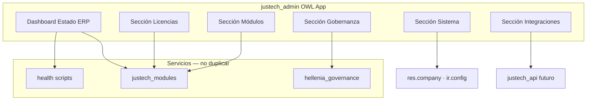
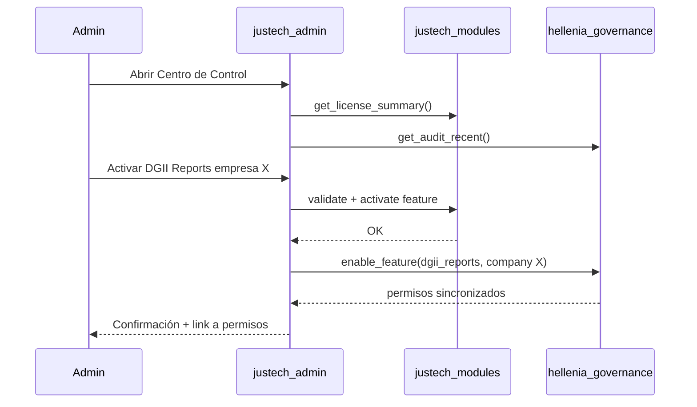

# Justech Admin — Arquitectura del Centro de Control

**Versión:** 1.0 · **Fase 31** · Sprint F31.3 target  
**Módulo:** `justech_admin`  
**Estado:** Diseño definitivo — implementar **después** de modules + governance

---

## 1. Propósito

`justech_admin` es el **Centro de Control del ERP Justech** — shell de administración unificado.

Responde: *¿Dónde veo y gestiono todo el ERP como producto?*

**Regla absoluta:** **Cero lógica de negocio propia.** Solo orquestación UI sobre:
- `justech_modules` (licencias)
- `hellenia_governance` (permisos, roles, menús)
- Modelos Odoo nativos (res.company, ir.config_parameter)
- Servicios externos (health scripts, futuro marketplace)

---

## 2. Qué NO es justech_admin

| Prohibido | Pertenece a |
|-----------|-------------|
| Validar licencias (lógica) | justech_modules |
| Definir permisos | hellenia_governance |
| Lógica fiscal / NCF / DGII | justech_l10n_do_* |
| Modelos duplicados de license/feature | justech_modules |
| Postear facturas, pagos, etc. | Módulos funcionales |

---

## 3. Arquitectura UI



---

## 4. Secciones del panel

### 4.1 Dashboard — Estado del ERP

| Widget | Fuente | Tipo |
|--------|--------|------|
| Score salud global | ERP_HEALTH_DASHBOARD H-01–H-18 | Read-only |
| Licencia status | justech_modules | Read-only |
| Features activas | justech_modules | Read-only |
| Última auditoría | hellenia_governance | Read-only |
| Versión Odoo / Justech | ir.module.module | Read-only |
| Healthchecks | scripts/health/*.json | Read-only |

### 4.2 Licencias (consume justech_modules)

- Ver licencia tenant
- Activar clave
- Features por empresa
- Consumo seats (usuarios / empresas)
- Historial activación
- Expiración / renovación

**Acciones:** delega a `justech.license.service.validate_license()` y writes en modelos JM.

### 4.3 Módulos y Features (consume justech_modules)

- Catálogo módulos Justech
- Estado: registrado / licenciado / activo
- Dependencias comerciales (visual DAG)
- Versiones instaladas vs disponibles

### 4.4 Gobernanza (consume hellenia_governance)

- Permisos funcionales
- Roles
- Usuarios funcionales (perfiles)
- Políticas por empresa
- Menús (visibilidad, etiquetas)
- Auditoría operativa

### 4.5 Empresas y organización

| Item | Fuente |
|------|--------|
| Empresas | res.company (vista embebida) |
| Sucursales / almacenes | stock.warehouse |
| Países / localizaciones | justech.localization (modules) |
| Branding | res.company + report config |

### 4.6 Sistema

| Item | Fuente | Notas |
|------|--------|-------|
| SMTP | ir.mail.server | Vista nativa |
| Variables globales | ir.config_parameter | Filtrado justech_* |
| Backups | Script trigger UI | Orquesta, no ejecuta inline |
| Actualizaciones | ir.module.module | Estado módulos |
| Diagnóstico | health scripts | JSON parse |

### 4.7 Integraciones (futuro — UI preparada)

| Item | Fase | Estado UI |
|------|------|-----------|
| Marketplace | F35 | Placeholder + disabled |
| IA | F36+ | Placeholder + disabled |
| APIs / Webhooks | F34 | Placeholder |
| Logs centralizados | F33 | Read-only básico |

---

## 5. API pública

**justech_admin no expone API Python pública.**

Es exclusivamente capa presentación. Otros módulos **nunca** dependen de justech_admin.

---

## 6. Dependencias

```
justech_admin
├── depends: justech_modules, hellenia_governance, web, mail
├── NO depende: ningún módulo fiscal, hellenia_account, l10n_do_*
└── consumed by: ninguno (hoja del DAG)
```

---

## 7. Flujo administración típico



---

## 8. Permisos acceso admin

| Rol | Acceso |
|-----|--------|
| Justech Super Admin | Todo el panel |
| Admin Empresa | Licencias read + gobernanza su empresa |
| Contador | Read-only dashboard + auditoría fiscal |
| Usuario operativo | Sin acceso justech_admin |

Definidos en hellenia_governance — no en admin.

---

## 9. Sprint F31.3 entregables

| # | Entregable | h | Prerequisito |
|---|------------|--:|--------------|
| 1 | OWL app shell + menú raíz | 24 | F31.2 |
| 2 | Dashboard widgets read-only | 24 | F31.1 |
| 3 | Sección Licencias (CRUD delegado) | 24 | F31.1 |
| 4 | Sección Gobernanza (embed views) | 24 | F31.2 |
| 5 | Sección Sistema básica | 16 | — |
| 6 | Placeholders Integraciones | 8 | — |
| | **Total** | **120** | |

---

## 10. Riesgos

| Riesgo | Mitigación |
|--------|------------|
| Admin acumula lógica | Code review: prohibir models de negocio |
| Duplicar forms licencia | Reutilizar views justech_modules via inherit |
| Performance dashboard | Lazy load widgets; cache 5min |
| Confusión admin vs Odoo Settings | Menú separado "Justech" app |

---

## Referencias

- Plataforma: `ERP_PLATFORM_ARCHITECTURE.md`
- Modules: `JUSTECH_MODULES_ARCHITECTURE.md`
- Governance: `HELLENIA_GOVERNANCE_ARCHITECTURE.md`
