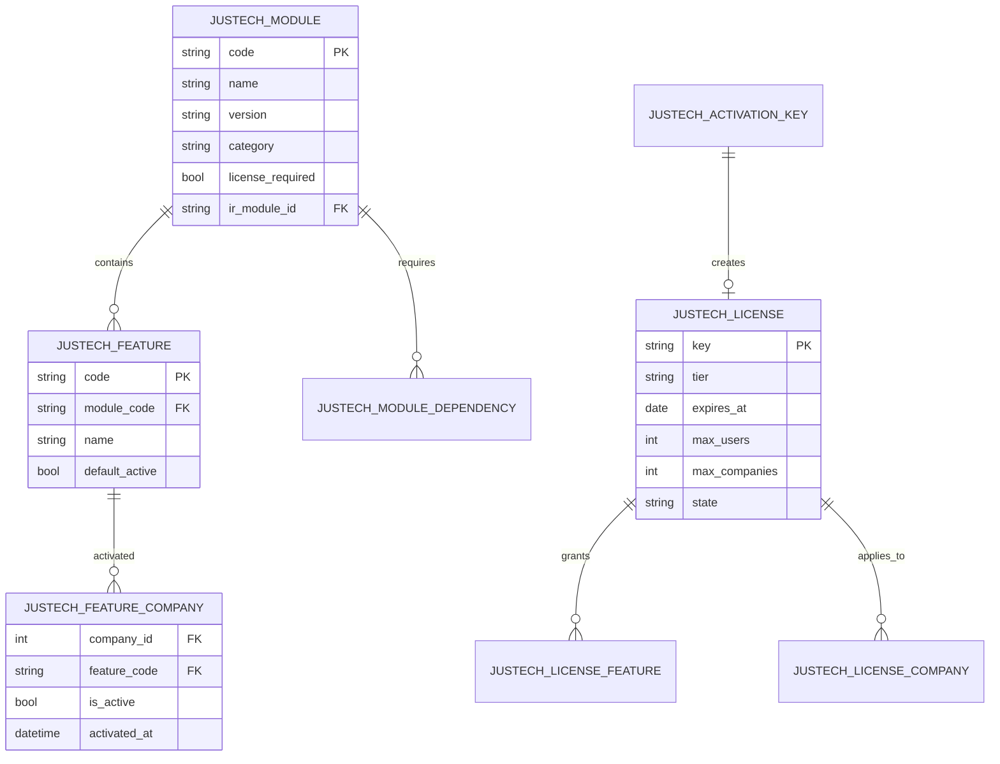
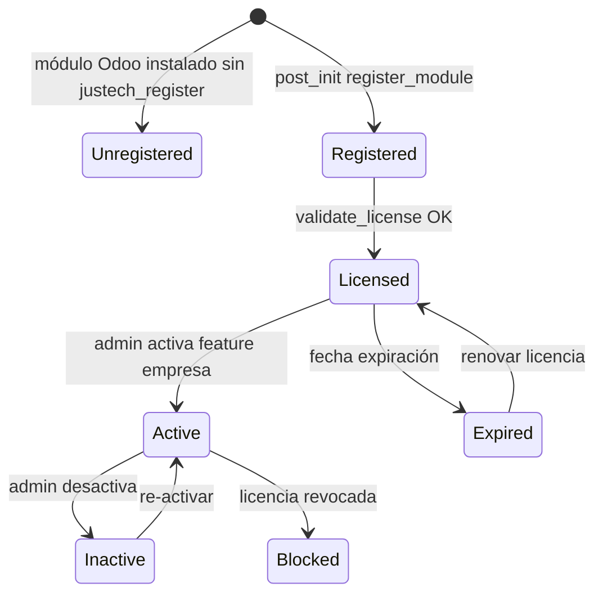

# Justech Modules — Arquitectura de Licenciamiento

**Versión:** 1.0 · **Fase 31** · Sprint F31.1 target  
**Módulo:** `justech_modules`  
**Estado:** Diseño definitivo — **primer desarrollo real post-aprobación**

---

## 1. Propósito

`justech_modules` es el **motor comercial** del ERP Justech. Responde exclusivamente:

- ¿Qué módulos existen en el catálogo Justech?
- ¿Qué features comerciales están disponibles?
- ¿Está licenciado para esta empresa?
- ¿Está activo comercialmente?

**No maneja:** permisos, roles, menús, políticas operativas → `hellenia_governance`

---

## 2. Modelos de datos



### 2.1 Catálogo

| Modelo | Descripción |
|--------|-------------|
| `justech.module` | Catálogo oficial módulos Justech |
| `justech.feature` | Feature comercial (unidad licencia) |
| `justech.module.dependency` | DAG dependencias comerciales |
| `justech.module.version` | Historial versiones publicadas |

### 2.2 Licencias

| Modelo | Descripción |
|--------|-------------|
| `justech.license` | Licencia tenant/instalación |
| `justech.license.feature` | Features incluidas en licencia |
| `justech.license.company` | Licencia aplicada a res.company |
| `justech.activation.key` | Clave activación one-time |
| `justech.license.audit` | Log activación/desactivación |

---

## 3. API pública (obligatoria)

Todos los módulos Justech **deben** usar esta API. Prohibido verificar licencias de otra forma.

### 3.1 `is_active(feature_code, company=None)`

```python
# Uso en módulo funcional
if env["justech.license.service"].is_active("dgii_reports"):
    # mostrar menú, permitir acceso UI
```

| Parámetro | Tipo | Default |
|-----------|------|---------|
| `feature_code` | str | requerido |
| `company` | res.company | env.company |

**Retorna:** `bool` — licencia válida AND feature activa para empresa

### 3.2 `require_active(feature_code, company=None)`

```python
# Uso en métodos Python / controllers
env["justech.license.service"].require_active("dgii_reports")
# Raises JustechLicenseError si inactivo
```

**Uso obligatorio en:** export DGII, POS fiscal, report design pro, API endpoints licenciados.

### 3.3 `get_feature(feature_code)`

```python
feature = env["justech.license.service"].get_feature("dgii_reports")
# Returns record justech.feature con metadata
```

**Retorna:** recordset `justech.feature` o empty

### 3.4 `validate_license(key=None, feature_code=None, company=None)`

```python
result = env["justech.license.service"].validate_license(
    key="XXXX-XXXX",
    feature_code="dgii_reports",
)
# Returns {valid: bool, reason: str, expires: date}
```

**Usado por:** justech_admin, activación manual, API externa (futuro).

### 3.5 `register_module(manifest_data)` (interno)

Llamado por post_init hook — no por módulos funcionales directamente.

---

## 4. Flujo activación / desactivación



| Transición | Trigger | Auditoría |
|------------|---------|-----------|
| → Registered | post_init hook | justech.license.audit |
| → Licensed | validate_license / activation key | justech.license.audit |
| → Active | justech_admin o API | justech.license.audit |
| → Inactive | admin desactiva | justech.license.audit |
| → Blocked | licencia revocada | justech.license.audit + alerta |

**Importante:** Activar feature aquí **no** habilita permisos — dispara callback a governance (ver PLATFORM_ARCHITECTURE).

---

## 5. Claves de activación

| Campo | Descripción |
|-------|-------------|
| Formato | `JT-{TIER}-{RANDOM12}` |
| Uso | One-time o multi-seat según tier |
| Tiers | `STD`, `PRO`, `ENT`, `TRIAL` |
| Grace period | 7 días offline validation cache |

---

## 6. Licencias por empresa

Multi-company: cada `res.company` puede tener subset de features según `justech.license.company`.

| Escenario | Comportamiento |
|-----------|----------------|
| Holding 3 empresas | Licencia ENT → 3 company records |
| Empresa sin feature | `is_active()` = False para esa company |
| Nueva empresa | Hereda licencia tenant si seats disponibles |

---

## 7. Dependencias comerciales

`justech.module.dependency` valida antes de activar:

```
justech_l10n_do_reports depends justech_l10n_do_ncf
justech_l10n_do_ncf depends justech_l10n_do_base
```

Activar `dgii_reports` sin `fiscal_ncf` activo → error con mensaje claro.

**Distinción:** dependencias **comerciales** (modules) vs dependencias **Odoo** (`__manifest__.py depends`).

---

## 8. Manifest extension

```python
{
    "name": "Justech Dominican Fiscal Reports",
    "depends": ["justech_modules", "justech_l10n_do_ncf"],
    "justech_register": {
        "code": "justech_l10n_do_reports",
        "feature_code": "dgii_reports",
        "license_required": True,
        "category": "fiscal",
        "tier_minimum": "STD",
        "dependencies": ["fiscal_ncf"],
        "version": "19.0.1.12.4",
    },
}
```

---

## 9. Dependencias módulo

```
justech_modules
├── depends: base, mail
├── NO depende: hellenia_governance, justech_admin, ningún fiscal
└── consumed by: hellenia_governance, justech_admin, todos justech_*
```

---

## 10. Tests obligatorios (F31.1)

| Test | Descripción |
|------|-------------|
| T-01 | register_module desde manifest |
| T-02 | is_active True/False según licencia |
| T-03 | require_active raises JustechLicenseError |
| T-04 | validate_license key válida/inválida |
| T-05 | dependencia comercial bloquea activación |
| T-06 | multi-company feature isolation |
| T-07 | audit log en cada transición |
| T-08 | cache invalidation on license write |

---

## 11. Sprint F31.1 entregables

| # | Entregable | h |
|---|------------|--:|
| 1 | Modelos catálogo + licencia | 32 |
| 2 | justech.license.service API | 24 |
| 3 | post_init register hook | 16 |
| 4 | Vistas básicas (sin admin shell) | 16 |
| 5 | Tests T-01–T-08 | 24 |
| 6 | Documentación + evidencia DEV | 8 |
| | **Total** | **120** |

---

## Referencias

- Plataforma: `ERP_PLATFORM_ARCHITECTURE.md`
- Gobernanza: `HELLENIA_GOVERNANCE_ARCHITECTURE.md`
- Infraestructura: `ERP_INFRASTRUCTURE_ROADMAP.md`
