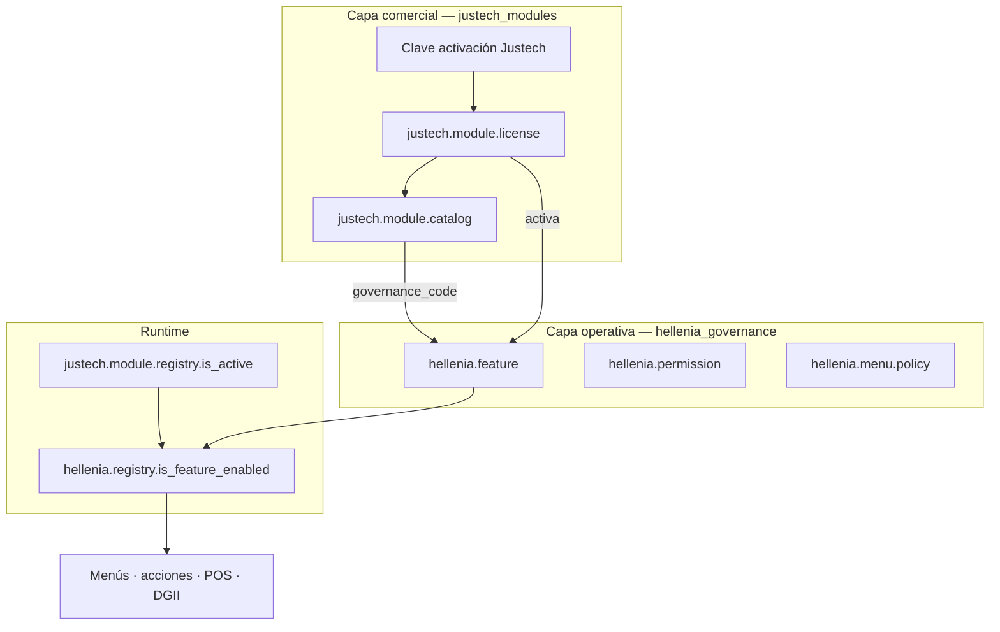
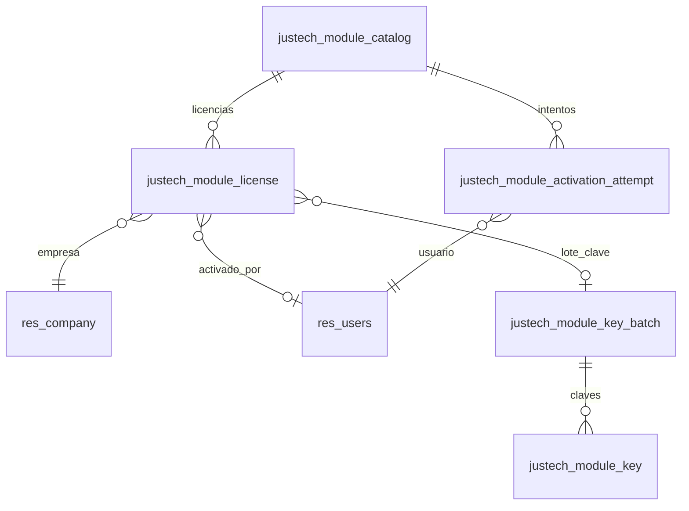
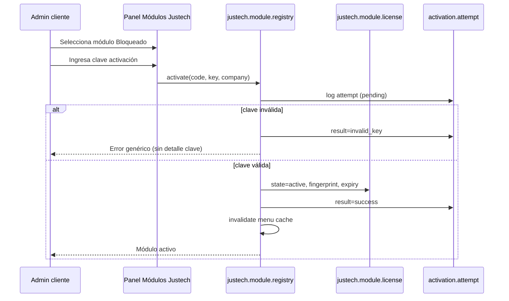

# Módulos Justech — Licenciamiento y activación por clave

**Versión:** 1.0 (diseño)  
**Fecha:** 2026-07-03  
**Estado:** Propuesta — **sin implementación**  
**Integración futura:** `hellenia_governance` (Centro de Gobierno Funcional ERP)  
**Principio:** *Módulo Odoo instalado ≠ funcionalidad Justech activa para el cliente.*

---

## 1. Resumen ejecutivo

Justech necesita comercializar y controlar activaciones de funcionalidades custom (POS avanzado, Conduces, DGII, Retenciones, Auditoría, etc.) **sin depender de instalar/desinstalar módulos Odoo** ni de editar código/XML por cliente.

**Solución:** módulo **`justech_modules`** (nombre propuesto) con panel **Módulos Justech**, catálogo de features comerciales, activación mediante **clave Justech** (hash/token firmado), enforcement en runtime, y auditoría completa de intentos.

Este sistema es la **capa de licenciamiento comercial** que en Fase G (governance) se fusionará con `hellenia.feature` + `hellenia.feature.company`, manteniendo separados:

| Capa | Responsabilidad |
|------|-------------------|
| **justech_modules** | Licencia comercial, clave, vencimiento, bloqueo comercial |
| **hellenia_governance** | Permisos funcionales, menús, roles, políticas operativas post-activación |

---

## 2. Objetivos y no-objetivos

### 2.1 Objetivos

1. Panel **Módulos Justech** visible para admin cliente (solo lectura + solicitud) y admin Justech (activación).
2. Estados comerciales: **Disponible / Bloqueado / Activo / Expirado**.
3. Activación **solo** con clave válida generada por Justech.
4. Feature flags en runtime — bloquear menús, acciones, RPC, cron, sin desinstalar código.
5. Auditoría de intentos (IP, usuario, resultado, sin exponer clave).
6. Desactivación controlada (Justech o expiración automática).
7. Compatible con migración a `hellenia_governance`.

### 2.2 No-objetivos (v1)

- Billing/pagos automáticos (Stripe, etc.) — solo campo nota comercial opcional.
- Instalar/desinstalar `ir.module.module` automáticamente al activar.
- Gestionar licencia Odoo Enterprise.
- Claves por usuario final ilimitadas (v1: clave por módulo+empresa+periodo).
- Panel de permisos granulares ERP completo (eso es `hellenia_governance`).

---

## 3. Relación con `hellenia_governance`



### 3.1 Regla de enforcement combinada

Una funcionalidad está **operativa** para una compañía si y solo si:

```
justech.module.registry.is_active(module_code, company)
AND hellenia.registry.is_feature_enabled(feature_code, company)  # post-migración
AND usuario tiene permiso funcional requerido                        # post-migración
```

En v1 (solo `justech_modules`): solo la primera condición.

### 3.2 Migración a governance

| justech_modules (v1) | hellenia_governance (G2+) |
|----------------------|---------------------------|
| `justech.module.catalog` | `hellenia.feature` (+ campo `license_required`) |
| `justech.module.license` | `hellenia.feature.company` + extensión licencia |
| `justech.module.activation.audit` | `hellenia.governance.audit` |
| `justech.module.registry` | `hellenia.registry` (merge API) |
| Panel "Módulos Justech" | Tab "Licencias" dentro de Administración Hellenia |

Campo puente en catálogo:

```python
governance_feature_code = fields.Char  # ej. "pos_advanced", "dgii_reports"
odoo_module_names = fields.Char        # CSV: hellenia_pos, justech_l10n_do_reports
```

---

## 4. Modelo de datos

### 4.1 Diagrama ER



### 4.2 `justech.module.catalog` — Catálogo comercial

| Campo | Tipo | Descripción |
|-------|------|-------------|
| `code` | Char, unique | `pos_advanced`, `delivery_notes`, `dgii_reports` |
| `name` | Char | Nombre comercial |
| `description` | Html | Qué incluye |
| `affects_summary` | Html | Qué afecta (Contabilidad, DGII, Inventario…) |
| `risk_level` | Selection | low / medium / high / critical |
| `commercial_note` | Char | Precio o nota comercial (texto libre) |
| `governance_feature_code` | Char | Slug futuro `hellenia.feature` |
| `odoo_module_names` | Char | Módulos técnicos relacionados (info) |
| `default_state` | Selection | `blocked` (default), `available` |
| `requires_modules_installed` | Char | Precondición técnica (informativa) |
| `sequence` | Integer | Orden en panel |
| `active` | Boolean | Catálogo publicado |

**Estados visibles al cliente** (computed por compañía vía license):

| Estado UI | Condición |
|-----------|-----------|
| **Bloqueado** | Sin licencia o license.state=blocked |
| **Disponible** | Catálogo visible, aún no activado (puede solicitar) |
| **Activo** | license.state=active y no expirado |
| **Expirado** | license.state=active y `expiry_date < today` o state=expired |

### 4.3 `justech.module.license` — Licencia por compañía

| Campo | Tipo | Descripción |
|-------|------|-------------|
| `module_id` | M2o catalog | |
| `company_id` | M2o res.company | |
| `state` | Selection | `blocked`, `active`, `expired`, `revoked` |
| `activated_at` | Datetime | |
| `activated_by_id` | M2o res.users | Usuario que ingresó clave válida |
| `expiry_date` | Date | Opcional |
| `key_fingerprint` | Char | SHA256 prefix de clave usada (no reversible) |
| `key_batch_id` | M2o | Lote generación Justech |
| `notes` | Text | Notas internas Justech |
| `revoked_at` | Datetime | |
| `revoked_by_id` | M2o | |

**Unique:** `(module_id, company_id)`

### 4.4 `justech.module.key.batch` — Lotes de claves (solo Justech)

| Campo | Tipo |
|-------|------|
| `name` | Char — ej. "Hellenia POS Q3-2026" |
| `module_id` | M2o |
| `company_id` | M2o — False = clave multi-empresa (usar con cuidado) |
| `valid_from` | Date |
| `valid_until` | Date — vencimiento clave |
| `max_activations` | Integer — default 1 |
| `activation_count` | Integer computed |
| `created_by_id` | M2o |
| `notes` | Text |

### 4.5 `justech.module.key` — Clave individual (hash almacenado)

| Campo | Tipo |
|-------|------|
| `batch_id` | M2o |
| `key_hash` | Char | **bcrypt** o **HMAC-SHA256** del token |
| `key_hint` | Char | Últimos 4 chars visibles para soporte (`****-****-X7K9`) |
| `state` | Selection | `unused`, `used`, `revoked` |
| `used_at` | Datetime |
| `used_by_id` | M2o |
| `license_id` | M2o |

**Nunca almacenar:** plaintext, clave completa post-uso.

### 4.6 `justech.module.activation.attempt` — Auditoría intentos

| Campo | Tipo |
|-------|------|
| `module_id` | M2o |
| `company_id` | M2o |
| `user_id` | M2o |
| `ip_address` | Char |
| `user_agent` | Char |
| `result` | Selection | `success`, `invalid_key`, `expired_key`, `revoked`, `already_active`, `denied_permission`, `rate_limited` |
| `key_hint_submitted` | Char | Solo últimos 4 si formato válido |
| `timestamp` | Datetime |

No guardar clave completa ni hash de intento fallido (solo hint parcial).

---

## 5. Generación y formato de claves (solo Justech)

### 5.1 Formato propuesto

```
JM-{MODULE}-{COMPANY_SHORT}-{RANDOM}-{CHECKSUM}
Ejemplo: JM-POS-HLLN-A7K9M2X4-QR8F
```

- `MODULE`: código corto (POS, DGII, RET, AUD…)
- `COMPANY_SHORT`: 4 chars slug empresa (HLLN) o `GEN` si batch genérico
- `RANDOM`: 8 chars CSPRNG base32
- `CHECKSUM`: 4 chars HMAC truncado (integridad)

### 5.2 Generación (herramienta Justech — fuera del ERP cliente)

**Opción A — CLI interno Justech (recomendado v1):**

```bash
# Ejecutar en entorno Justech seguro, NO en servidor cliente
python scripts/justech-generate-module-key.py \
  --module pos_advanced \
  --company hellenia \
  --valid-until 2027-12-31 \
  --batch "Hellenia POS 2026"
# Output: clave plaintext UNA VEZ → entregar al cliente por canal seguro
# Insert: key_hash en BD vía API Justech o import wizard superuser
```

**Opción B — Wizard Odoo solo `justech.group_license_admin`:**

- Genera clave, muestra **una sola vez** en pantalla
- Persiste solo hash
- Envía email opcional al cliente (sin clave en email — canal separado)

### 5.3 Algoritmo hash

```python
import bcrypt  # o passlib
key_hash = bcrypt.hashpw(plaintext.encode(), bcrypt.gensalt(rounds=12))
# verify: bcrypt.checkpw(submitted.encode(), stored_hash)
```

Alternativa stateless (claves firmadas):

```python
token = jwt.encode({
    "mod": "pos_advanced",
    "co": company_id,
    "exp": expiry_ts,
    "jti": uuid4(),
}, JUSTECH_SIGNING_SECRET, algorithm="HS256")
# Validar firma + exp + jti no reutilizado (tabla justech.module.key.used_jti)
```

**Recomendación v1:** bcrypt + tabla `justech.module.key` (revocable, auditable). JWT como v2 para claves offline.

### 5.4 Quién puede generar claves

| Grupo | Permiso |
|-------|---------|
| `justech_modules.group_license_admin` | Generar lotes, revocar, ver auditoría completa |
| `justech_modules.group_license_support` | Ver estado, reenviar instrucciones, NO generar |
| Cliente admin | Intentar activar con clave, ver catálogo |

Clave maestra `JUSTECH_SIGNING_SECRET` vive en **env servidor Justech** (`config/credentials/`), nunca en git.

---

## 6. Flujo de activación



### 6.1 Desactivación

| Método | Quién | Efecto |
|--------|-------|--------|
| Revocar licencia | Justech license admin | `state=revoked`, runtime block inmediato |
| Expiración | Cron diario | `state=expired` si `expiry_date` pasada |
| Solicitud cliente | Workflow futuro | Notifica Justech; no auto-desactiva |

Desactivar **no desinstala** módulos Odoo. Oculta menús y bloquea acciones.

---

## 7. Enforcement — bloqueo de funcionalidades

### 7.1 API runtime

```python
# justech.module.registry (AbstractModel)
def is_active(self, code, company=None):
    """True si licencia activa y no expirada."""

def require_active(self, code, company=None):
    """UserError si bloqueado — mensaje comercial estándar."""

@decorator
def requires_justech_module(code):
    """Decorador métodos Python en módulos custom."""
```

Frontend OWL:

```javascript
const mod = useService("justech_module");
if (!mod.isActive("pos_advanced")) { /* hide / block */ }
```

### 7.2 Puntos de enforcement por módulo

| Módulo catalog | Código | Enforcement |
|----------------|--------|-------------|
| POS avanzado | `pos_advanced` | `hellenia_pos` patches, menú POS config avanzada |
| Conduces | `delivery_notes` | `justech_report_design` actions, menús |
| Reportes DGII | `dgii_reports` | `justech_l10n_do_reports` wizards, cron export |
| Retenciones | `withholding` | `hellenia_account` catalog write, wizard pagos |
| Auditoría | `audit_suite` | Vistas audit log custom |
| Factura posterior POS | `pos_late_invoice` | `InvoiceButton` patch |
| Permisos POS avanzados | `pos_permissions` | `hellenia.pos.*` governance |
| Dashboards | `dashboards` | Menús spreadsheet/dashboard |
| Reportes personalizados | `custom_reports` | Report actions hellenia_reports |

### 7.3 Menús

Al activar/desactivar licencia:

```python
justech.module.menu.sync(module_code, company)
# Aplica hellenia.menu.policy equivalente o directamente menu.active
```

Compatible con migración a `hellenia_governance.menu.policy`.

### 7.4 Cron y server actions

Catálogo declara `cron_xmlids` y `server_action_xmlids` a pausar cuando `blocked`.

---

## 8. Catálogo inicial seed

| code | name | governance_code | odoo_module_names | default |
|------|------|-----------------|---------------------|---------|
| `pos_basic` | Punto de Venta base | `pos` | point_of_sale, hellenia_pos | blocked |
| `pos_advanced` | POS avanzado (permisos, auditoría caja) | `pos_permissions` | hellenia_pos | blocked |
| `pos_late_invoice` | Factura posterior POS | `pos_late_conversion` | hellenia_pos | blocked |
| `delivery_notes` | Conduces | `delivery_notes` | justech_report_design | blocked |
| `dgii_reports` | Reportes DGII | `dgii_reports` | justech_l10n_do_reports | blocked |
| `withholding` | Retenciones RD | `withholding` | hellenia_account | blocked |
| `fiscal_core` | Facturación fiscal DO | `fiscal_core` | justech_l10n_do_* | **active** (base contrato) |
| `audit_suite` | Auditoría Justech | `fiscal_audit` | hellenia_pos, justech_l10n_do_reports | blocked |
| `custom_reports` | Reportes PDF corporativos | `custom_reports` | hellenia_reports | blocked |
| `dashboards` | Dashboards avanzados | `dashboard` | spreadsheet_dashboard | blocked |
| `integrations_hub` | Integraciones futuras | — | justech_core | blocked |

**Nota:** `fiscal_core` puede venir activo por contrato base; resto bloqueado hasta pago.

Cada registro incluye `description`, `affects_summary`, `risk_level`, `commercial_note`.

---

## 9. Vistas y UX

### 9.1 Menú raíz

**Módulos Justech** — icono candado/Justech

Acceso:
- **Cliente:** `justech_modules.group_module_viewer` — ver catálogo, intentar activar
- **Justech:** `justech_modules.group_license_admin` — generar claves, revocar

Ubicación: menú raíz propio **o** Configuración → Módulos Justech (decisión UX).

### 9.2 Pantallas

```
Módulos Justech
├── Catálogo (kanban + lista)
│   ├── Tarjeta: nombre, estado, riesgo, comercial
│   ├── Botón "Activar con clave" (si bloqueado/disponible)
│   └── Smart: licencias, intentos
├── Mis licencias (por compañía)
│   ├── Activo / Expirado / Revocado
│   └── Fechas, activado por
├── Activar módulo (wizard)
│   ├── Módulo (readonly)
│   ├── Clave (password input, no log)
│   └── Empresa
├── Auditoría activaciones (Justech only)
│   └── Filtros: éxito/fallo, IP, módulo
└── Generar claves (Justech only)
    ├── Lote, módulo, empresa, vencimiento
    └── Clave plaintext mostrada UNA VEZ
```

### 9.3 Mock tarjeta módulo

```
┌─────────────────────────────────────────────┐
│ POS avanzado                    [Bloqueado] │
├─────────────────────────────────────────────┤
│ Permisos de caja, auditoría, roles cajero.  │
│ Afecta: POS · Contabilidad · Auditoría       │
│ Riesgo: Medio                               │
│ Nota comercial: Según propuesta 29E.3       │
│                                             │
│ [ Activar con clave Justech ]               │
└─────────────────────────────────────────────┘
```

---

## 10. Seguridad

### 10.1 Grupos Odoo

| XML ID | Propósito |
|--------|-----------|
| `justech_modules.group_module_viewer` | Ver catálogo, activar con clave |
| `justech_modules.group_license_support` | Soporte Justech lectura |
| `justech_modules.group_license_admin` | Generar/revocar claves |

Cliente **nunca** tiene `group_license_admin`.

### 10.2 Protecciones

| Amenaza | Mitigación |
|---------|------------|
| Fuerza bruta claves | Rate limit: 5 intentos / 15 min / user+IP |
| Clave en logs | Input type password; no log request params |
| Cliente auto-activa sin clave | Sin bypass API; `require_active` en todo hook |
| SQL injection | ORM estándar |
| Replay clave usada | `key.state=used` atómico en transaction |
| Escalación privilegios | Activar módulo ≠ group_license_admin |

### 10.3 Record rules

- Cliente ve solo licencias de `company_ids`.
- Justech admin ve todas.
- Auditoría: cliente ve sus intentos; Justech ve todo.

---

## 11. Módulo técnico propuesto

| Aspecto | Valor |
|---------|-------|
| Nombre | `justech_modules` |
| Path | `custom/justech_modules/` |
| Depends | `base`, `mail`, `hellenia_base` |
| Versión inicial | `19.0.1.0.0` |

### 11.1 Estructura archivos

```
justech_modules/
├── __manifest__.py
├── models/
│   ├── justech_module_catalog.py
│   ├── justech_module_license.py
│   ├── justech_module_key.py
│   ├── justech_module_key_batch.py
│   ├── justech_module_activation_attempt.py
│   └── justech_module_registry.py      # AbstractModel
├── wizard/
│   ├── justech_module_activate_wizard.py
│   └── justech_module_generate_key_wizard.py
├── security/
│   ├── justech_modules_security.xml
│   └── ir.model.access.csv
├── data/
│   └── justech_module_catalog_seed.xml
├── views/
│   ├── justech_module_catalog_views.xml
│   ├── justech_module_license_views.xml
│   ├── justech_module_activation_views.xml
│   └── justech_modules_menu.xml
├── static/src/services/
│   └── justech_module_service.js
└── scripts/  (repo scripts/, no módulo)
    └── justech-generate-module-key.py
```

### 11.2 Registro por módulo custom

Cada módulo Justech implementa en `post_init_hook`:

```python
def _register_justech_module_catalog(env):
    env['justech.module.registry'].register_catalog_entry({...})
```

No registra licencia — solo declara existencia comercial.

---

## 12. Plan de implementación (post-aprobación)

| Fase | Entregable | Semanas |
|------|------------|---------|
| **JM1** | Modelos + seed catálogo + API `is_active` | 2 |
| **JM2** | Wizard activación + hash + auditoría | 2 |
| **JM3** | Panel UI catálogo + licencias | 1–2 |
| **JM4** | Generación claves Justech + CLI | 1 |
| **JM5** | Enforcement piloto (POS avanzado, DGII) | 2 |
| **JM6** | Integración hooks en todos custom modules | 2–3 |
| **JM7** | Puente `hellenia_governance` (cuando exista) | 1 |

**Orden vs otras fases:**

```
justech_modules (JM1–JM4)  →  puede paralelizarse con hellenia_governance G1
29E.3 POS permisos         →  requiere JM5 enforcement o flag bypass en TEST
```

---

## 13. Riesgos

| Riesgo | Mitigación |
|--------|------------|
| Cliente frustrado por módulo instalado pero bloqueado | UX clara "Disponible — requiere activación Justech" |
| Bypass por código sin `require_active` | Lint CI + checklist PR |
| Clave filtrada | Revocación batch + rotación |
| Desincronía licencia vs governance | `governance_feature_code` único |
| Performance checks | ormcache por `(code, company_id)` TTL 60s |

---

## 14. Preguntas abiertas

| # | Pregunta | Recomendación |
|---|----------|---------------|
| 1 | ¿Clave por empresa o global por cliente? | Por empresa (multi-compañía futuro) |
| 2 | ¿`fiscal_core` siempre activo sin clave? | Sí — base contrato Hellenia |
| 3 | ¿Cliente puede ver módulos bloqueados no contratados? | Sí, modo "Disponible para contratar" |
| 4 | ¿Expiración auto-bloquea o grace period? | 7 días grace + banner |
| 5 | ¿Generación claves solo off-site CLI? | Sí v1 — máxima seguridad |

---

## 15. Conclusión

**Módulos Justech** es la capa comercial de feature flags con activación por clave exclusiva Justech. Se implementa como `justech_modules` y converge con **`hellenia_governance`** vía `governance_feature_code`, sin duplicar permisos operativos ni desinstalar código Odoo.

**Próximo paso:** aprobación → JM1 en rama dedicada → piloto TEST con `pos_advanced` bloqueado hasta clave.

---

*Diseño v1.0 — sin implementación, sin cambios TEST/PROD.*
