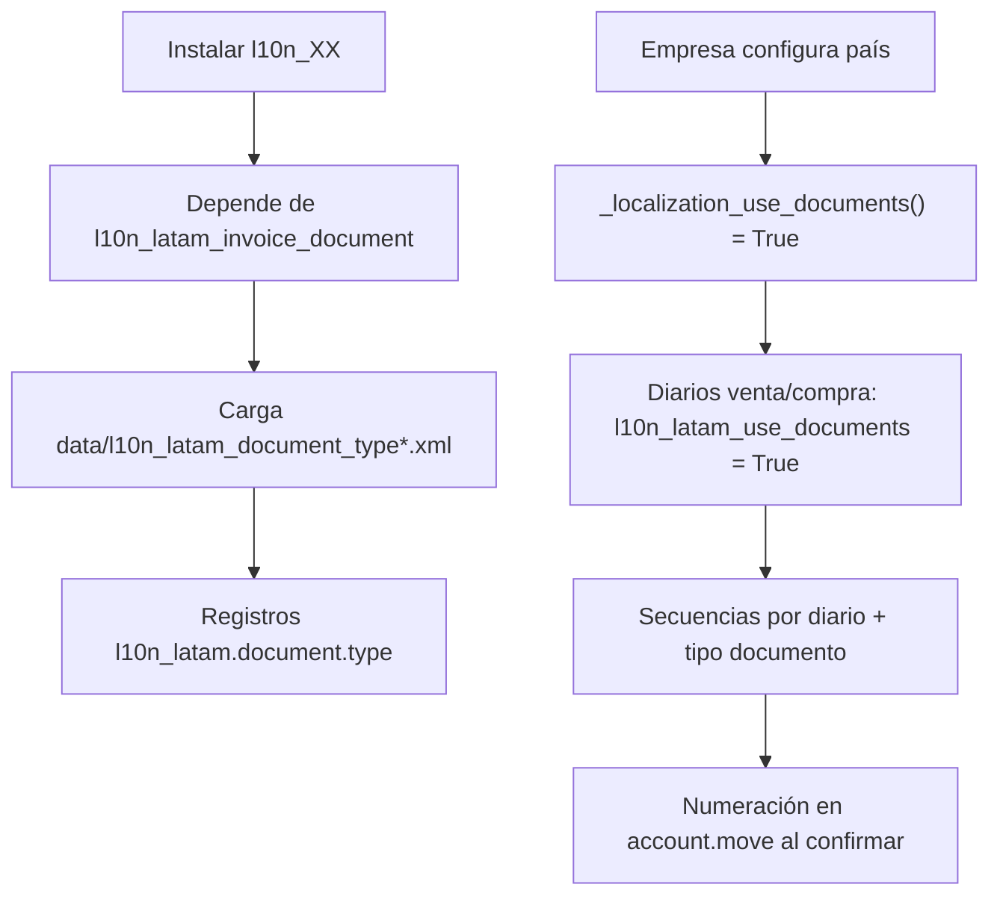
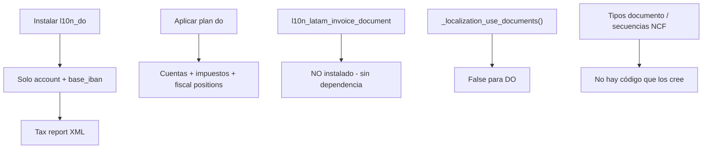

# Análisis de arquitectura — Localización dominicana (`l10n_do`)

> **Documento histórico (pre-v3.0):** Investigación saas-19.3 vs 19.0 on-premise. **No bloquea** el proyecto. Plataforma oficial y política actual: [PROJECT_STRATEGY.md](PROJECT_STRATEGY.md).

**Cliente:** Hellenia, S.R.L.  
**Fecha:** 2026-06-30  
**Ambiente analizado:** `hellenia_dev` — Odoo `19.0+e-20260619`  
**Tipo:** Investigación técnica (archivada)  
**Estado:** Referencia — no actualizar salvo cambio de plataforma

---

## Resumen ejecutivo

El comportamiento observado en TC-001/TC-002 **no es un fallo de instalación ni una omisión de configuración**. Es coherente con el **código fuente exacto** desplegado en el build on-premise `19.0+e-20260619`.

La aparente contradicción con la **documentación oficial publicada** (saas-19.3 / master) se explica por **tres capas distintas**:

| Capa | Qué describe | Qué incluye sobre documentos fiscales / NCF |
|------|----------------|---------------------------------------------|
| **A. Manifest `l10n_do` (texto largo)** | Marketing legacy (desde ≥17.0) | Menciona “secuencias NCF” pero **admite explícitamente** que requieren terceros o desarrollo adicional |
| **B. Código `l10n_do` rama `19.0` (Hellenia)** | Plan contable, impuestos, posiciones fiscales, tax report ITBIS | **No** crea tipos documento, **no** crea secuencias NCF, **no** depende de `l10n_latam_*` |
| **C. Documentación Odoo saas-19.3 / master** | Stack fiscal RD actual en Odoo Online | Documentos **electrónicos E31–E34**, `l10n_latam_*`, `l10n_do_edi` + Infile — **no documenta NCF tradicional B01–B13** |

**Conclusión principal:** No hay evidencia en el repositorio público Odoo de que los tipos NCF tradicionales (B01, B02, B03, B04, B11, B13, etc.) estén implementados en ninguna rama analizada. La documentación “oficial” vigente describe **eNCF**, no NCF papel. El build Enterprise descargado (`19.0+e.20260629`) **no incluye** `l10n_do_edi`.

---

## 1. Versión exacta del código ejecutado

### 1.1 Runtime DEV

| Atributo | Valor | Evidencia |
|----------|-------|-----------|
| Imagen Docker | `hellenia-odoo:19-enterprise` | `docker inspect hellenia-dev-odoo-1` |
| Servidor Odoo | `19.0-20260619` | `odoo --version` en contenedor |
| Módulo instalado | `l10n_do` v `19.0.2.0` | XML-RPC `ir.module.module` TC-001 |
| Ruta código Community | `/usr/lib/python3/dist-packages/odoo/addons/l10n_do/` | `find` en contenedor |
| Ruta Enterprise RD | `/opt/odoo/enterprise/addons/l10n_do_{reports,check_printing}/` | `find` en contenedor |

### 1.2 Integridad frente a GitHub `19.0`

| Archivo | MD5 en DEV | Coincide con rama `19.0` |
|---------|------------|--------------------------|
| `__manifest__.py` | `bb298d8fb4a2aff0c50b5f81b04cf6c5` | Sí — contenido idéntico al publicado en GitHub |
| `models/template_do.py` | `d47f8936eb376c6efc822b4b9f2016e2` | Sí — único modelo Python además de `__init__.py` |

### 1.3 Inventario completo de archivos `l10n_do` en DEV (19.0)

```
l10n_do/
├── __init__.py
├── __manifest__.py
├── data/
│   ├── account_tax_report_data.xml
│   └── template/
│       ├── account.account-do.csv      (284 líneas)
│       ├── account.fiscal.position-do.csv
│       ├── account.group-do.csv
│       ├── account.tax-do.csv
│       └── account.tax.group-do.csv
├── demo/demo_company.xml
├── i18n/es_419.po, l10n_do.pot
└── models/
    ├── __init__.py          → solo importa template_do
    └── template_do.py       → chart template @template('do')
```

**Total:** 13 archivos funcionales. **Cero** archivos XML/CSV de tipos documento, secuencias NCF, o modelos fiscales extendidos.

### 1.4 Paquete Enterprise descargado

Archivo: `/opt/odoo-projects/hellenia/downloads/enterprise/odoo_19.0+e.20260629.tar.gz`

| Módulo RD en tarball | Presente |
|----------------------|----------|
| `l10n_do` (Community embebido) | ✅ Misma estructura que §1.3 |
| `l10n_do_reports` | ✅ |
| `l10n_do_check_printing` | ✅ |
| `l10n_do_edi` | ❌ **0 archivos** en tarball |

---

## 2. Comparación de versiones / ramas

### 2.1 Ramas Git públicas relevantes

| Referencia | Existe como rama Odoo | `l10n_do` presente | Notas |
|------------|----------------------|-------------------|-------|
| **19.0** | ✅ | ✅ | **Build Hellenia** — sin LATAM docs |
| **19.1** | ❌ No publicada | — | Odoo no expone rama intermedia |
| **19.2** | ❌ No publicada | — | Idem |
| **19.3** | ❌ No publicada | — | Idem |
| **saas-19.3** | ✅ (Odoo Online / docs) | ✅ | Evolución EDI + LATAM — **no backportada a 19.0** |
| **18.0, 17.0** | ✅ | ✅ | Misma estructura base que 19.0 (sin LATAM en manifest) |

> Odoo publica releases on-premise en rama **`19.0`** y evolución SaaS en **`saas-19.x`**. No existen ramas `19.1`–`19.3` separadas en `github.com/odoo/odoo`.

### 2.2 Diff manifest `l10n_do` — cambio arquitectónico clave

| Campo | `19.0` (Hellenia) | `saas-19.3` |
|-------|-------------------|-------------|
| **depends** | `account`, `base_iban` | `account`, `l10n_latam_base`, `l10n_latam_invoice_document` |
| **data** | `account_tax_report_data.xml` | + `l10n_latam_identification_type_data.xml` + `l10n_latam_document_type_data.xml` |
| **models** | `template_do.py` | + `account_move.py` |
| **demo** | `demo_company.xml` | + `demo_res_partner.xml`, `demo_account_journal.xml` |
| **Último commit manifest 19.0** | 2025-09-17 | — |
| **Commit EDI en saas-19.3** | — | **2026-02-11** `9c1305add32e` |

**Commit saas-19.3 `9c1305add32e` — `[IMP] l10n_do: support EDI for Dominican Republic`:**

```
Purpose:
- Support electronic invoicing for Dominican Republic by adding
  dependencies to l10n_latam_base, l10n_latam_invoice_document
- Document type
```

Archivos añadidos en ese commit (evidencia GitHub API):

- `data/l10n_latam_document_type_data.xml`
- `data/l10n_latam_identification_type_data.xml`
- `models/account_move.py`
- `demo/demo_account_journal.xml`

**Este commit no aparece en el historial de la rama `19.0`.** El build `20260619` de junio 2026 sigue empaquetando la línea `19.0` sin ese cambio.

### 2.3 Tabla comparativa funcional

| Capacidad | 19.0 on-premise (Hellenia) | saas-19.3 (docs oficiales) |
|-----------|------------------------------|----------------------------|
| Plan contable `do` | ✅ CSV template | ✅ CSV template |
| Impuestos ITBIS / ISR | ✅ CSV template | ✅ CSV template (actualizado en commit EDI) |
| Posiciones fiscales | ✅ CSV template | ✅ CSV template |
| Tax report ITBIS | ✅ XML | ✅ XML |
| Tipos identificación RD (RNC, cédula) | ❌ | ✅ `l10n_latam_identification_type_data.xml` |
| Tipos documento fiscal | ❌ | ✅ **Solo E31–E34 (eNCF)** |
| NCF tradicional B01–B13 | ❌ | ❌ (no en código ni docs saas-19.3) |
| `l10n_do_edi` | ❌ ausente del tarball | ✅ documentado (Enterprise + Infile) |
| Hook `_localization_use_documents()` para DO | ❌ | ⚠️ Implícito vía cadena LATAM (no hay `res_company.py` en `l10n_do`) |

---

## 3. `l10n_latam_invoice_document` — estado real

### 3.1 ¿Cambió de nombre, fue absorbido, o falta en el build?

| Pregunta | Respuesta con evidencia |
|----------|-------------------------|
| ¿Cambió de nombre? | **No.** Sigue siendo `l10n_latam_invoice_document` v `19.0.1.1` en la imagen |
| ¿Fue absorbido en `l10n_do`? | **No en 19.0.** `l10n_do` 19.0 no lo declara como dependencia ni importa sus modelos |
| ¿Está en el build? | **Sí** — `/usr/lib/python3/dist-packages/odoo/addons/l10n_latam_invoice_document/` |
| ¿Está instalado en DEV? | **No** — `state: uninstalled` (TC-001/002) porque `l10n_do` 19.0 no lo arrastra |
| ¿Módulos LATAM en imagen? | `l10n_latam_base`, `l10n_latam_invoice_document`, `l10n_latam_check` — todos **uninstalled** |

### 3.2 Rol arquitectónico del módulo

`l10n_latam_invoice_document` es la **infraestructura genérica** LATAM (modelo `l10n_latam.document.type`, flag `Use Documents` en diarios, numeración integrada en facturas). Lo usan localizaciones como Argentina y Chile:

```python
# l10n_ar 19.0 — dependencias
'depends': ['l10n_latam_invoice_document', 'l10n_latam_base', 'account', ...]
```

**República Dominicana en 19.0 no sigue ese patrón.** Comparación directa:

| Localización | Depende de `l10n_latam_invoice_document` | Datos `l10n_latam.document.type` |
|--------------|------------------------------------------|----------------------------------|
| `l10n_ar` (19.0) | ✅ | ✅ CSV + XML |
| `l10n_cl` (19.0) | ✅ | ✅ CSV + XML |
| `l10n_do` (19.0) | ❌ | ❌ |

### 3.3 Por qué TC-002 no mostró modelos `l10n_latam*`

Los modelos **existen en el filesystem** de la imagen pero **no se registran en `ir.model`** hasta instalar el módulo. Con solo `l10n_do` instalado:

- `l10n_latam.document.type` → modelo no cargado en ORM
- `_localization_use_documents()` en `res.company` → retorna `False` (default)

Esto explica el conteo `0` modelos `l10n_latam*` en TC-002 sin implicar que el módulo no exista en la imagen.

---

## 4. Revisión del código fuente `l10n_do` (completo)

### 4.1 `__manifest__.py` — texto vs realidad

El manifest declara en prosa:

> *"Secuencias Preconfiguradas para manejo de todos los NCF"*

Inmediatamente después advierte:

> *"Esta localización, aunque posee las secuencias para NCF, las mismas no pueden ser utilizadas sin la instalación de módulos de terceros o desarrollo adicional."*

**Búsqueda en código fuente (DEV + GitHub 19.0 + saas-19.3):**

| Término | Ocurrencias en archivos de datos/código `l10n_do` |
|---------|------------------------------------------------|
| `B01`, `B02`, `B03`, `B04`, `B11`, `B13` | **0** |
| `NCF` | **1** — solo en texto del `__manifest__.py` |
| `ir.sequence` / secuencias | **0** |
| `l10n_latam.document.type` | **0** en 19.0; **4 registros E31–E34** en saas-19.3 |

El campo `document_type` en `account.tax-do.csv` es columna del **formato CSV de impuestos** (repartición contable), no tipos de comprobante fiscal DGII.

### 4.2 `models/template_do.py` — única lógica Python (19.0)

Responsabilidades:

- Definir dígitos del plan (`code_digits: 8`)
- Mapear cuentas por defecto (cobrar, pagar, inventario, ITBIS venta/compra)
- Configurar `anglo_saxon_accounting`, prefijos bancarios, cuentas de diferencia de cambio

**No** override de `_localization_use_documents`, **no** creación de secuencias, **no** tipos documento.

### 4.3 Datos cargados al instalar `l10n_do` (19.0)

| Archivo | Qué crea en BD |
|---------|----------------|
| `account_tax_report_data.xml` | Estructura tax report ITBIS (tags, líneas DGII) |
| Templates CSV | Cuentas, impuestos, grupos, posiciones fiscales — **al aplicar plan `do`** |

### 4.4 Evolución saas-19.3 — `account_move.py`

```python
# saas-19.3/addons/l10n_do/models/account_move.py
def _get_l10n_latam_documents_domain(self):
    ...
    if self.country_code != 'DO':
        return domain
    allowed_docs = [ecf_31, ecf_32] if partner.vat else [ecf_32]
```

Filtra tipos documento **electrónicos** según si el cliente tiene RNC. Orientado a eNCF, no a B01/B02 papel.

### 4.5 Tipos documento en saas-19.3 (evidencia XML)

| XML ID | Código | Prefijo | Nombre |
|--------|--------|---------|--------|
| `ecf_31` | 31 | E31 | Electronic Tax Credit Invoice |
| `ecf_32` | 32 | E32 | Electronic Consumer Invoice |
| `ecf_33` | 33 | E33 | Electronic Debit Note |
| `ecf_34` | 34 | E34 | Electronic Credit Note |

**Ningún registro B01–B13.**

---

## 5. Dónde *deberían* crearse documentos fiscales y secuencias NCF

### 5.1 Patrón Odoo estándar (otras localizaciones LATAM)



**Punto de enganche clave:** `res.company._localization_use_documents()` — cada localización lo override (ej. Argentina en `l10n_ar/models/res_company.py`).

### 5.2 Qué ocurre en `l10n_do` 19.0 (Hellenia)



### 5.3 Qué ocurriría en saas-19.3 (teórico, no desplegado en Hellenia)

1. `l10n_do` instala → arrastra `l10n_latam_base` + `l10n_latam_invoice_document`
2. Se cargan tipos E31–E34 y tipos identificación RNC/cédula
3. Con `l10n_do_edi` + Infile → rangos eNCF, envío DGII (según documentación)
4. Secuencias gestionadas por framework LATAM en diarios con *Use Documents*

**Aún sin B01–B13 tradicionales.**

### 5.4 Secuencias NCF — mecanismo técnico

En localizaciones que usan documentos LATAM, la numeración no suele ser un `ir.sequence` independiente con prefijo `B01`, sino:

- Modelo `l10n_latam.document.type` con `doc_code_prefix`
- Integración en `account.move` vía `l10n_latam_invoice_document`
- Rangos autorizados (en RD electrónico: *Document Range* con vigencia DGII — doc saas-19.3)

En `l10n_do` 19.0 **no hay ningún punto de entrada** a este flujo.

---

## 6. Dependencias oficiales — grafo real

### 6.1 Stack instalado en Hellenia DEV (post TC-001)

```
l10n_do (19.0.2.0)
├── account (auto)
├── base_iban (auto)
├── account_accountant, account_reports, ... (cadena EE)
├── l10n_do_reports (auto_install: True)
└── l10n_do_check_printing (auto_install: ['l10n_do'])

NO incluye:
├── l10n_latam_base          [en imagen, uninstalled]
├── l10n_latam_invoice_document [en imagen, uninstalled]
└── l10n_do_edi              [ausente del tarball Enterprise]
```

### 6.2 Stack documentado oficialmente (saas-19.3)

```
l10n_do
├── l10n_latam_base
├── l10n_latam_invoice_document
├── account
└── (opcional) l10n_do_edi + contrato Infile
    └── l10n_do_reports
    └── l10n_do_check_printing
```

### 6.3 ¿Instalar manualmente `l10n_latam_invoice_document` resolvería NCF tradicional?

**Hipótesis evaluada por código (no ejecutada en DEV por instrucción de detener pruebas):**

| Si se instala manualmente | Resultado esperado |
|---------------------------|-------------------|
| `l10n_latam_invoice_document` | Expone modelos y UI *Use Documents* |
| Sin data XML de tipos DO | **0 tipos documento RD** — el módulo es framework vacío para DO |
| Sin override `_localization_use_documents()` en `l10n_do` 19.0 | Diarios **no** activarían documentos automáticamente para DO |
| Sin datos B01–B13 en ninguna rama | **No aparecerían** tipos NCF tradicionales |

**Conclusión:** Instalar el framework LATAM solo no reproduce lo que describe la documentación saas-19.3 ni NCF tradicional.

---

## 7. Documentación oficial vs build descargado

### 7.1 Fuente documental vigente

URL analizada: [Dominican Republic — Odoo saas-19.3](https://www.odoo.com/documentation/saas-19.3/applications/finance/fiscal_localizations/dominican_republic.html)

**Contenido real de la documentación:**

| Tema documentado | Menciona NCF tradicional B01–B13 | Menciona eNCF E31–E34 |
|------------------|----------------------------------|------------------------|
| Módulos | `l10n_do`, `l10n_do_edi`, `l10n_do_reports` | ✅ |
| Tipos documento | ❌ | ✅ E31, E32, E33, E34 |
| Secuencias / rangos | Rangos eNCF con vencimiento DGII | ✅ |
| Infile / DGII electrónico | ✅ | ✅ |
| Facturación papel / NCF impreso | ❌ **No aparece** | — |

La documentación **no contradice** el código 19.0 sobre NCF tradicional — simplemente **no lo cubre**. Describe un producto distinto (electrónico) disponible en otra línea de código (saas-19.3 + `l10n_do_edi`).

### 7.2 Discrepancias identificadas (posibles bugs / deuda documental)

| ID | Tipo | Descripción | Severidad |
|----|------|-------------|-----------|
| **D-01** | Deuda documental | Texto del `__manifest__.py` afirma “secuencias NCF preconfiguradas” pero **no existen en datos** desde al menos 17.0 | Alta — confunde implementadores |
| **D-02** | Divergencia versión | Docs publicadas en saas-19.3/master; build on-premise 19.0 **sin** commit EDI (`9c1305add32e`) | Alta — expectativa incorrecta |
| **D-03** | Paquete Enterprise | `l10n_do_edi` documentado pero **ausente** de `odoo_19.0+e.20260629.tar.gz` | Alta — imposible seguir docs on-premise |
| **D-04** | Arquitectura | `l10n_latam_*` presentes en imagen pero **no encadenados** a `l10n_do` 19.0 | Media — módulos “huérfanos” para DO |
| **D-05** | Producto | NCF tradicional B01–B13 **nunca implementado** en código público Odoo analizado; solo comunidad/OCA histórica | Crítica para Etapa 1 Hellenia |

### 7.3 Manifest vs documentación — alineación

| Afirmación | Manifest 19.0 | Código 19.0 | Docs saas-19.3 |
|------------|---------------|-------------|----------------|
| Plan contable DGII | ✅ | ✅ | ✅ |
| Impuestos ITBIS | ✅ | ✅ | ✅ |
| Secuencias NCF operativas | ⚠️ Texto sí, nota “terceros” | ❌ | ❌ (solo eNCF con EDI) |
| Tipos documento en UI | ❌ | ❌ | ✅ E31–E34 |
| Requiere Infile | ❌ | ❌ | ✅ para eNCF legal |

---

## 8. Implicaciones para Hellenia (Etapa 1 — NCF tradicional)

### 8.1 Reinterpretación de G-01

G-01 (**secuencias NCF / tipos documento no disponibles**) queda **confirmada funcionalmente** en TC-002, pero la causa raíz no es un paso de configuración omitido:

- Es una **brecha de producto** entre expectativa (manifest + planes de proyecto basados en docs saas-19.3) y **código 19.0 on-premise** entregado por Odoo S.A.

### 8.2 Opciones técnicas (fuera de alcance de esta investigación)

| Opción | Descripción |
|--------|-------------|
| **A. Custom `hellenia_account`** | Implementar tipos B01–B13, secuencias, hooks LATAM o propio |
| **B. Esperar backport** | Commit `9c1305add32e` a rama `19.0` + disponibilidad `l10n_do_edi` en Enterprise — **solo cubre eNCF**, no NCF papel |
| **C. Upgrade SaaS / 19.3+** | Misma limitación: docs y código apuntan a electrónico |
| **D. Módulo tercero / OCA** | Manifest 19.0 lo menciona explícitamente como vía histórica |

### 8.3 Qué NO hacer hasta nueva decisión

- ❌ TC-003 y pruebas funcionales posteriores (instrucción cliente)
- ❌ Asumir que instalar `l10n_latam_invoice_document` solo activará NCF
- ❌ Usar documentación saas-19.3 como spec de NCF tradicional on-premise 19.0

---

## 9. Evidencia recopilada

| Artefacto | Ubicación |
|-----------|-----------|
| TC-001 instalación + módulos | `docs/TC-001-RESULT.md`, `evidence/l10n-do-tests/2026-06-30/TC-001/` |
| TC-002 empresa DO + validación | `docs/TC-002-RESULT.md`, `evidence/l10n-do-tests/2026-06-30/TC-002/` |
| Log instalación `l10n_do` | `evidence/l10n-do-tests/2026-06-30/TC-001/install.log` |
| Manifest/hash en contenedor | Inspección SSH 2026-06-30 |
| Enterprise tarball inventory | `odoo_19.0+e.20260629.tar.gz` en VPS |
| Commit EDI saas-19.3 | `9c1305add32e9e67d861cdca999210f6efb5546b` |
| Manifest 19.0 GitHub | https://github.com/odoo/odoo/blob/19.0/addons/l10n_do/__manifest__.py |
| Manifest saas-19.3 GitHub | https://github.com/odoo/odoo/blob/saas-19.3/addons/l10n_do/__manifest__.py |
| Docs oficiales RD | https://www.odoo.com/documentation/saas-19.3/applications/finance/fiscal_localizations/dominican_republic.html |

---

## 10. Conclusión de la investigación

1. **Versión exacta:** Hellenia ejecuta `l10n_do` **19.0.2.0** de la rama **`19.0`**, idéntico al código publicado en GitHub, empaquetado en imagen `19.0-20260619`.

2. **Diferencia de versiones:** La evolución fiscal RD con framework LATAM y tipos documento está en **`saas-19.3`** (commit feb-2026), **no backportada** a `19.0`. Ramas `19.1`–`19.3` no existen como líneas de código públicas.

3. **`l10n_latam_invoice_document`:** Existe, no fue renombrado ni absorbido; **no está en la cadena de dependencias** de `l10n_do` 19.0 y permanece **uninstalled** en DEV.

4. **Código `l10n_do` completo:** Solo plan contable + impuestos + posiciones fiscales + tax report. **Cero implementación** de tipos documento o secuencias NCF en archivos de datos.

5. **Dónde deberían crearse:** En el patrón Odoo LATAM → `data/l10n_latam_document_type_data.xml` + `_localization_use_documents()` — presente en **saas-19.3 solo para E31–E34**, ausente en **19.0**.

6. **Dependencia oficial faltante para documentos:** `l10n_latam_base` + `l10n_latam_invoice_document` (saas-19.3); para operación legal electrónica además `l10n_do_edi` (no en tarball Enterprise 19.0).

7. **Documentación vs build:** La discrepancia observada es **real** pero se explica como **deuda documental del manifest**, **documentación orientada a eNCF en saas-19.3**, y **paquete Enterprise 19.0 incompleto** respecto a esa documentación — no como bug de la instalación Hellenia.

**Estado:** Investigación cerrada. **Ejecución funcional detenida** hasta nueva aprobación del cliente.

---

**Versión:** 1.0  
**Mantenido por:** Consultoría implementación Justech  
**Relacionado:** [GAP_ANALYSIS_RD.md](GAP_ANALYSIS_RD.md), [TC-002-RESULT.md](TC-002-RESULT.md), [NCF_IMPLEMENTATION.md](NCF_IMPLEMENTATION.md)
