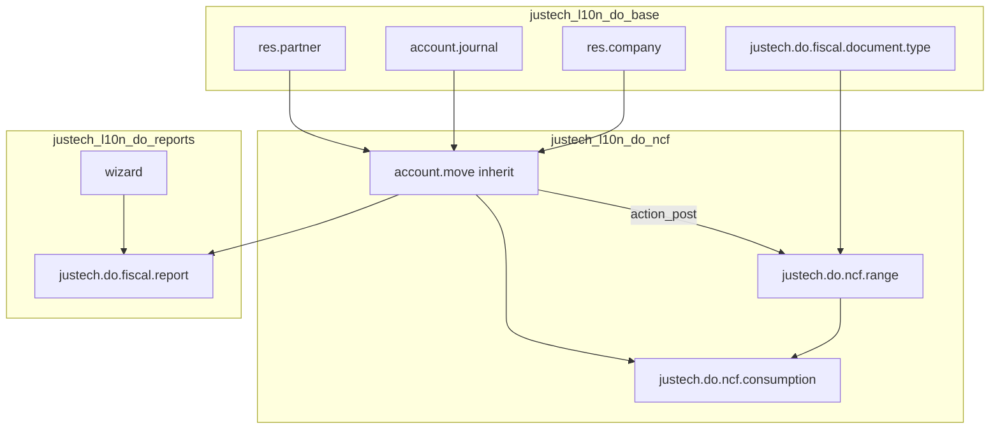

# Fase 6.5 — Revisión de Arquitectura

**Alcance:** `justech_l10n_do_base`, `justech_l10n_do_ncf`, `justech_l10n_do_reports`  
**Versión auditada:** 19.0.1.0.0  
**Fecha:** 2026-06-30  
**Rol:** Software Architect / Lead Engineer

---

## 1. Resumen ejecutivo

La arquitectura de tres capas es **correcta y alineada con Odoo** para un MVP fiscal. La separación base → NCF → reportes respeta dependencias y responsabilidades. Sin embargo, hay **deuda estructural** que impide certificar como producto comercial multi-empresa sin un sprint de hardening.

| Dimensión | Calificación | Comentario |
|-----------|--------------|------------|
| Estructura modular | ✅ Buena | 3 módulos cohesivos |
| Separación de responsabilidades | ⚠️ Aceptable | Lógica fiscal concentrada en `account.move` |
| Acoplamiento | ⚠️ Medio | XML IDs hardcodeados, refs cruzados |
| Multi-empresa | ❌ Insuficiente | Sin `ir.rule` |
| Escalabilidad | ⚠️ Aceptable | Sin locking de secuencia NCF |

---

## 2. Estructura de módulos

```
justech_l10n_do_base          → Tipos documento, compañía, diario, RNC
        ↓
justech_l10n_do_ncf           → Rangos, consumo, account.move, PDF
        ↓
justech_l10n_do_reports       → Reportes 606/607/608, wizard, export
```

### Dependencias declaradas

| Módulo | Depends | Evaluación |
|--------|---------|------------|
| `base` | `account`, `contacts`, `l10n_do` | ✅ Mínimas y correctas |
| `ncf` | `base`, `account_debit_note` | ✅ B03 requiere debit note |
| `reports` | `ncf` | ✅ Correcta cadena |

**No hay dependencias circulares.** No se modifica core ni Enterprise.

---

## 3. Modelos y responsabilidades

| Modelo | Módulo | Responsabilidad | Evaluación |
|--------|--------|-----------------|------------|
| `justech.do.fiscal.document.type` | base | Catálogo tipos NCF | ✅ Correcto |
| `res.company` / `res.partner` / `account.journal` | base | Configuración | ✅ Extensión estándar |
| `justech.do.ncf.range` | ncf | Rangos autorizados | ✅ Correcto |
| `justech.do.ncf.consumption` | ncf | Auditoría consumo | ✅ Correcto |
| `account.move` | ncf | Asignación NCF en post | ⚠️ Mucha lógica en un solo inherit |
| `justech.do.fiscal.report` | reports | Generación reportes | ✅ Correcto |
| `justech.do.fiscal.report.wizard` | reports | UI período | ✅ Correcto |

### Responsabilidades incorrectas o mezcladas

1. **`JustechDoNcfRange._validate_ncf_format`** — validación de formato NCF en modelo de rango; debería vivir en `fiscal.document.type` o módulo `justech_l10n_do_fiscal_utils` compartido.
2. **`account.move._justech_resolve_document_type`** — reglas de negocio DGII hardcodeadas con `env.ref("justech_l10n_do_base.doc_type_b01")` en lugar de configuración por diario/tipo.
3. **`justech_do_ncf_alert_days`** en `res.company` — campo definido pero **sin uso** (código muerto / feature incompleta).

---

## 4. Herencia y extensiones

| Patrón | Uso | Riesgo upgrade |
|--------|-----|----------------|
| `_inherit` en modelos estándar | ✅ Único mecanismo | Bajo |
| `action_post` override | ✅ Pre-hook antes de `super()` | Medio — vigilar cambios Odoo 20 |
| QWeb inherit PDF | ✅ `account.report_invoice_document` | Bajo |
| XML IDs en data | ⚠️ Tipos globales sin `company_id` | Medio multi-empresa |

**No hay monkeypatch ni replace de métodos core.**

---

## 5. Organización de carpetas

Cumple convenciones Odoo: `models/`, `views/`, `security/`, `data/`, `tests/`, `wizard/`, `report/`.

**Faltante para producto comercial:**
- `i18n/es_DO.po` — sin traducciones
- `static/description/` — sin assets de módulo Apps
- `security/*_security.xml` con record rules — **ausente**

---

## 6. Duplicación de lógica

| Lógica | Ubicaciones | Recomendación |
|--------|-------------|---------------|
| Setup fiscal en tests | 3 archivos de test | Extraer `tests/common.py` mixin |
| ITBIS en reportes | `_lines_606`, `_lines_607` | Extraer `_get_move_itbis(move)` |
| Validación RNC | `_justech_validate_rnc_format` + constraint | OK, cohesivo |

---

## 7. Código muerto / incompleto

- `justech_do_ncf_alert_days` — no referenciado
- `authorization_number` en rango — capturado en UI, no validado ni usado
- `justech_do_ncf_void_reason` — campo sin obligatoriedad ni UI prominente

---

## 8. Refactorizaciones recomendadas (sin cambiar comportamiento MVP)

### P0 — Antes de TEST

1. Añadir **`ir.rule`** multi-empresa en todos los modelos `justech.do.*`
2. Extraer mixin `justech.do.fiscal.mixin` con `_validate_ncf_format`, `_get_itbis_amount`
3. Proteger `action_void_ncf` con `groups` server-side (`@api.model` check)

### P1 — Producto comercial

4. Sustituir `env.ref(doc_type_b01)` por resolución configurable (diario → tipo por `move_type`)
5. Migrar `_sql_constraints` → `models.Constraint` (Odoo 19 deprecation)
6. Añadir `mail.thread` en `justech.do.ncf.range` y `consumption` para auditoría

### P2 — Escalabilidad

7. Lock pesimista en `consume_next` (`SELECT FOR UPDATE` o `write` con version field)
8. Cron para marcar rangos `expired` automáticamente

---

## 9. Diagrama de flujo arquitectónico



---

## 10. Conclusión arquitectónica

**Veredicto:** Arquitectura **sólida para MVP**, **insuficiente para producto comercial multi-tenant** sin record rules, locking de secuencia y desacople de XML IDs hardcodeados.

**Calificación arquitectura:** **A-**
