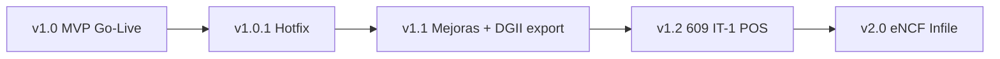

# Roadmap Oficial — Justech l10n República Dominicana

**Producto:** Justech Dominican Localization for Odoo 19  
**Cliente piloto:** Hellenia, S.R.L.  
**Fecha:** 2026-06-30  
**Estado actual:** MVP v19.0.1.1.0 — APTO PARA PILOTO / GO-LIVE CON OBS

---

## 1. Visión

Convertir el MVP Justech en la localización dominicana de referencia para Odoo 19 Enterprise: NCF tradicional hoy, eNCF y compliance DGII completo mañana.

---

## 2. Versiones

### v1.0 — MVP Go-Live Hellenia (actual)

**Estado:** ✅ Certificado UAT — pendiente corte producción

| Funcionalidad | Estado |
|---------------|--------|
| Tipos documento B01/B02/B03/B04/B11/B13 | ✅ |
| Rangos NCF + consumo | ✅ |
| Factura PDF con NCF | ✅ |
| 606/607/608 MVP | ✅ |
| Anulación NCF | ✅ |
| RNC básico | ✅ |
| Hardening P0 | ✅ |
| Multi-company rules | ✅ |

**Criterio release:** Ejecutar `PRODUCTION_CHECKLIST.md` con aprobación Hellenia.

---

### v1.0.1 — Correcciones post Go-Live (hotfix)

**Ventana:** 0-30 días post corte  
**Tipo:** Correcciones

| Item | Tipo | ID |
|------|------|-----|
| Tooltip void NCF vs cancelar | UX | UX-04 |
| `parse_ncf` ValueError | Corrección | TD-007 |
| Logo / assets PDF | Corrección | GL-U06 |
| Escenario retenciones documentado | Corrección | UAT |

---

### v1.1 — Mejoras operativas

**Ventana:** 1-3 meses post Go-Live  
**Tipo:** Mejoras + optimización

| Item | Categoría |
|------|-----------|
| i18n completo `es_DO.po` | Mejora |
| Export formato TXT DGII oficial 606/607/608 | Mejora fiscal |
| Cron auto-expire rangos NCF | Automatización |
| Dashboard alertas rangos | UX |
| `models.Constraint` Odoo 19 | Upgrade-safe |
| ITBIS por XML ID impuesto | Corrección |
| Cobertura tests ≥65% | Calidad |
| `static/description` Apps | Comercial |
| Manual usuario español | Documentación |
| Script `backup-prod.sh` | Operación |

**Módulo nuevo opcional:** `justech_l10n_do_dgii_export`

---

### v1.2 — Expansión fiscal

**Ventana:** 3-6 meses  
**Tipo:** Nuevos módulos + integraciones

| Item | Categoría |
|------|-----------|
| Formulario 609 básico | Nuevo módulo |
| IT-1 preparación / export | Nuevo módulo |
| `in_refund` NCF compras | Corrección fiscal |
| B12/B14 tipos adicionales | Nuevo |
| Validación RNC dígito verificador | Integración |
| POS fiscal básico | Nuevo módulo `justech_l10n_do_pos` |
| Validación RNC API DGII (si disponible) | Integración |

---

### v2.0 — Localización completa / eNCF

**Ventana:** 6-18 meses  
**Tipo:** Plataforma fiscal digital

| Item | Categoría |
|------|-----------|
| eNCF serie E (E31–E34) | Nuevo módulo `justech_l10n_do_encf` |
| XML DGII | Integración |
| Firma digital | Integración tercero |
| Web Services DGII | Integración |
| Infile certificación | Integración |
| IR-17 | Nuevo módulo |
| Multi-compañía UAT dedicado | Escalabilidad |
| HA / multi-VPS template | Escalabilidad |

---

## 3. Clasificación por tipo

### Correcciones (v1.0.1)

- Bugs post producción
- Gaps UAT menores
- Hardening residual P1 crítico para operación

### Mejoras (v1.1)

- i18n, UX, export DGII, tests, documentación comercial

### Nuevos módulos (v1.2–v2.0)

| Módulo | Versión |
|--------|---------|
| `justech_l10n_do_dgii_export` | v1.1 |
| `justech_l10n_do_reports_extended` | v1.2 |
| `justech_l10n_do_pos` | v1.2 |
| `justech_l10n_do_encf` | v2.0 |
| `justech_l10n_do_dgii` | v2.0 |

### Integraciones

| Integración | Versión |
|-------------|---------|
| Export TXT DGII | v1.1 |
| API validación RNC | v1.2 |
| eNCF / Infile | v2.0 |
| Odoo.sh CI template Justech | v1.1 |

### Optimización y escalabilidad

| Item | Versión |
|------|---------|
| Workers / tuning prod | v1.0 (Go-Live) |
| Swap VPS | v1.0 (Go-Live) |
| Monitoreo alertas | v1.0.1 |
| Índices reportes grandes | v1.1 |
| Arquitectura HA | v2.0 |

---

## 4. Dependencias roadmap

---

## 5. Criterios de promoción de versión

| Versión | Gate |
|---------|------|
| v1.0 → v1.0.1 | Incidencia P0/P1 en producción |
| v1.0.1 → v1.1 | 30 días estable + feedback Hellenia |
| v1.1 → v1.2 | Export DGII validado contador |
| v1.2 → v2.0 | Mandato eNCF cliente o mercado |

---

## 6. Módulos esqueleto — disposición

| Módulo | Acción roadmap |
|--------|----------------|
| `hellenia_*` | Archivar o convertir en extensiones cliente v1.2 |
| `justech_core` | Absorber en `justech_l10n_do_base` v1.1 o eliminar |

---

**Roadmap sujeto a aprobación comercial Justech y prioridades DGII.**
