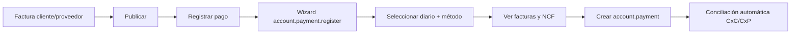

# Flujo CxC / CxP y pagos — Hellenia

**Fase:** 16  
**Odoo:** 19 EE + Justech `l10n_do` / NCF  
**Idioma UI:** Español (República Dominicana)

---

## 1. Resumen del flujo

---

## 2. Cobro a cliente (CxC)

### Pasos operativos

1. **Contabilidad → Clientes → Facturas** → abrir factura publicada con saldo pendiente.
2. Clic en **Registrar pago** (o acción masiva sobre varias facturas).
3. En el wizard:
   - **Diario:** `Banco López de Haro DOP` (BNKD), `Banco USD` (BNKU) o `Caja / Efectivo` (CSH1).
   - **Método de pago:** Transferencia, Efectivo o Tarjeta según corresponda.
   - **Cuenta bancaria receptora:** se muestra al elegir diario bancario con `bank_account_id` vinculado.
4. Sección **Documentos a pagar/cobrar** (extensión `hellenia_account`):

| Columna | Origen |
|---------|--------|
| Factura | `move_id` |
| NCF | `justech_do_ncf` (Justech NCF) |
| Fecha | `date` |
| Vencimiento | `date_maturity` |
| Moneda | `currency_id` |
| Total | `amount_currency` |
| Residual | `amount_residual` |

5. **Importe:** editable para pago parcial; total para liquidar.
6. Confirmar → genera `account.payment` y concilia la línea por cobrar.

### Diarios recomendados

| Escenario | Diario | Método |
|-----------|--------|--------|
| Transferencia bancaria DOP | BNKD | Transferencia |
| Transferencia USD | BNKU | Transferencia |
| Efectivo en caja | CSH1 | Efectivo |
| Tarjeta (registro manual) | BNKD / BNKU | Tarjeta |

---

## 3. Pago a proveedor (CxP)

1. **Contabilidad → Proveedores → Facturas** → factura publicada.
2. **Registrar pago**.
3. Diario BNKD/BNKU + método **Transferencia** o **Cheque**.
4. Lista muestra factura proveedor + NCF compra (B11/B13 según tipo).
5. El pago reduce CxP y genera movimiento bancario/caja.

### Pago parcial

- Reducir el campo **Importe** antes de confirmar.
- Estado factura: `Parcialmente pagado` (`partial`).
- Saldo residual visible en lista de facturas pendientes.

### Pago múltiple

- Seleccionar varias facturas del mismo partner (mismo tipo: cliente o proveedor).
- Un solo wizard agrupa líneas; opción **Agrupar pagos** según configuración Odoo.
- Cada factura se concilia con el/los pago(s) generado(s).

---

## 4. Cuentas contables involucradas

| Concepto | Cuenta típica (plan `do`) |
|----------|---------------------------|
| CxC clientes | Por cobrar — `asset_receivable` |
| CxP proveedores | Por pagar — `liability_payable` |
| Banco DOP | Cuenta del diario BNKD (`default_account_id`) |
| Banco USD | Cuenta del diario BNKU |
| Caja | Cuenta del diario CSH1 |
| ITBIS | Cuentas impuesto 18% ITBIS |
| Retenciones | Cuentas en impuestos `l10n_do` (ver doc retenciones) |

---

## 5. Conciliación

- **Automática:** al registrar pago desde factura, Odoo concilia pago ↔ línea CxC/CxP.
- **Bancaria (EE):** módulo `account_accountant` — importar extracto en diario BNKD/BNKU y emparejar con pagos registrados.
- **Requisito Fase 16:** `bank_account_id` en diario bancario (corregido por `hellenia_account`).

---

## 6. Reportes fiscales

| Reporte | Incluye pagos |
|---------|---------------|
| **607** Ventas | Facturas clientes + NCF emitidos |
| **606** Compras | Facturas proveedor + NCF + retenciones aplicadas |

Los pagos afectan columnas de fecha de pago en 606 cuando aplica; las retenciones se reflejan en líneas de impuesto de la factura.

---

## 7. Validación automatizada

Script: `scripts/phase16-validate-payments-test.py`

| Prueba | Descripción |
|--------|-------------|
| `cobro_transferencia` | Cliente, BNKD, NCF |
| `cobro_efectivo` | CSH1 |
| `cobro_tarjeta` | BNKD, método Tarjeta |
| `pago_proveedor` | BNKD transferencia salida |
| `pago_cheque` | BNKD, cheque salida |
| `pago_parcial` | 50% del residual |
| `pago_multiple` | Dos facturas mismo cliente |
| `wizard_ncf_visible` | NCF en líneas del wizard |
| `reportes_606_607` | Smoke reportes Justech |

---

## 8. Limitaciones conocidas

- **Tarjeta / datáfono:** registro manual; sin pasarela integrada (decisión Fase 3.5).
- **Link de pago:** estructura pendiente fase posterior.
- **Retenciones en pago:** se aplican en **factura** (impuestos), no como wizard separado de retención en pago salvo extensión futura.
