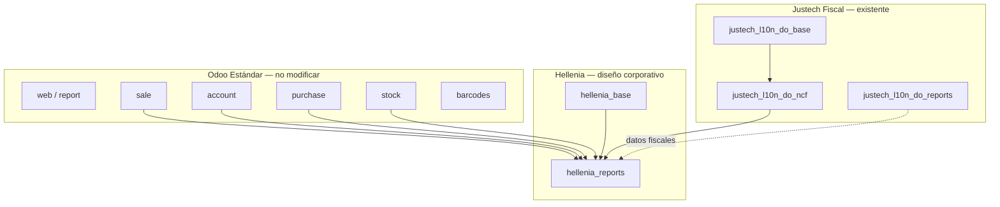
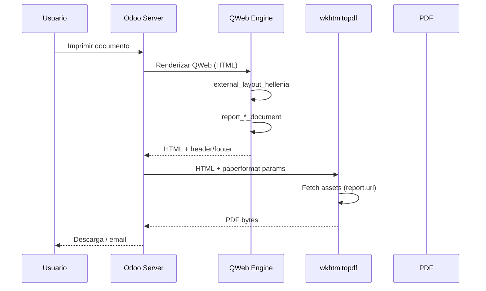

# Arquitectura Motor de Reportes — Justech / Hellenia

**Fase:** 13.5  
**Cliente:** Hellenia, S.R.L.  
**Plataforma:** Odoo 19 Enterprise On-Premise  
**Alcance:** Diseño arquitectónico — **sin implementación de reportes en esta fase**  
**Fecha:** 2026-06-30

---

## 1. Principios de diseño

| Principio | Regla |
|-----------|-------|
| **No tocar core** | Cero modificaciones en `/usr/lib/python3/dist-packages/odoo` |
| **No tocar Enterprise** | Cero modificaciones en `/mnt/enterprise` |
| **No tocar odoo-pecv** | Proyecto aislado en el mismo VPS |
| **Solo custom Justech** | Todo en `custom/hellenia_*` y `custom/justech_*` |
| **Upgrade-safe** | Herencia QWeb (`inherit_id`), no copias de plantillas estándar |
| **Plantilla única** | Un layout corporativo reutilizado por todos los documentos |
| **Separación fiscal / comercial** | Fiscal en `justech_l10n_do_*`; diseño en `hellenia_reports` |

---

## 2. Mapa de módulos



| Módulo | Rol en reportes | Estado |
|--------|-----------------|--------|
| `hellenia_base` | Configuración compartida, campos empresa | Esqueleto |
| `hellenia_reports` | **Motor de diseño corporativo** | Esqueleto — destino principal |
| `justech_l10n_do_ncf` | Campos NCF/tipo doc en factura | Instalado — hereda `account.report_invoice_document` |
| `justech_l10n_do_reports` | Export DGII 606/607/608 | Instalado — fuera de PDF comercial |

---

## 3. Arquitectura de plantillas (Bloque 4 y 5)

### 3.1 Capas

```
┌─────────────────────────────────────────────────────────┐
│  ir.actions.report  (acción PDF por modelo)             │
├─────────────────────────────────────────────────────────┤
│  report.<modulo>_document  (cuerpo del documento)       │
│    inherit_id → plantilla estándar Odoo                 │
├─────────────────────────────────────────────────────────┤
│  external_layout_hellenia  (encabezado / pie único)     │
│    inherit_id → web.external_layout_standard            │
├─────────────────────────────────────────────────────────┤
│  report.paperformat_hellenia_letter  (carta RD)         │
├─────────────────────────────────────────────────────────┤
│  static/src/scss/hellenia_reports.scss  (estilos PDF)   │
└─────────────────────────────────────────────────────────┘
```

### 3.2 Estructura propuesta `hellenia_reports/`

```
hellenia_reports/
├── __manifest__.py
├── data/
│   ├── paperformat_data.xml          # US Letter Hellenia
│   └── report_actions.xml            # Reasignar paperformat/layout
├── report/
│   ├── layout_templates.xml          # external_layout_hellenia
│   ├── report_sale_order.xml         # Cotización / pedido
│   ├── report_invoice.xml            # Factura / NC / ND
│   ├── report_purchase.xml           # RFQ / OC
│   ├── report_stock.xml              # Entrega / recepción / picking
│   └── report_payment.xml            # Pagos / cobros / estado cuenta
├── models/
│   └── res_company.py                # Campos branding (watermark, social)
├── static/
│   └── src/
│       ├── scss/hellenia_reports.scss
│       └── img/                      # Assets estáticos módulo
└── views/
    └── res_company_views.xml         # UI configuración branding
```

### 3.3 Patrón de herencia (upgrade-safe)

**Correcto — heredar:**

```xml
<template id="report_invoice_document_hellenia"
          inherit_id="account.report_invoice_document">
    <xpath expr="//div[@class='page']" position="attributes">
        <attribute name="class">page hellenia-invoice</attribute>
    </xpath>
</template>
```

**Incorrecto — copiar plantilla completa del core:**

```xml
<!-- NO HACER: rompe en upgrades -->
<template id="report_invoice_document" inherit_id="account.report_invoice">
    <!-- 500 líneas copiadas de Odoo -->
</template>
```

### 3.4 Layout corporativo único

| Componente | Template ID propuesto | Hereda de |
|------------|----------------------|-----------|
| Layout principal | `hellenia_reports.external_layout_hellenia` | `web.external_layout_standard` |
| Encabezado | `hellenia_reports.hellenia_header` | — |
| Pie de página | `hellenia_reports.hellenia_footer` | — |
| Marca de agua | CSS `::before` o imagen absoluta | Config `res.company` |

Todos los reportes invocan:

```xml
<t t-call="hellenia_reports.external_layout_hellenia">
    <!-- contenido específico del documento -->
</t>
```

---

## 4. Catálogo de reportes futuros (Bloque 5)

Todos reutilizan `external_layout_hellenia` + `paperformat_hellenia_letter`.

| Área | Documento | XML ID base Odoo | Módulo destino |
|------|-----------|------------------|----------------|
| **Ventas** | Cotización | `sale.report_saleorder` | `hellenia_reports` |
| **Ventas** | Orden de venta | `sale.report_saleorder` | `hellenia_reports` |
| **Ventas** | Proforma | `sale.report_saleorder_pro_forma` | `hellenia_reports` |
| **Contabilidad** | Factura | `account.report_invoice` | `hellenia_reports` + `justech_l10n_do_ncf` |
| **Contabilidad** | Nota de crédito | `account.report_invoice` | `hellenia_reports` |
| **Contabilidad** | Nota de débito | `account.report_invoice` | `hellenia_reports` |
| **Compras** | RFQ | `purchase.report_purchasequotation` | `hellenia_reports` |
| **Compras** | Orden de compra | `purchase.report_purchaseorder` | `hellenia_reports` |
| **Inventario** | Albarán entrega | `stock.report_deliveryslip` | `hellenia_reports` |
| **Inventario** | Orden picking | `stock.report_picking` | `hellenia_reports` |
| **Inventario** | Recepción | `stock.report_reception` | `hellenia_reports` |
| **Pagos** | Recibo de pago | `account.report_payment_receipt` | `hellenia_reports` |
| **Cobros** | Estado de cuenta | Custom QWeb | `hellenia_reports` |
| **Fiscal** | Reportes DGII 606/607/608 | `justech_l10n_do_reports` | Sin cambio — export TXT/Excel |
| **Gerencial** | Dashboards EE | `spreadsheet_dashboard` | Sin cambio — fuera de PDF |

---

## 5. Personalización sin Enterprise (Bloque 4)

### 5.1 Mecanismos disponibles

| Mecanismo | Uso | Upgrade-safe |
|-----------|-----|--------------|
| **QWeb `inherit_id`** | Modificar/añadir bloques en plantillas | ✅ Sí |
| **`external_layout`** | Encabezado/pie global | ✅ Sí |
| **`report.paperformat`** | Tamaño, márgenes, DPI | ✅ Sí |
| **`ir.actions.report`** | Reasignar plantilla/paperformat | ✅ Sí |
| **`res.company`** | Logo, header/footer HTML | ✅ Sí |
| **Assets SCSS/CSS** | Estilos PDF vía `web.report_assets_common` | ✅ Sí |
| **Bootstrap 5** | Clases estándar en QWeb Odoo 19 | ✅ Sí |
| **Widgets barcode/QR** | `<div t-field="..." t-options="{'widget': 'barcode'}"/>` | ✅ Sí |
| **Studio** | Editor visual EE | ⚠️ No usar — no upgrade-safe para Git |

### 5.2 Respuestas arquitectónicas

| Pregunta | Respuesta |
|----------|-----------|
| ¿Formatos completamente personalizados sin modificar Enterprise? | **Sí** — módulo `hellenia_reports` en `custom/` |
| ¿Upgrade-safe? | **Sí** — si se usa solo herencia QWeb y datos XML propios |
| ¿Reemplazar formatos estándar? | **Sí** — `ir.actions.report` puede apuntar a nueva plantilla o heredar la existente |
| ¿Mejor arquitectura? | Layout único + herencias por documento + fiscal en `justech_*` |

---

## 6. Flujo de renderizado PDF



---

## 7. Estrategia de despliegue

| Paso | Ambiente | Acción |
|------|----------|--------|
| 1 | DEV | Desarrollar `hellenia_reports` |
| 2 | TEST | Instalar, validar PDFs todos los documentos |
| 3 | PROD | Promover tras UAT visual aprobado por Hellenia |
| 4 | Upgrade Odoo | Diff plantillas heredadas; ajustar xpath si cambió core |

### Dependencias `hellenia_reports` propuestas

```python
"depends": [
    "hellenia_base",
    "sale",
    "account",
    "purchase",
    "stock",
    "justech_l10n_do_ncf",  # NCF en facturas
],
```

---

## 8. Relación con módulos existentes

| Módulo | Integración |
|--------|-------------|
| `justech_l10n_do_ncf` | Ya añade NCF/tipo doc a factura — `hellenia_reports` hereda y estiliza |
| `justech_l10n_do_reports` | Export DGII independiente del PDF comercial |
| `hellenia_ui` | Menús prod — sin impacto en reportes |

**Regla:** No mover lógica fiscal a `hellenia_reports`. Solo presentación.

---

## 9. Referencias

- [PDF_ENGINE_CERTIFICATION.md](PDF_ENGINE_CERTIFICATION.md) — Certificación infraestructura
- [COMMERCIAL_DOCUMENTS_SPEC.md](COMMERCIAL_DOCUMENTS_SPEC.md) — Contenido por documento
- [QWEB_CUSTOMIZATION_GUIDE.md](QWEB_CUSTOMIZATION_GUIDE.md) — Guía técnica
- [BRANDING_GUIDE.md](BRANDING_GUIDE.md) — Configuración visual
- [CUSTOM_MODULE_GUIDE.md](CUSTOM_MODULE_GUIDE.md) — Estándares módulos Justech
