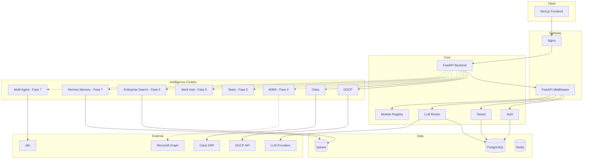
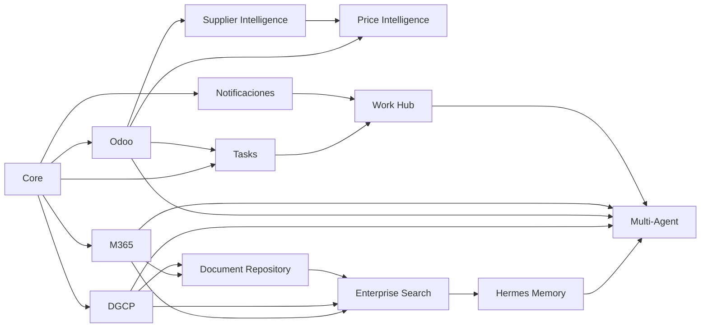

# JAIOS — Arquitectura

## Visión

JAIOS es un sistema operativo de IA multiempresa. La plataforma evoluciona por **fases de Intelligence Centers** que consultan fuentes externas de forma segura, alimentan búsqueda/memoria y culminan en operaciones multi-agente.

**Roadmap oficial:** [`docs/roadmap.md`](roadmap.md)

## Fases de entrega

| Fase | Módulo | Estado |
|------|--------|--------|
| 1 | Core Platform | Entregado |
| 2 | DGCP Intelligence Center | Entregado |
| 3 | Odoo Intelligence Center | **Activo** (solo lectura) |
| 4 | Microsoft 365 Intelligence Center | Planificado |
| 5 | Tasks + Notificaciones + Work Hub | Planificado |
| 6 | Enterprise Search | Entregado |
| 6.5 | Search Acceleration Engine | Planificado |
| 6+ | Document Repository, Supplier/Price Intelligence | Futuro |
| 7 | Hermes Enterprise Memory, Multi-Agent Operations | Futuro |

## Diagrama de componentes (actual + futuro)



Líneas punteadas = planificado, no implementado.

## Grafo de dependencias entre módulos



Definición canónica en `backend/app/platform/modules.py`.

## Estructura de carpetas

```
jaios/
├── frontend/                 # Next.js — UI por módulo (/dgcp, /odoo, /m365 futuro…)
├── backend/
│   └── app/
│       ├── api/v1/           # REST endpoints por módulo activo
│       ├── platform/         # Registro de módulos, schemas futuros
│       ├── core/             # Security, tenant, exceptions
│       ├── llm/              # LLM Router
│       ├── models/           # ORM (schema jaios)
│       └── services/         # Lógica de módulos activos
├── agents/                   # Framework multi-agente (Fase 7)
├── integrations/
│   ├── odoo/                 # Odoo JSON-RPC + SafeOdooClient
│   ├── dgcp/                 # API DGCP
│   ├── microsoft365/         # Stub Graph API (Fase 4)
│   └── intelligence/         # Interfaces futuras por dominio
├── database/                 # Alembic migrations
└── docs/
    ├── architecture.md       # Este documento
    └── roadmap.md            # Roadmap oficial
```

## Multiempresa (Multi-tenant)

| Capa | Mecanismo |
|------|-----------|
| Base de datos | `tenant_id` FK en tablas de dominio |
| API | Header `X-Tenant-ID` + claim JWT `tenant_id` |
| Backend | `ContextVar` en `app/core/tenant.py` |
| Módulos | `tenants.settings.enabled_modules` (JSONB, clave futura) |
| Integraciones | `integration_connections` — `integration` string + `config` JSONB |

## API Gateway

1. **Nginx** — Rate limiting, proxy `/api/` → backend, `/` → frontend.
2. **FastAPI Middleware** — Request ID, timing, tenant propagation.

## LLM Router

| Proveedor | Uso actual / futuro |
|-----------|---------------------|
| OpenAI, Claude, DeepSeek, Hermes Local | Consultas, clasificación DGCP, agentes |

Hermes Local evoluciona hacia **Hermes Enterprise Memory** (Fase 7) con Qdrant.

## Intelligence Centers — patrones

Cada center sigue el mismo contrato arquitectónico:

| Capacidad | Descripción |
|-----------|-------------|
| `health` | Estado de conexión, sin datos mock |
| `summary` | KPIs agregados read-only |
| `query` | Consultas inteligentes por reglas/IA |
| `safe_client` | Bloqueo de escritura cuando aplique |
| `audit` | Intentos bloqueados y operaciones sensibles |

**Odoo (Fase 3):** `SafeOdooClient` + `ODOO_READ_ONLY=true` por defecto.

**M365 (Fase 4):** Mismo patrón read-only inicial sobre Microsoft Graph.

## Modelos de datos futuros

Sin tablas dedicadas hasta que el módulo entre en desarrollo activo:

| Módulo | Stub Pydantic | Ubicación |
|--------|---------------|-----------|
| Tasks / Work Hub | `TaskAssignment`, `WorkHubItem` | `app/platform/schemas.py` |
| Notificaciones | `NotificationEvent` | `app/platform/schemas.py` |
| Enterprise Search | `SearchIndexEntry` | `app/platform/schemas.py` |
| Document Repository | `EnterpriseDocument` | `app/platform/schemas.py` |
| Hermes Memory | `MemoryEntry` | `app/platform/schemas.py` |
| Multi-Agent | `AgentOperation` | `app/platform/schemas.py` |
| Supplier / Price | `SupplierQuote`, `PriceSource` | `integrations/intelligence/` |

Persistencia inicial vía JSONB en `tenants.settings` e `integration_connections.config` para no limitar esquemas futuros.

## Principios de extensibilidad

1. **IDs de módulo estables** — definidos en `app/platform/modules.py`.
2. **Dependencias explícitas** — validadas en tests de arquitectura.
3. **Agentes consumen APIs** — nunca credenciales de integración directamente.
4. **Search y Memory son transversales** — no duplican fuentes de verdad.
5. **Work Hub agrega** — Tasks Center es la fuente de verdad de pendientes.
6. **Sin implementación adelantada** — stubs, ABCs y dataclasses hasta la fase correspondiente.

## Integraciones

| Integración | Ubicación | Fase | Estado |
|-------------|-----------|------|--------|
| DGCP | `integrations/dgcp/` | 2 | Productivo |
| Odoo | `integrations/odoo/` | 3 | Read-only productivo |
| Microsoft 365 | `integrations/microsoft365/` | 4 | Stub |
| n8n | `integrations/n8n/` | 7 | Webhook trigger |
| Intelligence stubs | `integrations/intelligence/` | 4–7 | Interfaces |
