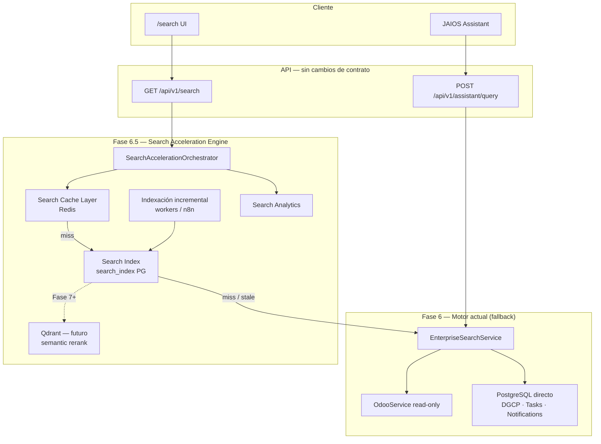
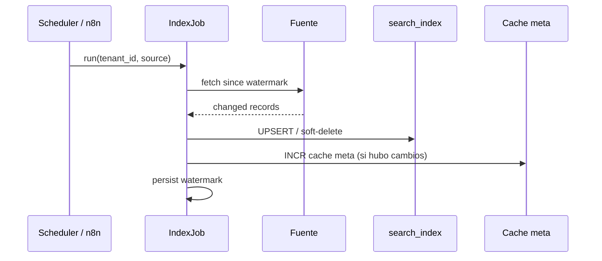

# Backlog — Fase 6.5: Search Acceleration Engine

**Estado:** Planificado · **No implementar todavía**  
**Depende de:** Fase 6 — Enterprise Search (entregada)  
**Objetivo:** Reducir latencia de `GET /api/v1/search` y consultas del Assistant (`enterprise_search`) sin romper el contrato ni el motor estructurado actual.

---

## Principios de diseño (no romper Fase 6)

| Regla | Detalle |
|-------|---------|
| **Facade estable** | `EnterpriseSearchService` sigue siendo el punto de entrada. La aceleración es una capa interna opcional. |
| **Contrato API intacto** | `GET /api/v1/search?q=` mantiene el mismo JSON (`query`, `total`, `groups[]`). |
| **Fallback automático** | Si cache/index falla o está deshabilitado → comportamiento Fase 6 (SQL + Odoo read-only). |
| **Opt-in por tenant** | `tenants.settings.search_acceleration` (JSONB) hasta migración dedicada. |
| **Seguridad** | Cache e índice siempre filtrados por `tenant_id`; Odoo sigue read-only; sin secretos en Redis. |
| **Assistant** | `_answer_enterprise_search` consume el mismo servicio; no duplicar lógica. |

---

## Arquitectura objetivo



### Flujo de consulta (target)

1. Normalizar query + filtros (`source`, `type`, `company`, `limit`).
2. **Cache hit** (Redis) → respuesta inmediata + métrica `cache_hit=true`.
3. **Cache miss** → consultar `search_index` (FTS / trigram) por `tenant_id`.
4. Si índice insuficiente o desactualizado → **fallback Fase 6** + encolar re-indexación del slice afectado.
5. Guardar respuesta en cache (TTL) + registrar analytics.
6. *(Futuro)* Qdrant rerank sobre top-N del índice estructurado.

---

## 1. Search Cache Layer (Redis)

### Propósito

Evitar repetir fan-out a Odoo + múltiples queries SQL en consultas frecuentes e idénticas.

### Claves Redis

```
jaios:search:cache:{tenant_id}:{cache_version}:{query_hash}
jaios:search:cache:meta:{tenant_id}          # versión global de invalidación
jaios:search:assistant:{tenant_id}:{hash}    # respuestas Assistant (TTL más corto)
```

- `query_hash` = SHA-256 de `q|source|type|company|limit|odoo_company_id`.
- `cache_version` = contador en meta; incrementar invalida todo el tenant sin SCAN masivo.

### TTL configurable (por tenant)

```json
{
  "search_acceleration": {
    "enabled": false,
    "cache": {
      "enabled": true,
      "ttl_seconds": 120,
      "assistant_ttl_seconds": 60,
      "max_entries_per_tenant": 5000
    }
  }
}
```

| Perfil | TTL sugerido | Uso |
|--------|--------------|-----|
| Búsqueda UI | 60–300 s | Consultas repetidas en `/search` |
| Assistant | 30–120 s | Misma pregunta en ventana corta |
| Post-invalidate | 0 | Tras sync DGCP / cambio tarea |

### Invalidación

| Evento | Acción |
|--------|--------|
| Sync DGCP completado | `INCR jaios:search:cache:meta:{tenant_id}` |
| CRUD tarea / notificación | Invalidar slice `source=jaios` o bump version |
| Cambio contexto Odoo empresa | Bump version (nuevo `odoo_company_id` en hash) |
| Admin «limpiar cache búsqueda» | Bump version |

### Servicio (stub)

- `integrations/intelligence/search.py` → `SearchCacheLayer` (ABC).
- Implementación futura: `backend/app/services/search_cache_service.py`.

### Criterios de aceptación (backlog)

- [ ] Cache hit &lt; 50 ms p95 en gateway.
- [ ] Aislamiento estricto por tenant (imposible leer cache de otro tenant).
- [ ] Con `enabled=false`, cero lecturas/escrituras Redis.
- [ ] Payload en Redis sin PII sensible innecesaria (solo respuesta ya autorizada).

---

## 2. Search Index (`search_index`)

### Propósito

Materializar documentos de búsqueda en PostgreSQL para evitar N llamadas Odoo por consulta y unificar ranking.

### Tabla propuesta

```sql
-- Migración futura: 008_search_index.py
CREATE TABLE jaios.search_index (
    id              UUID PRIMARY KEY DEFAULT gen_random_uuid(),
    tenant_id       UUID NOT NULL REFERENCES jaios.tenants(id) ON DELETE CASCADE,
    source          VARCHAR(32) NOT NULL,   -- odoo | dgcp | jaios | m365 | documents
    entity_type     VARCHAR(32) NOT NULL,   -- cliente | producto | licitación | tarea | ...
    entity_id       VARCHAR(128) NOT NULL,  -- id Odoo o UUID JAIOS
    title           TEXT NOT NULL,
    subtitle        TEXT,
    description     TEXT,
    url             TEXT NOT NULL,
    company         VARCHAR(64),            -- empresa Odoo / clasificación DGCP
    odoo_company_id INTEGER,
    score_boost     SMALLINT DEFAULT 0,
    metadata        JSONB NOT NULL DEFAULT '{}',
    source_updated_at TIMESTAMPTZ,
    indexed_at      TIMESTAMPTZ NOT NULL DEFAULT now(),
    is_active       BOOLEAN NOT NULL DEFAULT true,
    UNIQUE (tenant_id, source, entity_type, entity_id)
);

CREATE INDEX ix_search_index_tenant_source ON jaios.search_index (tenant_id, source);
CREATE INDEX ix_search_index_tenant_active ON jaios.search_index (tenant_id) WHERE is_active;
CREATE INDEX ix_search_index_fts ON jaios.search_index
    USING gin (to_tsvector('spanish', coalesce(title,'') || ' ' || coalesce(subtitle,'') || ' ' || coalesce(description,'')));
```

### Fuentes e indexadores

| Fuente | Fase | Indexador | Watermark / trigger |
|--------|------|-----------|---------------------|
| **Odoo** clientes | 6.5 | `OdooSearchIndexer` | `write_date` por modelo; poll cada 5–15 min |
| **Odoo** productos | 6.5 | idem | idem |
| **Odoo** facturas / cotizaciones / CRM / proyectos | 6.5 | idem | dominio read-only existente |
| **Odoo** proveedores | 6.5 | idem | idem |
| **DGCP** oportunidades | 6.5 | `DGCPSearchIndexer` | post-sync job + `synced_at` |
| **Tasks** | 6.5 | `JaiosSearchIndexer` | `tasks.updated_at` + evento create/update |
| **Notifications** | 6.5 | idem | `notifications.created_at` (ventana 90 días) |
| **M365** correo | 7+ | `M365SearchIndexer` | Graph delta + stub hasta Graph real |
| **Documents** | 7+ | `DocumentSearchIndexer` | repositorio documental |

### Indexación incremental



Tabla de control (futura):

```sql
CREATE TABLE jaios.search_index_state (
    tenant_id   UUID NOT NULL,
    source      VARCHAR(32) NOT NULL,
    watermark   TIMESTAMPTZ,
    last_run_at TIMESTAMPTZ,
    last_error  TEXT,
    PRIMARY KEY (tenant_id, source)
);
```

### Consulta sobre índice

- Reemplazar fan-out interno de `EnterpriseSearchService.search()` cuando `search_acceleration.index.enabled=true`.
- Mapear filas → `SearchResultGroup` / `SearchResultItem` (misma lógica de URLs que Fase 6).
- Mantener `_score()` o migrar a `ts_rank` + `score_boost`.

### Criterios de aceptación (backlog)

- [ ] Búsqueda `dell` / `Banco` / `MIREX` desde índice con latencia &lt; 500 ms p95 (sin Odoo en hot path).
- [ ] Re-indexación incremental &lt; 2 min tras sync DGCP.
- [ ] Fallback transparente si índice vacío.
- [ ] Sin escritura en Odoo.

---

## 3. Search Analytics

### Propósito

Visibilidad operativa: qué buscan los usuarios, qué tan rápido responde el sistema, eficacia del cache.

### Tabla de eventos (futura)

```sql
CREATE TABLE jaios.search_analytics_events (
    id            UUID PRIMARY KEY DEFAULT gen_random_uuid(),
    tenant_id     UUID NOT NULL,
    user_id       UUID,
    channel       VARCHAR(16) NOT NULL,  -- ui | assistant | api
    query         VARCHAR(512) NOT NULL,
    filters       JSONB DEFAULT '{}',
    latency_ms    INTEGER NOT NULL,
    cache_hit     BOOLEAN NOT NULL DEFAULT false,
    index_hit     BOOLEAN NOT NULL DEFAULT false,
    result_count  INTEGER NOT NULL DEFAULT 0,
    sources_used  JSONB DEFAULT '[]',
    created_at    TIMESTAMPTZ NOT NULL DEFAULT now()
);

CREATE INDEX ix_search_analytics_tenant_time ON jaios.search_analytics_events (tenant_id, created_at DESC);
```

### Métricas expuestas (Admin futuro)

| Métrica | Descripción |
|---------|-------------|
| **Top consultas** | Top 20 últimos 7 días por tenant |
| **Tiempo promedio** | p50 / p95 `latency_ms` por canal |
| **Cache hit ratio** | `cache_hit / total` rolling 24 h |
| **Index hit ratio** | consultas resueltas sin fallback Odoo |
| **Consultas sin resultado** | candidatas a mejorar índice |

### API futura (solo diseño)

```
GET /api/v1/admin/search/analytics?days=7
GET /api/v1/admin/search/analytics/top-queries
```

- Permisos: `owner` / `admin` / `gerencia` (mismo patrón Admin Center).
- **No almacenar** tokens ni datos fuera del tenant.

### Pipeline

1. `SearchAccelerationOrchestrator` emite evento async (no bloquear respuesta).
2. Batch insert cada N segundos o Redis stream → PG.
3. Agregados materializados opcionales (vista diaria).

---

## 4. Future Qdrant Integration

### Propósito (Fase 7+, no 6.5)

Búsqueda semántica, documentos, knowledge base empresarial (Hermes).

### Diseño híbrido

```mermaid
flowchart LR
    Q[Query usuario]
    STRUCT[search_index FTS]
    VEC[Qdrant vectors]
    MERGE[Merge + rerank]
    OUT[SearchResultItem[]]

    Q --> STRUCT
    Q --> VEC
    STRUCT --> MERGE
    VEC --> MERGE
    MERGE --> OUT
```

| Colección Qdrant | Contenido | Fase |
|------------------|-----------|------|
| `jaios_search_{tenant_id}` | Chunks de título+descripción del índice | 7 |
| `jaios_docs_{tenant_id}` | PDF/Word/Excel fragmentados | 7 |
| `jaios_mail_{tenant_id}` | Snippets correo M365 | 7 |
| `jaios_hermes_{tenant_id}` | Memoria empresarial persistente | 7 |

### Interfaces (stub)

- `SemanticSearchProvider` en `integrations/intelligence/search.py`.
- Implementación: `integrations/qdrant/search_client.py` (futuro).
- Feature flag: `search_acceleration.semantic.enabled=false` por defecto.

### Reglas

- Nunca reemplazar el índice estructurado; Qdrant **complementa** (rerank / recall).
- Embeddings vía LLM router existente; sin nueva dependencia en 6.5.
- Resultados semánticos etiquetados `source` + `type` igual que Fase 6.

---

## Epics y historias (backlog Jira-style)

### Epic A — Search Cache Layer

| ID | Historia | Prioridad |
|----|----------|-----------|
| A1 | Servicio Redis + claves por tenant | Alta |
| A2 | Integrar cache en orchestrator con fallback | Alta |
| A3 | Settings tenant TTL / enable | Media |
| A4 | Invalidación post-sync DGCP y CRUD tareas | Media |
| A5 | Tests: hit/miss, aislamiento tenant | Alta |

### Epic B — Search Index

| ID | Historia | Prioridad |
|----|----------|-----------|
| B1 | Migración `search_index` + `search_index_state` | Alta |
| B2 | Indexador DGCP (incremental) | Alta |
| B3 | Indexador Tasks + Notifications | Alta |
| B4 | Indexador Odoo (clientes, productos, facturas…) | Alta |
| B5 | Query path FTS + mapeo a groups/items | Alta |
| B6 | Scheduler / n8n webhook reindex | Media |
| B7 | Stubs M365 + Documents (sin datos) | Baja |

### Epic C — Search Analytics

| ID | Historia | Prioridad |
|----|----------|-----------|
| C1 | Tabla eventos + writer async | Media |
| C2 | Métricas cache/index hit | Media |
| C3 | Panel Admin «Analítica de búsqueda» | Baja |
| C4 | Alerta latencia p95 &gt; umbral | Baja |

### Epic D — Qdrant (futuro, fuera de 6.5)

| ID | Historia | Prioridad |
|----|----------|-----------|
| D1 | `SemanticSearchProvider` + colección tenant | Fase 7 |
| D2 | Pipeline embeddings documentos | Fase 7 |
| D3 | Hybrid rerank en EnterpriseSearchService | Fase 7 |
| D4 | Integración Hermes knowledge base | Fase 7 |

---

## Configuración tenant (JSONB — sin migración en 6.5 design)

```json
{
  "search_acceleration": {
    "enabled": false,
    "cache": { "enabled": true, "ttl_seconds": 120 },
    "index": { "enabled": true, "prefer_index": true },
    "semantic": { "enabled": false },
    "analytics": { "enabled": true, "sample_rate": 1.0 }
  }
}
```

---

## Impacto en código existente (plan de integración)

| Archivo actual | Cambio futuro |
|----------------|---------------|
| `backend/app/services/enterprise_search_service.py` | Delegar a `SearchAccelerationOrchestrator`; conservar métodos `_search_odoo_*` como fallback |
| `backend/app/api/v1/search.py` | Sin cambio de firma |
| `backend/app/services/assistant_service.py` | Sin cambio; usa mismo servicio |
| `integrations/intelligence/search.py` | ABCs cache / index / semantic |
| `docker-compose.yml` | Redis ya presente — reutilizar instancia |
| `scripts/qa_self_heal.sh` | Añadir checks opcionales cache/index cuando `enabled` |

---

## KPIs de éxito (Fase 6.5)

| KPI | Baseline Fase 6 | Objetivo 6.5 |
|-----|-----------------|--------------|
| p95 `GET /search` (con Odoo conectado) | 3–15 s | &lt; 800 ms |
| p95 Assistant `enterprise_search` | 5–20 s | &lt; 1.5 s |
| Cache hit ratio (prod) | 0% | &gt; 40% tras 2 semanas |
| Consultas resueltas solo índice | 0% | &gt; 70% |
| Regresiones Fase 6 | — | 0 (mismo JSON, mismos links) |

---

## Orden de implementación recomendado

1. **B1 + B2 + B5** — Índice DGCP + query FTS (ganancia rápida sin Odoo).
2. **B3** — Tasks + Notifications.
3. **A1 + A2** — Cache Redis sobre respuestas ya resueltas.
4. **B4** — Indexación Odoo incremental.
5. **C1 + C2** — Analytics básico.
6. **D*** — Qdrant en Fase 7 con Hermes.

---

## Referencias

- Motor actual: `backend/app/services/enterprise_search_service.py`
- API: `backend/app/api/v1/search.py`
- Interfaces: `integrations/intelligence/search.py`
- Módulo: `backend/app/platform/modules.py` → `search_acceleration`
- Roadmap: `docs/roadmap.md`
