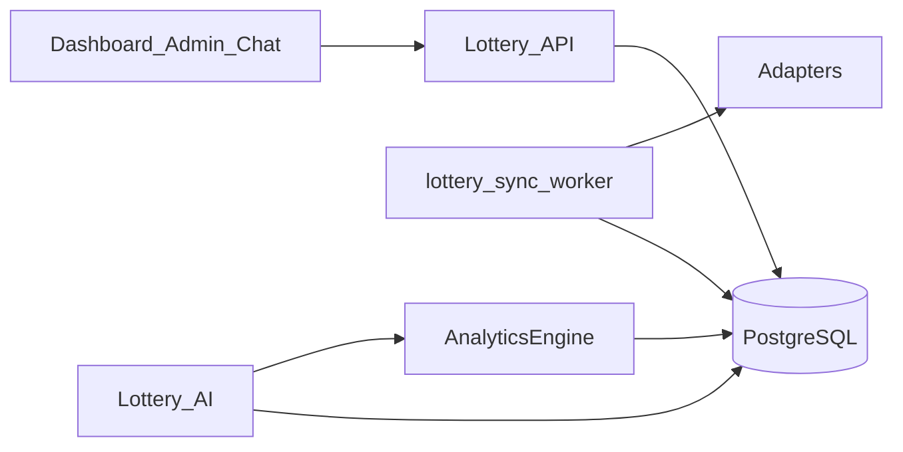

# Lottery 3.0 — Architecture

## Vision

JAIOS Lottery is an **intelligence platform**: sync, multi-source validation, analytics, AI analyst, ops dashboard — not a results viewer.

## Components

| Component | Location | Role |
|-----------|----------|------|
| Lottery Core | `backend/app/lottery/core/` | TZ helpers, metadata integrity |
| Sync Engine | `backend/app/lottery/sync/` | Window planner, dispatcher, multi-source, **standalone worker** |
| Analytics Engine | `backend/app/lottery/analytics/` | Descriptive stats from DB only |
| AI Engine | `backend/app/services/lottery_*` + `lottery/ai/` | Intent → tools → synthesis + usage metrics |
| Dashboard / Catalog / Admin | `frontend/.../lottery/` | Ops UI; never runs sync loop |
| API | `/api/v1/lottery/*` | Thin HTTP; includes `/dashboard/v3`, `/analytics/*`, `/sync/windows` |

## Sync worker decoupling

- Entrypoint: `python -m app.lottery.sync.worker`
- Compose service: `lottery-sync-worker` (profile `lottery-sync`)
- When `LOTTERY_SYNC_WORKER_STANDALONE=true`, API **does not** start APScheduler
- Redis lock + per-lottery auto-write flags prevent double-write / over-write

## Smart windows

Phases: `idle` → `pre` → `live` → `post` → `paused` (after validated result).

Intervals (defaults): 60 / 5 / 1 / 1 minutes. Per-lottery overrides in DB (migration 058).

## Multi-source

Tables: `lottery_sources`, `lottery_source_attempts`, `lottery_source_conflicts`.

Failover: primary → secondary → backup. Conflicts **block auto-write** and open admin incidents.

## Scaling 3 → 50 auto-write

1. Observe dry-run  
2. Manual write ×2 + idempotency  
3. Seed schedule windows  
4. Enable `is_auto_write_enabled`  
5. Monitor inserts + conflicts  

Do **not** enable Nacional Día without explicit authorization.

## Implemented vs prepared

| Area | Implemented now | Prepared |
|------|-----------------|----------|
| P0 TZ / Real metadata | Yes | — |
| Worker standalone | Yes | Horizontal scale |
| Window planner | Yes (3 seeded) | Seed remaining 47 schedules |
| Multi-source schema + compare | Yes | More live adapters |
| Analytics engine | Yes (core) | Snapshots cache |
| AI ops tools + usage | Yes | Cost dashboards |
| Dashboard v3 / catalog | Yes | SSE |
| Multi-country fields | Yes (`country_code`) | Non-DO operators |

## Risks

- `write_flag_timeout` can dry-run after TTL — raise carefully for long soaks or refresh `write_enabled_since`
- Dual tick if standalone flag false while worker also runs — use compose profile + env
- Polling near draw windows must respect source rate limits
