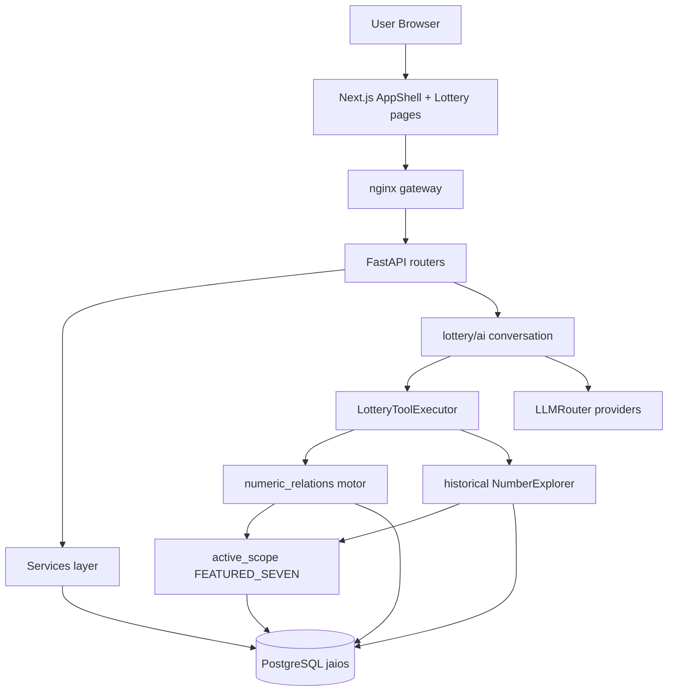

# POST J-10X — Architecture (as-built)

## Diagram

## Layer boundaries

| Layer | Responsibility | Violation risks |
|-------|----------------|-----------------|
| Frontend | Display, forms, navigation | Business formulas (none found); oversized pages |
| API routers | Auth, validation, orchestration | Raw `dict` bodies on AI admin; hardcoded paths |
| Services | Sync, admin, tools | Sync path defaults to laptop FS |
| Motor NR | T1/T2, analyze, historical | Unbounded universe loads |
| Scope policy | FEATURED_SEVEN | Must remain single gate |

## Couplings / smells

1. **Dual shells:** AppShell (module registry) vs `admin/ai/layout.tsx` custom shell.
2. **Lottery chat hard-wired** to lottery tools — not a generic Conversation API.
3. **`agents/` skeleton empty** while lottery AI is a parallel “agent-like” stack.
4. **Legacy redirect pages** still occupy App Router slots (also in `next.config` redirects).
5. **historial-numero** duplicates `historical-form` instead of sharing.

## No circular imports detected in NR package

Motor dependency direction is clean: `table1/table2 → catalog → analysis/historical → API`.

## Dead / transitional

- Redirect-only pages: `search`, `compare`, `statistics`, `groups-table1/2`, `admin/numeric-relations`.
- Branding remnant: `print/page.tsx` “Resultados de Loterías”.
