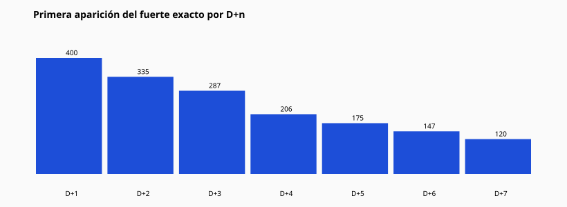

# 06 — Resultados del fuerte exacto

Activaciones fuerte (únicas/día): **2222**  
Con exacto en ≤7d: **1670**  
Sin exacto: **552**

## Por día de primera aparición

| Día | Conteo | % de activaciones |
| --- | --- | --- |
| D+1 | 400 | 18.0 |
| D+2 | 335 | 15.08 |
| D+3 | 287 | 12.92 |
| D+4 | 206 | 9.27 |
| D+5 | 175 | 7.88 |
| D+6 | 147 | 6.62 |
| D+7 | 120 | 5.4 |

## Acumulado

| Ventana | Conteo | % |
| --- | --- | --- |
| D+1 | 400 | 18.0 |
| D+1–D+2 | 735 | 33.08 |
| D+1–D+3 | 1022 | 45.99 |
| D+1–D+4 | 1228 | 55.27 |
| D+1–D+5 | 1403 | 63.14 |
| D+1–D+6 | 1550 | 69.76 |
| D+1–D+7 | 1670 | 75.16 |

CSV: `strong_exact_results.csv`
