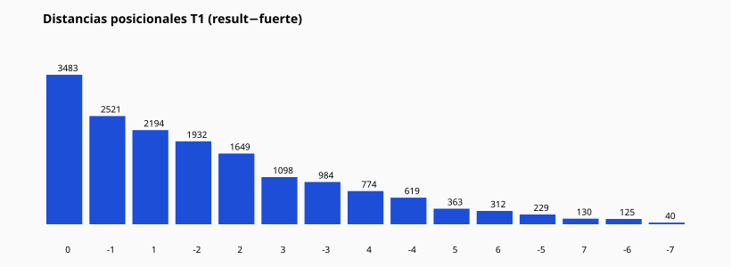

# 08 — Análisis posicional Tabla 1

## Distancias observadas (result − fuerte)

| Distancia | Conteo | % |
| --- | --- | --- |
| 0 | 3483 | 21.17% |
| -1 | 2521 | 15.32% |
| 1 | 2194 | 13.33% |
| -2 | 1932 | 11.74% |
| 2 | 1649 | 10.02% |
| 3 | 1098 | 6.67% |
| -3 | 984 | 5.98% |
| 4 | 774 | 4.7% |
| -4 | 619 | 3.76% |
| 5 | 363 | 2.21% |
| 6 | 312 | 1.9% |
| -5 | 229 | 1.39% |
| 7 | 130 | 0.79% |
| -6 | 125 | 0.76% |
| -7 | 40 | 0.24% |

## Matriz (extracto) posición_fuerte × posición_aparecida

| Pos fuerte | Pos aparecida | Conteo | % fila |
| --- | --- | --- | --- |
| 1 | 1 | 1031 | 22.56% |
| 1 | 2 | 981 | 21.47% |
| 1 | 3 | 730 | 15.97% |
| 1 | 4 | 562 | 12.3% |
| 1 | 5 | 515 | 11.27% |
| 1 | 6 | 322 | 7.05% |
| 1 | 7 | 299 | 6.54% |
| 1 | 8 | 130 | 2.84% |
| 2 | 1 | 598 | 25.93% |
| 2 | 2 | 638 | 27.67% |
| 2 | 3 | 447 | 19.38% |
| 2 | 4 | 264 | 11.45% |
| 2 | 5 | 202 | 8.76% |
| 2 | 6 | 126 | 5.46% |
| 2 | 7 | 18 | 0.78% |
| 2 | 8 | 13 | 0.56% |
| 3 | 1 | 860 | 22.66% |
| 3 | 2 | 854 | 22.5% |
| 3 | 3 | 804 | 21.18% |
| 3 | 4 | 454 | 11.96% |
| 3 | 5 | 496 | 13.07% |
| 3 | 6 | 218 | 5.74% |
| 3 | 7 | 87 | 2.29% |
| 3 | 8 | 23 | 0.61% |
| 4 | 1 | 437 | 19.18% |
| 4 | 2 | 468 | 20.54% |
| 4 | 3 | 452 | 19.83% |
| 4 | 4 | 442 | 19.39% |
| 4 | 5 | 231 | 10.14% |
| 4 | 6 | 120 | 5.27% |
| 4 | 7 | 83 | 3.64% |
| 4 | 8 | 46 | 2.02% |
| 5 | 1 | 345 | 18.47% |
| 5 | 2 | 339 | 18.15% |
| 5 | 3 | 366 | 19.59% |
| 5 | 4 | 358 | 19.16% |
| 5 | 5 | 323 | 17.29% |
| 5 | 6 | 71 | 3.8% |
| 5 | 7 | 33 | 1.77% |
| 5 | 8 | 33 | 1.77% |

### Preguntas

- **¿Cuál distancia domina?** Ver ranking arriba (dato exacto en CSV).
- **¿+1 vs −1?** Comparar conteos de distancia +1 y −1 en la tabla.
- **¿Cercanos vs lejanos?** Etiquetas POSICION_T1_ADYACENTE / CERCANA / LEJANA en `label_summary`.

CSV: `table1_position_results.csv`
