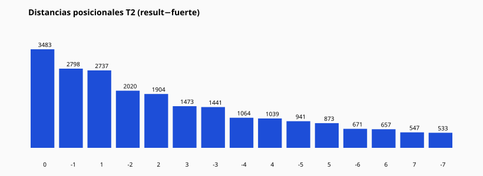

# 09 — Análisis posicional Tabla 2

| Distancia | Conteo | % |
| --- | --- | --- |
| 0 | 3483 | 14.66% |
| -1 | 2798 | 11.77% |
| 1 | 2737 | 11.52% |
| -2 | 2020 | 8.5% |
| 2 | 1904 | 8.01% |
| 3 | 1473 | 6.2% |
| -3 | 1441 | 6.06% |
| -4 | 1064 | 4.48% |
| 4 | 1039 | 4.37% |
| -5 | 941 | 3.96% |
| 5 | 873 | 3.67% |
| -6 | 671 | 2.82% |
| 6 | 657 | 2.76% |
| 7 | 547 | 2.3% |
| -7 | 533 | 2.24% |
| 8 | 400 | 1.68% |
| -8 | 366 | 1.54% |
| -9 | 280 | 1.18% |
| 9 | 248 | 1.04% |
| 10 | 154 | 0.65% |

Preguntas respondidas con conteos:

- Vecinos inmediatos T2: etiqueta `POSICION_T2_ADYACENTE` / dist ±1.
- Reaparición del confirmador: etiqueta `CONFIRMADOR_ORIGINAL`.
- Compañero/vecino del confirmador: `COMPANERO_DEL_CONFIRMADOR`, `VECINO_DEL_CONFIRMADOR`.

CSV: `table2_position_results.csv`
