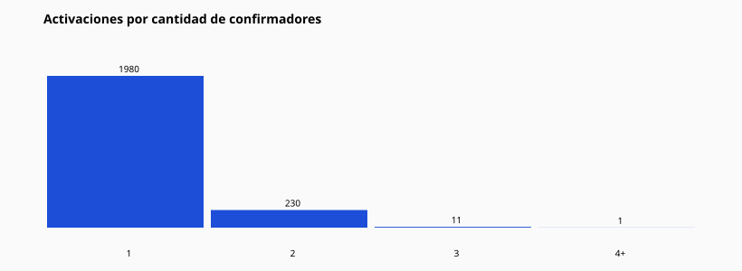

# 14 — Cantidad de confirmaciones

| Confirmadores | Activaciones | Exactos | % | Mediana D+ | Media D+ |
| --- | --- | --- | --- | --- | --- |
| 1 | 1980 | 1496 | 75.56% | 3 | 3.2 |
| 2 | 230 | 166 | 72.17% | 3 | 3.16 |
| 3 | 11 | 7 | 63.64% | 6 | 4.71 |
| 4+ | 1 | 1 | 100.0% | 6 | 6.0 |

Interpretación: comparar filas para ver si más confirmadores cambian tasa o velocidad.
No se modifica el motor.
