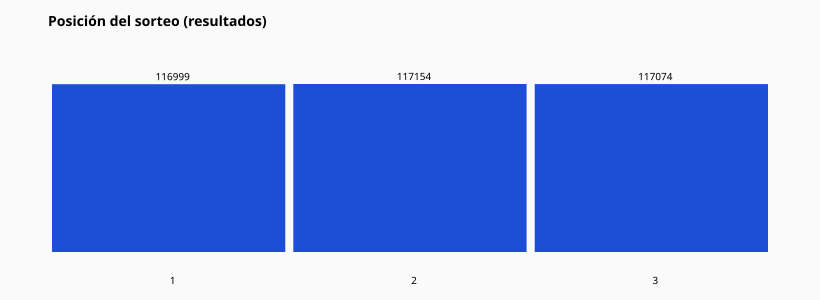

# 16 — Posición del sorteo

Matriz posición origen × posición resultado (márgenes en JSON):

Total celdas no nulas disponibles en `full_statistics.json` → `matrices.origin_pos_x_result_pos`.

Preguntas (responder con la matriz):

- ¿El exacto se concentra en 1ª/2ª/3ª?
- ¿Los compañeros T1 cambian de posición de sorteo?
- ¿La posición del confirmador predice la del resultado? (correlación descriptiva, no causal)
