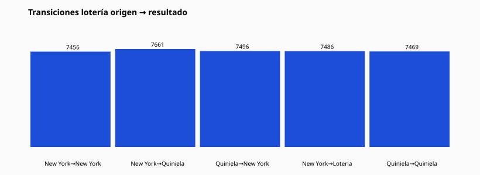

# 17 — Transiciones entre loterías

Forma: lotería origen → lotería confirmadora → lotería resultado

| Origen | Confirmadora | Resultado | Conteo |
| --- | --- | --- | --- |
| Gana Mas | Loteria Nacional | Quiniela Real | 1492 |
| New York 10:30 | New York 2:30 | New York 2:30 | 1491 |
| Gana Mas | Loteria Nacional | New York 2:30 | 1486 |
| New York 10:30 | New York 2:30 | New York 10:30 | 1484 |
| New York 10:30 | Quiniela Leidsa | Quiniela Real | 1475 |
| Gana Mas | Loteria Nacional | Quiniela Loteka | 1472 |
| New York 10:30 | Quiniela Leidsa | New York 2:30 | 1467 |
| New York 10:30 | New York 2:30 | Quiniela Real | 1465 |
| Gana Mas | Loteria Nacional | New York 10:30 | 1464 |
| New York 10:30 | New York 2:30 | Quiniela Leidsa | 1459 |
| New York 10:30 | New York 2:30 | Quiniela Loteka | 1457 |
| New York 10:30 | Quiniela Leidsa | New York 10:30 | 1455 |
| Gana Mas | Loteria Nacional | Quiniela Leidsa | 1455 |
| Loteria Nacional | Quiniela Loteka | New York 2:30 | 1454 |
| Loteria Nacional | Quiniela Loteka | New York 10:30 | 1450 |
| Gana Mas | Loteria Nacional | Loteria Nacional | 1445 |
| New York 10:30 | Quiniela Leidsa | Quiniela Leidsa | 1444 |
| New York 10:30 | Quiniela Leidsa | Quiniela Loteka | 1443 |
| New York 2:30 | Quiniela Loteka | New York 2:30 | 1437 |
| Loteria Nacional | Quiniela Loteka | Quiniela Real | 1436 |

CSV: `lottery_transitions.csv`
