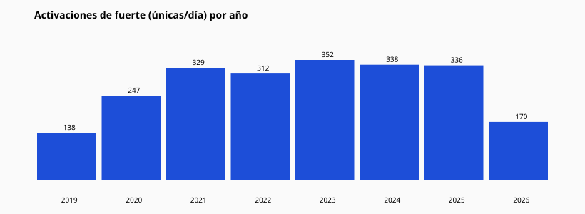

# 18 — Estabilidad anual

| Año | Activaciones fuerte | Exactos | % |
| --- | --- | --- | --- |
| 2019 | 138 | 109 | 78.99% |
| 2020 | 247 | 178 | 72.06% |
| 2021 | 329 | 235 | 71.43% |
| 2022 | 312 | 235 | 75.32% |
| 2023 | 352 | 270 | 76.7% |
| 2024 | 338 | 261 | 77.22% |
| 2025 | 336 | 252 | 75.0% |
| 2026 | 170 | 130 | 76.47% |

Matriz año × relación: `matrices.year_x_relation` en JSON.
Una relación estable aparece en varios años con conteo material (niveles 3–5).
