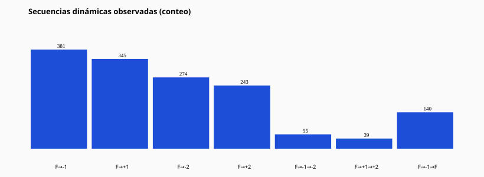

# 08 — Dinámica de familias

Secuencias observadas (conteos de activaciones donde el orden temporal se cumple):

| Secuencia | Conteo |
| --- | --- |
| F→-1 | 381 |
| F→+1 | 345 |
| F→-2 | 274 |
| F→+2 | 243 |
| F→-1→-2 | 55 |
| F→+1→+2 | 39 |
| F→-1→F | 140 |

CSV: `family_dynamics.csv`
