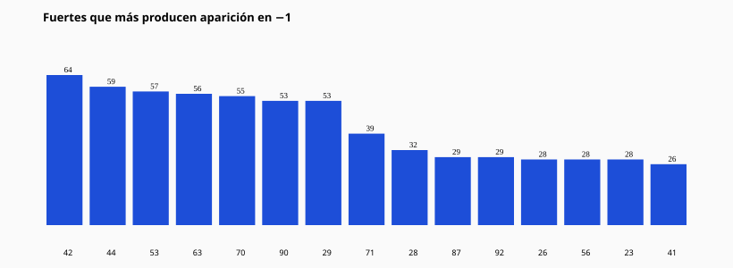
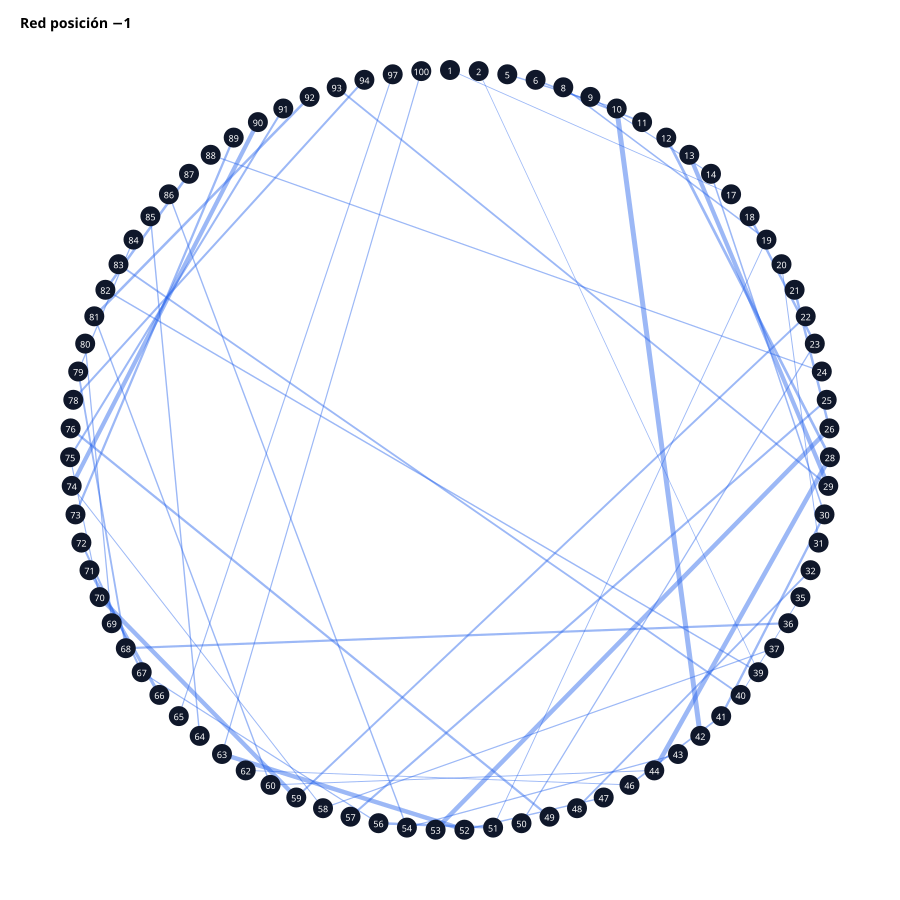

# 10 — Posición −1

Tasa (oportunidad→aparición): **77.54%**
(1198 / 1545)

## ¿Qué es −1?

−1 funciona principalmente como destino frecuente de la familia (tasa 77.54%). En 393 activaciones −1 apareció antes que el fuerte (puente/precursor). En 286 casos −1 precedió a −2. Fue el confirmador original en 0 activaciones.

Top fuertes productores de −1: [(42, 64), (44, 59), (53, 57), (63, 56), (70, 55), (90, 53), (29, 53), (71, 39), (28, 32), (87, 29)]

Top números que ocupan −1: [(10, 64), (28, 59), (26, 57), (52, 56), (59, 55), (74, 53), (13, 53), (66, 39), (12, 32), (82, 29)]

