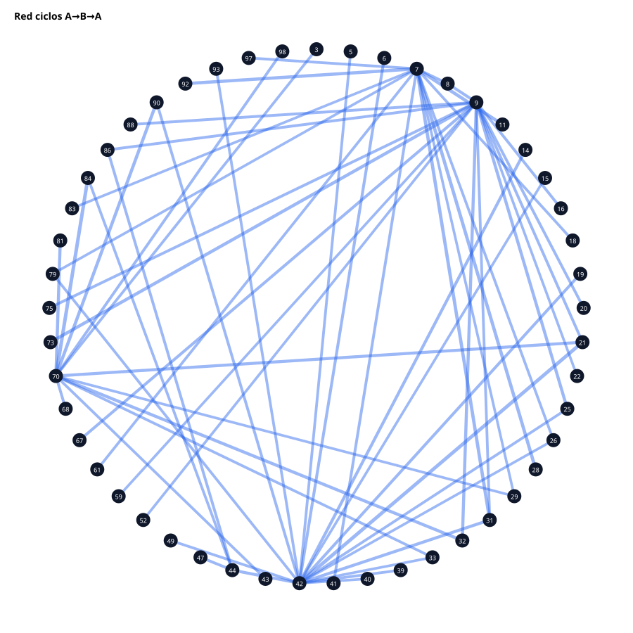

# 14 — Ciclos y memoria

Top ciclos A→B→A (fuerte → otro → fuerte otra vez en la ventana):

| Ciclo | Conteo |
| --- | --- |
| F→-1→F | 140 |
| A→B→A:70→84→70 | 31 |
| A→B→A:42→21→42 | 31 |
| A→B→A:7→11→7 | 29 |
| A→B→A:7→31→7 | 29 |
| A→B→A:7→28→7 | 29 |
| A→B→A:7→92→7 | 28 |
| A→B→A:9→73→9 | 28 |
| A→B→A:70→90→70 | 28 |
| A→B→A:9→32→9 | 27 |
| A→B→A:70→32→70 | 27 |
| A→B→A:70→81→70 | 27 |
| A→B→A:9→25→9 | 27 |
| A→B→A:42→14→42 | 26 |
| A→B→A:42→44→42 | 26 |

CSV: `cycles.csv`
