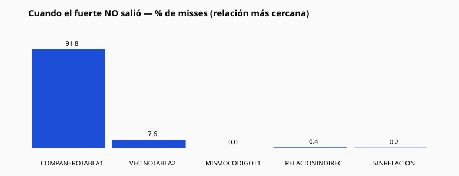
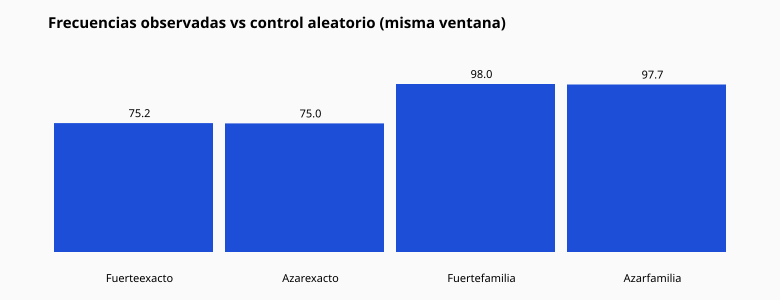

# 01 — Resumen ejecutivo

## Qué es esta auditoría

No es un intento de demostrar que el motor “funciona”.
No es un intento de demostrar que el motor “falla”.

Es una reconstrucción forense e **imparcial** de lo que ocurrió en el histórico oficial
después de que la metodología vigente (`nr-historical-relations-j1.0.0`) declarara un **fuerte**.

Motor, Tabla 1, Tabla 2 y Producción **no se modificaron**.

## Universo y período

| Campo | Valor |
|-------|-------|
| Loterías | FEATURED_SEVEN (7) |
| Metodología | `nr-historical-relations-j1.0.0` |
| Ventana de evidencia | días **+1 … +7** (nunca el mismo día) |
| DB featured min→max | 2015-01-02 → 2026-07-23 |
| Análisis | 2019-07-23 → 2026-07-16 |
| audit_id | `c667ed2f-db12-483a-882b-8ac7bb3166bd` |

Se pidieron siete años. El histórico featured en DEV llega desde 2015; se usaron
los **últimos ~7 años** disponibles hasta la fecha máxima, dejando 7 días de cola
para la ventana de validación.

## Volumen

| Métrica | Valor |
|---------|------:|
| Días con ≥2 observados | 2549 |
| Días con ≥1 fuerte | 1333 |
| Activaciones de fuerte | 2222 |

## Frecuencias crudas (lo que salió)

| Resultado | Valor |
|-----------|------:|
| Fuerte exacto en ≤7 días | **75.16%** (1670/2222) |
| Exacto o compañero T1 (más cercano) | **97.97%** |
| Algo con distancia ≤ 3 | **99.86%** |

### Cuando el fuerte NO salió

| Relación más cercana | Conteo | % de misses |
|----------------------|-------:|------------:|
| COMPANERO_TABLA1 | 507 | 91.85% |
| VECINO_TABLA2 | 42 | 7.61% |
| MISMO_CODIGO_T1 | 0 | 0.0% |
| RELACION_INDIRECTA | 2 | 0.36% |
| SIN_RELACION | 1 | 0.18% |

## Control de azar (imprescindible para leer las frecuencias)

La ventana de 7 días, con siete loterías, concentra muchos números distintos
(mediana ≈ **76** números únicos de 1..100).

Bajo ese régimen, un número **aleatorio** también “sale” con frecuencia similar:

| Métrica | Motor (fuerte) | Control aleatorio | Lift |
|---------|---------------:|------------------:|-----:|
| Exacto en ventana | 75.16% | 75.02% | **1.0018** |
| Exacto o familia T1 | 97.97% | 97.66% | **1.0032** |

**Lectura imparcial:** las frecuencias crudas son altas; el **exceso sobre el azar
en esta ventana de 7 días es ~nulo** (lift ≈ 1.00). Eso no niega la geometría T1×T2;
describe el poder discriminativo de “salió en 7 días” bajo FEATURED_SEVEN.

## Tres hechos que el histórico sí muestra

1. Tras un fuerte, el exacto aparece en ~75.16% de activaciones (ventana 7d).
2. Cuando no, lo más cercano suele ser un **compañero Tabla 1** (~91.85% de misses).
3. Esas mismas tasas las reproduce casi igual un número aleatorio en la misma ventana.

Detalle: capítulos 11, 17 y 19.
