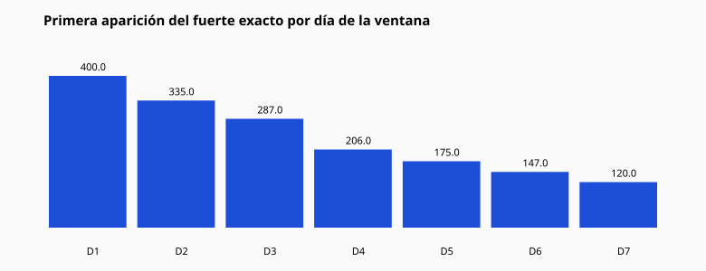

# 08 — El fuerte exacto

## Totales

| Métrica | Valor |
|---------|------:|
| Activaciones | 2222 |
| Hits exactos ≤7d | 1670 |
| Tasa | 75.16% |
| Misses | 552 (24.84%) |
| Tasa azar (control) | 75.02% |
| Lift | 1.0018 |

## ¿En qué día aparece?

| Día de la ventana | Primeras apariciones | % de hits |
|------------------:|---------------------:|----------:|
| +1 | 400 | 24.0% |
| +2 | 335 | 20.1% |
| +3 | 287 | 17.2% |
| +4 | 206 | 12.3% |
| +5 | 175 | 10.5% |
| +6 | 147 | 8.8% |
| +7 | 120 | 7.2% |

Patrón observado: la masa de primeras apariciones decrece con el día
(D1 > D2 > … > D7). Eso es coherente con “más oportunidades acumuladas al inicio”
y con saturación progresiva del universo en la ventana.

## Lectura

El fuerte **sí aparece a menudo** en 7 días. Un número aleatorio también.
La pregunta útil no es la tasa cruda, sino el lift ≈ **1.0018**.
