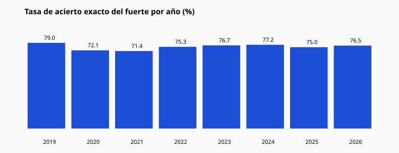

# 12 — Análisis por año

| Año | Activaciones | Hits exactos | Tasa | Misses |
|-----|-------------:|-------------:|-----:|-------:|
| 2019 | 138 | 109 | 78.99% | 29 |
| 2020 | 247 | 178 | 72.06% | 69 |
| 2021 | 329 | 235 | 71.43% | 94 |
| 2022 | 312 | 235 | 75.32% | 77 |
| 2023 | 352 | 270 | 76.7% | 82 |
| 2024 | 338 | 261 | 77.22% | 77 |
| 2025 | 336 | 252 | 75.0% | 84 |
| 2026 | 170 | 130 | 76.47% | 40 |

## Observaciones

- Las tasas anuales de exacto oscilan en una banda estrecha (~71–79%).
- No hay un año que “rompa” el patrón de forma extrema en esta muestra.
- La estabilidad anual refuerza que el fenómeno es estructural de la **ventana densa**,
  no un artefacto de un solo período.
