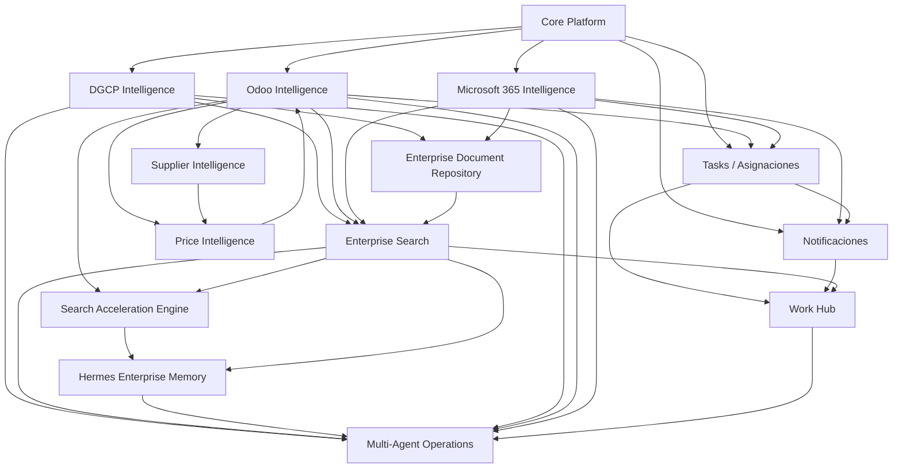

# JAIOS — Roadmap oficial

Este documento define el orden de entrega y las dependencias entre módulos. **No implementar módulos fuera de la fase activa.**

## Estado actual

| Fase | Módulo | Estado |
|------|--------|--------|
| 1 | Core Platform | Entregado |
| 2 | DGCP Intelligence Center | Entregado |
| 3 | Odoo Intelligence Center | **Prioridad actual** (solo lectura) |
| 4 | Microsoft 365 Intelligence Center | Planificado |
| 5 | Tasks / Work Hub | Planificado |
| 6 | Enterprise Search | **Entregado** |
| 6.5 | Search Acceleration Engine | Planificado |
| 6+ | Ver tabla inferior | Planificado |

## Prioridad de entrega

```
Fase 3  →  Odoo Intelligence Center          ← AHORA
Fase 4  →  Microsoft 365 Intelligence Center
Fase 5  →  Tasks / Pendientes / Asignaciones + Work Hub + Notificaciones
Fase 6   →  Enterprise Search                           ← ENTREGADO
Fase 6.5 →  Search Acceleration Engine (cache, índice, analytics)
Fase 6+  →  Document Repository, Supplier/Price Intelligence,
           Hermes Enterprise Memory, Multi-Agent Operations
```

### Fase 6.5 — Search Acceleration Engine (backlog)

**Objetivo:** Reducir latencia de `/api/v1/search` y Assistant sin romper Fase 6.

| Componente | Tecnología | Estado |
|------------|------------|--------|
| Search Cache Layer | Redis, TTL por tenant | Diseño |
| Search Index | PostgreSQL `search_index`, FTS, incremental | Diseño |
| Search Analytics | Eventos + métricas Admin | Diseño |
| Qdrant semantic | Hybrid rerank, documentos, Hermes | Fase 7+ |

**Documento completo:** [`docs/backlog-fase-6.5-search-acceleration.md`](backlog-fase-6.5-search-acceleration.md)

## Módulos futuros (catálogo completo)

| # | Módulo | Fase | Descripción breve |
|---|--------|------|-------------------|
| 1 | Microsoft 365 Intelligence Center | 4 | Outlook, Teams, SharePoint, OneDrive — consulta y contexto |
| 2 | Tasks / Pendientes / Asignaciones Center | 5 | Tareas, pendientes, asignaciones por usuario/equipo |
| 3 | Notificaciones | 5 | Alertas, recordatorios, eventos entre módulos |
| 4 | Work Hub | 5 | Vista unificada de trabajo: tareas, pendientes, prioridades |
| 5 | Enterprise Search | 6 | Búsqueda transversal Odoo, DGCP, tareas, notificaciones |
| 5b | Search Acceleration Engine | 6.5 | Cache Redis, índice, analytics, preparación Qdrant |
| 6 | Enterprise Document Repository | 6 | Repositorio documental unificado (PDF, Word, Excel, expedientes) |
| 7 | Supplier Intelligence | 6 | Catálogo de proveedores, SKUs, disponibilidad, condiciones |
| 8 | Price Intelligence | 6 | Comparación de costos, márgenes, fuentes externas |
| 9 | Hermes Enterprise Memory | 7 | Memoria empresarial persistente (RAG + contexto histórico) |
| 10 | Multi-Agent Operations | 7 | Orquestación de agentes sobre todos los centros de inteligencia |

## Dependencias entre módulos



### Reglas de dependencia

1. **Ningún módulo escribe en sistemas externos sin capa de seguridad** (patrón `SafeOdooClient`).
2. **Enterprise Search** indexa datos de otros módulos; no los posee.
3. **Hermes Enterprise Memory** consume índices de Search + eventos de auditoría; no reemplaza fuentes de verdad.
4. **Multi-Agent Operations** orquesta; no almacena datos de negocio propios.
5. **Work Hub** agrega vistas; la fuente de verdad de tareas es Tasks Center.
6. **Supplier / Price Intelligence** extienden Odoo y fuentes externas sin modificar catálogos ERP en fases tempranas.

## Ubicación en el repositorio

| Área | Ruta | Uso |
|------|------|-----|
| Registro de módulos | `backend/app/platform/modules.py` | IDs, fases, dependencias, estado |
| Modelos futuros (stubs) | `backend/app/platform/schemas.py` | DTOs Pydantic sin tablas DB aún |
| Intelligence stubs | `integrations/intelligence/` | Interfaces y dataclasses por dominio |
| Conectores | `integrations/{odoo,dgcp,microsoft365,...}/` | Clientes externos |
| Agentes | `agents/` | Multi-Agent Operations (Fase 7) |
| Habilitación por tenant | `tenants.settings.enabled_modules` | JSONB — sin migración dedicada |

## Principios para no limitar el futuro

- Usar **JSONB** (`tenants.settings`, `integration_connections.config`) hasta que un módulo requiera tablas propias.
- **IDs de módulo estables** (`odoo`, `m365`, `tasks`, …) — no renombrar una vez publicados.
- **Búsqueda y documentos** diseñados como capas transversales, no acoplados a un solo ERP.
- **Agentes** consumen APIs de módulos; nunca acceden directamente a credenciales de integración.
- Cada Intelligence Center expone **health + summary + consulta read-only** antes de capacidades de escritura.
