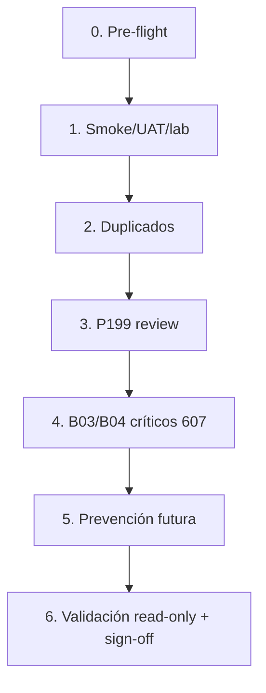

# C1.2 — Plan de corrección partners sin RNC (TEST)

**Estado:** PLANIFICADO — no ejecutar hasta aprobación explícita  
**Ambiente:** `hellenia_test` únicamente  
**Base:** evidencia C1 commit `420be05` — `evidence/c1-partners-rnc-diagnostic-test/`  
**Prerrequisito:** diagnóstico C1 aprobado como evidencia  
**Restricciones:** no PROD, no DEV, no merge; backup TEST antes de cualquier write

---

## Objetivo

Reducir a **cero** comprobantes posted de venta con partner sin RNC válido (254 hoy), preservando integridad fiscal TEST y dejando prevención para futuros posts.

**Criterio de éxito C1.2:**

| Métrica | Actual | Meta |
|---------|-------:|-----:|
| `out_invoice` posted sin RNC | 235 | 0 |
| `out_refund` posted sin RNC | 19 | 0 |
| B03/B04 sin RNC (bloquean 607) | 36 | 0 |
| Partners activos sin VAT en ventas posted | 48 | 0 (archivados o con RNC) |

---

## Orden de ejecución (obligatorio)



Cada fase es **independiente en rollback** (backup por fase). No saltar fases.

---

## Fase 0 — Pre-flight (antes de cualquier write)

| Paso | Acción | Owner |
|------|--------|-------|
| 0.1 | Backup DB TEST: `/opt/odoo-projects/hellenia/backups/test/YYYY-MM-DD_c1.2-pre` | Justech |
| 0.2 | Snapshot JSON read-only: re-ejecutar `run-c1-partners-rnc-diagnostic-test.sh` → `evidence/c1.2-pre/` | Justech |
| 0.3 | Confirmar rama/código TEST alineado (sin cambios PROD) | Justech |
| 0.4 | Crear partner maestro **Consumidor Final TEST** (si no existe): RNC `001-0000000-0`, tipo DGII RNC, tag/ref `CF-MASTER-TEST` | Justech + contador |
| 0.5 | Ventana de ejecución acordada (sin UAT concurrente) | Operaciones |

**Gate:** contador aprueba RNC genérico CF y tratamiento de comprobantes UAT.

---

## 1. Smoke / UAT / lab

### Alcance

| Métrica | Valor |
|---------|------:|
| Partners | 41 |
| Movimientos | 241 (222 facturas + 19 NC) |
| Monto RD$ | 838,723.56 |
| Partner principal | 311 — UAT Cliente Consumidor Final (188 mov.) |

**Partner IDs (41):**  
311, 2361, 2354, 2355, 2359, 10, 13, 2360, 2356, 2357, 2358, 407–436 (Cliente Demo 071–100), 421, 436, 420, 435, 419, 434, 418, 433, 417, 432, 416, 431, 415, 430, 414, 429, 413, 428, 412, 427, 411, 426, 410, 425, 409, 424, 408, 423, 422

### Estrategia recomendada (opción A — preferida)

**Migrar comprobantes al partner CF maestro + archivar partners lab**

1. Asignar `partner_id` → CF maestro en todos los `account.move` posted afectados (241).
2. Propagar `commercial_partner_id` coherente.
3. En partners lab: `active=False`, añadir sufijo `[ARCHIVADO-C1.2]` al nombre, `ref` con timestamp.
4. **No** borrar partners ni movimientos (auditoría).

### Estrategia alternativa (opción B — solo si contador lo exige)

Archivar partners sin migrar + NC/anulación de B03/B04 UAT. Mayor impacto en secuencias NCF; reservar para casos donde migración no sea aceptable fiscalmente en TEST.

### Sub-lotes sugeridos

| Lote | Partners | Mov. | Notas |
|------|----------|-----:|-------|
| 1a | 311 | 188 | Mayor volumen; incluye B02/B03/B04 |
| 1b | 2361, 2354–2360, 10, 13 | 22 | cert 19.6 / Phase / SMOKE |
| 1c | 407–436 (30 demos) | 30 | 1 factura c/u, journal INV/PCC |
| 1d | 12 sin NCF (10, 13 + demos sin NCF) | 12 | Solapamiento C3 — documentar |

### Script propuesto (a implementar en C1.2-exec)

```
scripts/c1.2-smoke-partner-migrate-test.py
```

- Modo `--dry-run` (default) / `--execute`
- Abort si `dbname != hellenia_test`
- Log CSV: move_id, old_partner, new_partner, ncf, doc_type
- Evidencia: `evidence/c1.2-smoke-migrate-test/`

### Validación post-fase 1

- Re-run diagnóstico C1: partners smoke → 0 movimientos sin RNC bajo IDs archivados
- Conteo CF maestro += 241 movimientos
- `accounting-total-audit-readonly` FISC-01 debe bajar en ~241

### Rollback

Restaurar backup fase 0 o revert CSV de partner_id por move_id.

### Riesgos

- B03 UAT migrados a CF: fiscalmente discutible en TEST — **contador debe aprobar** (ver fase 4).
- Secuencias NCF ya consumidas: no reversibles; solo corrección de partner.

---

## 2. Duplicados

### Alcance

| Cluster | Partner IDs | Mov. c/u | Monto |
|---------|-------------|--------:|------:|
| Concurrent Worker 0 | 227, 229, 275 | 1 | RD$ 59 |

Partner **maestro propuesto:** 227 (ID más bajo) o fusionar los 3 en CF maestro si son puramente lab.

### Pasos

1. **Dry-run** merge Odoo: `base.partner.merge.automatic.wizard` con 227 + 229 + 275.
2. Verificar que las 3 facturas quedan bajo un solo partner.
3. Asignar RNC CF maestro (`001-0000000-0`) al partner resultante **o** archivar si ya migradas en fase 1.
4. Partner 317 (Concurrent Worker 1) — tratar igual: 1 mov., incompleto; merge no aplica (nombre distinto) → RNC CF o archivar.

### Orden respecto a fase 1

- Si fase 1 migra **todos** los movimientos lab a CF maestro, fase 2 se reduce a **archivar** 227, 229, 275, 317 sin merge (partners huérfanos).
- Si fase 1 no tocó concurrent workers, ejecutar merge aquí.

### Script propuesto

```
scripts/c1.2-duplicate-partner-merge-test.py
```

### Validación

- 1 cluster duplicado → 0 en diagnóstico C1
- 4 movimientos concurrent con RNC válido o archivados

### Owner

Justech (merge técnico) + contador (criterio maestro)

---

## 3. P199 — review_required

### Alcance

| ID | Nombre | Facturas | NCF | Monto RD$ |
|----|--------|--------:|-----|----------:|
| 2362 | P199 H3 | 3 | B02 ×3 | 35,400 |
| 2363 | P199 WEBSAVE | 3 | B02 ×3 | 35,400 |
| 2364 | P199 WH | 3 | B02 ×3 | 35,400 |

**Total:** 9 facturas, RD$ 106,200 — todas B02, journal INV, fecha 2026-07-01.

### Decisión contador (elegir una)

| Opción | Acción |
|--------|--------|
| **3A — Smoke confirmado** | Migrar 9 facturas a CF maestro; archivar 2362–2364 |
| **3B — Escenario cert válido** | Completar RNC real de prueba (ej. RNC lab DGII) en cada partner |
| **3C — Híbrido** | Un partner P199 maestro con RNC; fusionar los 3 |

**Recomendación Justech:** 3A (nomenclatura Phase 19.9, mismo patrón cert 19.6).

### Pasos (opción 3A)

1. Confirmación escrita contador (evidencia en `evidence/c1.2-p199-test/`).
2. Migrar `partner_id` de 9 facturas → CF maestro.
3. Archivar partners 2362, 2363, 2364.
4. Actualizar clasificación en evidencia post-exec.

### Validación

- 0 movimientos posted bajo 2362–2364
- FISC-01 −9 facturas

### Gate

**Bloqueante:** sin confirmación contador, no ejecutar fase 3.

---

## 4. B03 / B04 críticos para 607

### Alcance (prioridad fiscal)

| Tipo | Cantidad | ¿607 exige RNC? | Origen principal |
|------|--------:|:----------------:|------------------|
| B03 (crédito fiscal) | 17 | **Sí** | Partner 311 — DINV/2026/00002+ |
| B04 (notas crédito) | 19 | **Sí** | Partner 311 — NC UAT |
| **Total crítico** | **36** | | |

B02 (206) no bloquean validación 607 por `_is_consumer_invoice`, pero deben quedar con RNC CF por consistencia de datos.

### Enfoque por escenario post-fase 1

Si fase 1 migró todo a **CF maestro con RNC 001-0000000-0**:

| Comprobante | Tratamiento |
|-------------|-------------|
| B02 sin RNC | Resuelto al migrar partner CF |
| B03 sin RNC | Partner CF con RNC → **validación 607 debe pasar**; contador confirma si B03 + CF es aceptable en TEST |
| B04 sin RNC | Idem; verificar enlace factura origen |

Si contador **rechaza** B03/B04 con partner CF:

| Comprobante | Tratamiento alternativo |
|-------------|-------------------------|
| B03 UAT | Nota crédito / void fiscal TEST (`justech_do_ncf_voided`) — **solo TEST** |
| B04 | Mantener NC; corregir partner a CF con RNC |

### Pasos técnicos

1. Lista explícita de 36 move IDs (extraer de `c1-diagnostic.json` → filtrar `ncf_without_rnc` donde prefijo ∉ B02/B12/E32/E33).
2. Tras fases 1–3, ejecutar `validate_period_607(company, 2026-06-01, 2026-07-31, refresh_states=False)`.
3. Export piloto 607 jun–jul 2026 (read-only file, no envío DGII).
4. Documentar errores residuales en `evidence/c1.2-607-validation-test/`.

### Script propuesto

```
scripts/c1.2-607-critical-validation-test.py
```

- Input: período 202606, 202607
- Output: JSON errores por move, counts B03/B04

### Criterio de cierre fase 4

- `validate_period_607` → 0 errores RNC/Cédula en universo jun–jul 2026
- 36 comprobantes con partner `justech_do_has_rnc() == True`

### Owner

Contador (decisión B03) + Justech (validación técnica)

---

## 5. Prevención futura

### 5A — Configuración (sin despliegue PROD)

| Item | Descripción | Módulo |
|------|-------------|--------|
| Partner CF maestro | Único contacto para ventas mostrador/UAT en TEST | `res.partner` |
| Tipo doc default B02 | En CF maestro: `justech_do_default_document_type_id` → B02 | `justech_l10n_do_base` |
| Tag partners lab | Campo `ref` prefix `SMOKE-` / categoría interna | Config |
| Diario UAT | Marcar journal `DINV` como no exportable 607 (dominio wizard) | `justech_l10n_do_reports` — evaluar |

### 5B — Código (rama separada, post C1.2-exec)

| Item | Descripción | Archivo candidato |
|------|-------------|-------------------|
| Pre-post RNC | Bloquear `action_post` si partner DO sin RNC y doc ≠ consumidor CF | `justech_l10n_do_ncf/models/account_move.py` |
| Excepción CF | Whitelist partner CF maestro o flag `justech_do_is_consumer_final` | `justech_l10n_do_base/models/res_partner.py` |
| Smoke guard TEST | Warning si partner name ~ smoke y sin RNC | `hellenia_account` o ir.config_parameter |
| Auditoría FISC-01+ | Desglose B02 vs B03/B04 en script audit | `scripts/accounting-total-audit-readonly.py` |
| CI cert | Falla pipeline si posted sin RNC en escenarios cert | `scripts/` + GitHub Action |

### 5C — Proceso / gobernanza

- UAT obligatorio usa partner CF o partners con RNC lab pre-cargado.
- Checklist pre-certificación: FISC-01 = 0, B03/B04 sin RNC = 0.
- No promover a PROD hasta C5 sign-off contador.

### Orden implementación prevención

1. Config CF maestro (fase 0 — antes de migraciones)
2. Validación audit extendida (read-only, puede ir en paralelo)
3. Pre-post constraint (requiere PR + upgrade TEST)
4. CI (último)

**Gate código:** aprobación explícita JM1/justech_modules **no requerida** para constraint RNC en módulos existentes; documentar en PR.

---

## Fase 6 — Cierre C1.2 (validación final)

| # | Check | Herramienta |
|---|-------|-------------|
| 6.1 | Diagnóstico C1 re-run | `run-c1-partners-rnc-diagnostic-test.sh` |
| 6.2 | Auditoría contable | `run-accounting-total-audit-readonly.sh` TEST |
| 6.3 | FISC-01 = 0 | audit report |
| 6.4 | 607 validate jun–jul 2026 | `c1.2-607-critical-validation-test.py` |
| 6.5 | Evidencia consolidada | `evidence/c1.2-closure-test/C1.2_CLOSURE_REPORT.md` |
| 6.6 | Sign-off contador | Documento externo / email archivado |

---

## Matriz RACI resumida

| Fase | Justech | Contador | Operaciones |
|------|---------|----------|-------------|
| 0 Pre-flight | R/A | C | I |
| 1 Smoke | R/A | C | I |
| 2 Duplicados | R/A | C | — |
| 3 P199 | R | A | — |
| 4 B03/B04 | R | A | — |
| 5 Prevención config | R/A | C | I |
| 5 Prevención código | R/A | I | — |
| 6 Cierre | R | A | I |

R = responsable, A = aprueba, C = consultado, I = informado

---

## Estimación de impacto post C1.2

| Fase | Movimientos corregidos | Partners tocados |
|------|----------------------:|-----------------:|
| 1 Smoke | 241 | 41 archivados |
| 2 Duplicados | 4 | 3–4 archivados |
| 3 P199 | 9 | 3 archivados |
| 4 B03/B04 | 36 (solapado con 1) | — |
| **Neto único** | **254** | **≤48** |

Fases 2–3 pueden quedar vacías si fase 1 migra todo el universo lab incluyendo concurrent y P199.

---

## Scripts a crear (C1.2-exec — no existen aún)

| Script | Fase | Modo |
|--------|------|------|
| `c1.2-smoke-partner-migrate-test.py` | 1 | dry-run / execute |
| `c1.2-duplicate-partner-merge-test.py` | 2 | dry-run / execute |
| `c1.2-p199-partner-migrate-test.py` | 3 | dry-run / execute |
| `c1.2-607-critical-validation-test.py` | 4, 6 | read-only |
| `run-c1.2-correction-test.sh` | orquestador | dry-run default |

---

## Lo que NO hace C1.2

- No toca PROD ni DEV
- No hace merge a main
- No anula NCF en DGII real
- No ejecuta C2 (ITBIS productos) ni C3 (15 sin NCF) — documentar solapamiento
- No implementa prevención código hasta PR aparte

---

## Aprobaciones requeridas antes de ejecutar

- [ ] Contador: RNC CF maestro `001-0000000-0` en TEST
- [ ] Contador: migración B03 UAT a CF vs NC/void
- [ ] Contador: P199 = smoke (opción 3A)
- [ ] Justech: backup + ventana UAT
- [ ] Usuario: autorización explícita **"Ejecutar C1.2"**

---

**Documento preparado — sin ejecución.**  
Próximo paso tras aprobaciones: implementar scripts dry-run y correr pre-flight fase 0.
