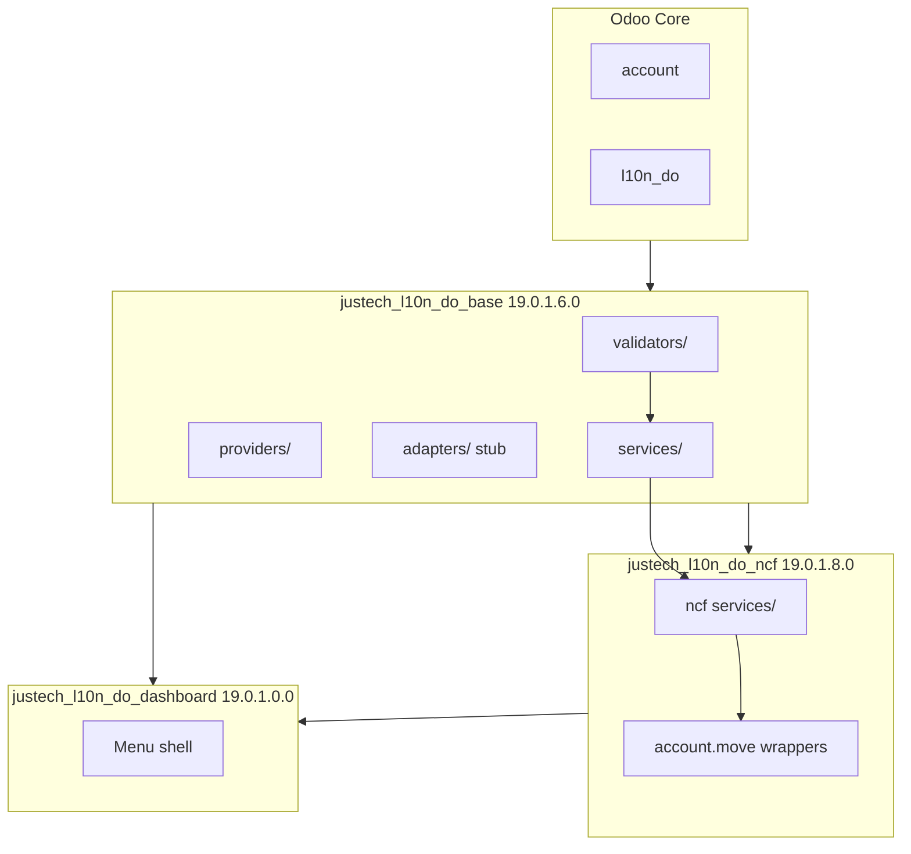

# Fase 3A — Sprint 1 Report

**Rama:** `feature/fiscal-standard-phase3a`  
**Fecha:** 2026-07-09  
**Entorno objetivo:** `erp.justech.do` / laboratorios (no Producción)  
**Estado:** Código completado + **validación lab ejecutada** en `justech_ncf_lab` (2026-07-09)

---

## 1. Objetivo cumplido

Construir la **base arquitectónica** del Estándar Fiscal Justech sin cambiar la experiencia
del usuario ni el comportamiento funcional de NCF.

| Prioridad | Entregable | Estado |
|-----------|------------|--------|
| Capa común services/validators/providers/adapters | `justech_l10n_do_base` | ✅ |
| Refactor NCF sin cambio funcional | `justech_l10n_do_ncf/services/` | ✅ |
| Módulo dashboard (estructura) | `justech_l10n_do_dashboard` | ✅ |
| Anti-hardcode | `tools/fiscal_no_hardcode_check.py` | ✅ |
| Documentación técnica por módulo | README/CHANGELOG/ARCHITECTURE/MIGRATION/ROADMAP + diagrams | ✅ |
| Compatibilidad erp.justech.do | Upgrade + integridad en `justech_ncf_lab` | ✅ |

---

## 2. Cambios realizados

### 2.1 `justech_l10n_do_base` → 19.0.1.6.0

**Nuevo:**
- `validators/rnc_format.py`, `ncf_format.py`, `fiscal_context.py`
- `services/fiscal_validator_service.py`, `fiscal_config_service.py`, `document_type_provider.py`
- `providers/__init__.py`, `adapters/__init__.py` (placeholders)
- `tests/test_fiscal_validators.py`
- Documentación + diagramas Mermaid

**Modificado:**
- `models/res_partner.py` — delegación RNC al servicio fiscal
- `models/fiscal_document_type.py` — `parse_ncf` usa validador puro

### 2.2 `justech_l10n_do_ncf` → 19.0.1.8.0

**Nuevo:**
- `services/ncf_document_type_resolver_service.py`
- `services/ncf_duplicate_service.py`
- `services/ncf_assignment_service.py`

**Modificado:**
- `models/account_move.py` — wrappers `_justech_*` delegan en servicios
- `models/ncf_range.py` — `_validate_ncf_format` delega en base

### 2.3 `justech_l10n_do_dashboard` → 19.0.1.0.0 (nuevo)

- Modelo placeholder `justech.do.fiscal.dashboard`
- Menú **Dashboard Fiscal** → **Inicio**
- ACL fiscal user/manager
- Data record empresa principal

### 2.4 Herramientas

- `tools/fiscal_no_hardcode_check.py` — escaneo `custom/justech_l10n_do_*`
- `tools/test_fiscal_validators_standalone.py` — 11 tests sin Odoo

---

## 3. Diagrama actualizado (stack Fase 3A)

Diagramas por módulo en `custom/*/diagrams/*.mmd`.

---

## 4. Cobertura de pruebas

| Suite | Tests | Resultado |
|-------|-------|-----------|
| `tools/test_fiscal_validators_standalone.py` | 11 | ✅ PASS local |
| `justech_l10n_do_base/tests/test_fiscal_validators.py` | 4 | ✅ PASS lab |
| `justech_l10n_do_ncf/tests/test_justech_l10n_do_ncf.py` | 20 | ✅ PASS lab (20/20) |
| Anti-hardcode (base/ncf/dashboard) | 0 findings | ✅ PASS |
| Integridad histórica lab | before=after | ✅ PASS |

**Suite NCF:** 20/20 PASS tras corrección de `invoice_date` en test B17 (`test_extended_document_types_assign_ncf`).

### Validación lab ejecutada (justech_ncf_lab)

| Métrica | Pre-upgrade | Post-upgrade |
|---------|-------------|--------------|
| Posted moves | 2.255 | 2.255 |
| GL débito/crédito | 85.656.868,89 | 85.656.868,89 |
| Conciliaciones | 947 | 947 |
| NCF Justech posted | 1.494 | 1.494 |

- **justech_dev operativo:** NO tocado (módulos Justech no instalados allí).
- Evidencia: `evidence/fiscal-phase3/validation.json`

---

## 5. Riesgos encontrados

| ID | Riesgo | Severidad | Mitigación |
|----|--------|-----------|------------|
| R1 | Upgrade no ejecutado aún en erp.justech.do | ~~Media~~ | ✅ Resuelto en `justech_ncf_lab` |
| R2 | Referencias `hellenia.*` en reports/treasury/withholding | Alta (deuda) | Sprint 2: adapters + bridge; checker las detecta |
| R3 | Duplicate detection sigue clave v1 (company+ncf) | Baja | Sprint 2: integrar `fiscal_duplicate_key_v2` |
| R4 | Dashboard placeholder por empresa única en data | Baja | Sprint 2: hook post_init multi-company |
| R5 | Sin commit en rama aún | Baja | Commit bajo solicitud explícita |

---

## 6. Anti-hardcode — resumen

Módulos **Sprint 1** (`base`, `ncf`, `dashboard`): **0 hallazgos**.

Stack completo `justech_l10n_do_*`: **27 hallazgos** — todos en módulos legacy/bridge
(`reports`, `reports_hellenia`, `treasury`, `payments_withholding`) por dependencias
Hellenia planificadas para desacoplamiento en sprints posteriores.

---

## 7. Rollback

1. Restaurar backup BD lab previo al upgrade.
2. Checkout commit anterior de `feature/fiscal-standard-phase3a`.
3. `-u justech_l10n_do_base,justech_l10n_do_ncf` con código anterior.
4. Desinstalar `justech_l10n_do_dashboard` si se instaló.

---

## 8. Restricciones respetadas

- ✅ No merge a `development` / `main`
- ✅ No cambios en Producción (`justgroup.app`)
- ✅ No modificación de histórico, asientos, pagos, conciliaciones, secuencias
- ✅ Sin cambios UX funcionales (dashboard = shell)
- ✅ Comportamiento NCF preservado vía wrappers + mismos tests

---

## 9. Recomendaciones Sprint 2

1. **Desplegar y validar** en `erp.justech.do` (`justech_lab` / `justech_dev`) con checklist MIGRATION.md.
2. **Duplicate key v2.0** — servicio de auditoría + reporte dashboard.
3. **Refactor reports** — eliminar imports directos `hellenia.*` vía adapters.
4. **Dashboard MVP** — KPIs rangos NCF, semáforo salud, OWL home.
5. **CI** — integrar `fiscal_no_hardcode_check.py --strict` en pipeline (excluir bridges documentados).
6. **Commit + tag** semver tras validación lab aprobada.

---

## 10. Archivos clave

| Área | Path |
|------|------|
| Validators | `custom/justech_l10n_do_base/validators/` |
| Base services | `custom/justech_l10n_do_base/services/` |
| NCF services | `custom/justech_l10n_do_ncf/services/` |
| Dashboard | `custom/justech_l10n_do_dashboard/` |
| Anti-hardcode | `tools/fiscal_no_hardcode_check.py` |
| Master plan | `docs/JUSTECH_FISCAL_MASTER_PLAN.md` |

---

**Próximo paso operativo:** commit en rama (bajo solicitud) → Sprint 2 (duplicate v2.0, dashboard KPIs, desacople hellenia en reports).

