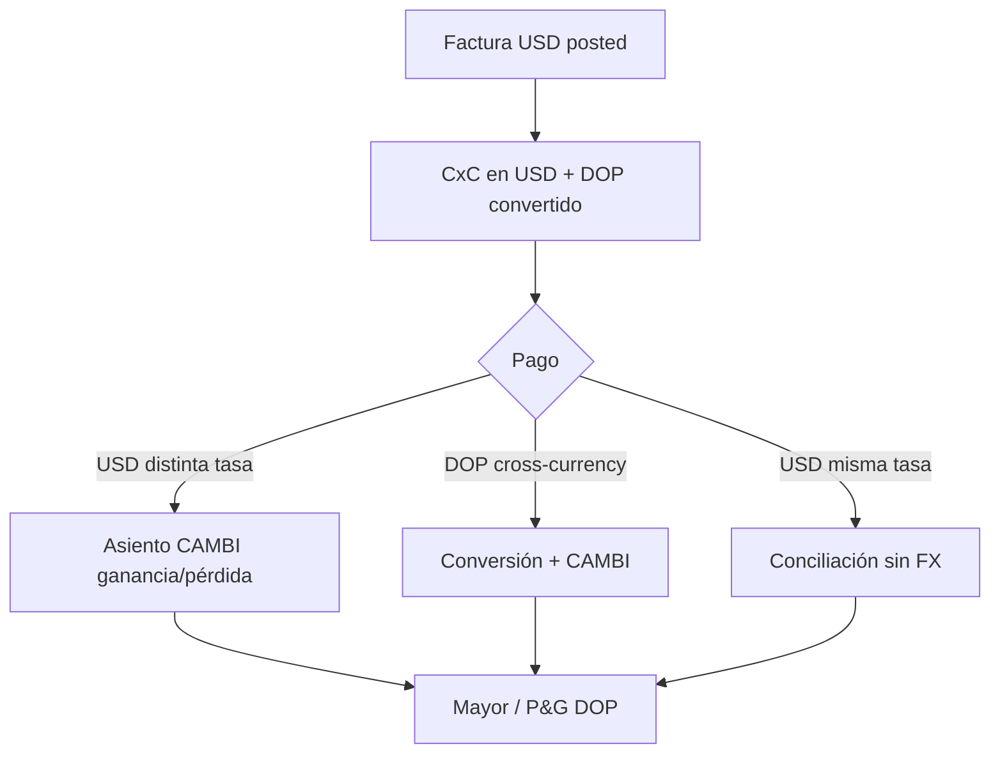

# MC-1 — Flujo contable multimoneda

## Principios

| Concepto | Hellenia / Justech |
|----------|-------------------|
| Moneda funcional | **DOP** |
| Moneda transacción | Moneda del `account.move` / `account.payment` |
| Moneda secundaria | `amount_currency` + `currency_id` en líneas |
| Motor FX | **100% Odoo estándar** — sin override Justech |

---

## Campos clave

### account.move

| Campo | Descripción |
|-------|-------------|
| `currency_id` | Moneda documento (DOP o USD) |
| `invoice_currency_rate` | Tasa congelada al publicar |
| `amount_untaxed` | En moneda documento |
| `amount_untaxed_signed` | En moneda compañía (+/-) |
| `amount_total_signed` | Total en DOP — **usado por DGII 607** |

### account.move.line

| Campo | Descripción |
|-------|-------------|
| `debit` / `credit` | Moneda compañía (DOP) |
| `amount_currency` | Monto en moneda documento |
| `currency_id` | Moneda línea |
| `balance` | Saldo signed en DOP |

---

## Asiento factura venta USD (ejemplo conceptual)

Factura USD 1,000 + ITBIS, tasa 58.00:

| Cuenta | Debit DOP | Credit DOP | amount_currency USD |
|--------|-------------|------------|---------------------|
| CxC cliente | 68,840 | | +1,180 |
| Ingresos | | 58,000 | -1,000 |
| ITBIS por pagar | | 10,840 | -180 |

*Números ilustrativos.*

---

## Ganancia / pérdida cambiaria

### Cuándo se genera

1. Pago en **moneda distinta** a la factura (USD inv, DOP pay o viceversa).
2. Pago en **misma moneda** pero tasa de pago ≠ tasa factura.
3. Revalorización al cierre (Odoo EE, configuración account_reports).

### Dónde termina

```
Diario: CAMBI (Exchange Difference)
Cuenta ganancia: company.income_currency_exchange_account_id → 410500
Cuenta pérdida:  company.expense_currency_exchange_account_id → 640101 ⚠️
```

**Hallazgo auditoría COA-2:** Pérdida mapeada a `640101 Cargos por servicios bancarios` — semánticamente incorrecto para pérdida cambiaria pura. Legacy Hellenia tenía cuenta dedicada `61070800 Foreign exchange losses`.

### Cálculo Odoo (simplificado)

```
Diferencia = Valor DOP al pagar - Valor DOP pendiente en factura
Si Diferencia > 0 → ganancia (cliente pagó "más" DOP de lo esperado)
Si Diferencia < 0 → pérdida
```

Odoo crea líneas automáticas en conciliación; usuario no edita manualmente en flujo normal.

---

## Pagos parciales

| Escenario | Comportamiento |
|-----------|----------------|
| Factura USD 1,000; pago USD 400 | Reduce residual USD; FX solo sobre porción si tasa difiere |
| Factura USD 1,000; pago DOP equivalente parcial | Conversión a tasa pago; FX proporcional |
| Segundo pago restante | Nueva conciliación → nuevo asiento FX si aplica |

**Wizard Hellenia** (`payment_partner_wizard.py`):
- Filtra facturas por **misma moneda** que pago seleccionado.
- No mezcla USD + DOP en un solo wizard batch.

---

## Conciliación bancaria

| Diario | Moneda extracto | Notas |
|--------|-----------------|-------|
| BNKD | DOP | Cuenta 4040043811 |
| BNKU | USD | Cuenta 4010461048 |
| CSH1 | DOP (default) | Efectivo local |

Extracto BNKU: líneas en USD. Pago registrado en USD concilia directamente. Pago DOP contra factura USD no pasa por extracto USD — pasa por wizard pago con conversión.

---

## Reportes financieros

| Reporte | Moneda presentación | Multimoneda |
|---------|---------------------|-------------|
| Balance General | DOP | Conversión posiciones USD |
| Estado Resultados | DOP | Ingresos/gastos en DOP |
| Mayor | DOP + columna amount_currency | ✅ |
| CxC / CxP | DOP + aging moneda doc | ✅ |
| DGII 606/607 | DOP (`*_signed`) | Sin columna USD |

**Coherencia:** Si no hay asientos posted, reportes vacíos (post CLEAN-1). Con operaciones USD, totales DGII deben cuadrar con Mayor en DOP, no con face value USD.

---

## Configuración contable Hellenia

| Elemento | Estado |
|----------|--------|
| Diario CAMBI | ✅ Existe (prod audit) |
| Cuenta ganancia FX 410500 | ✅ |
| Cuenta pérdida FX 640101 | ⚠️ Revisar con contador |
| Cuentas conversión compañía | Configuradas post COA-2 |

---

## Diagrama flujo completo



---

## Referencias

- `config/company/journals.yaml` — CAMBI
- `scripts/coa-2-replace-chart-test.py` — mapping FX accounts
- `docs/ERP_FINANCIAL_ARCHITECTURE.md` §14
- `docs/RECEIVABLES_PAYABLES_PAYMENT_FLOW.md`
