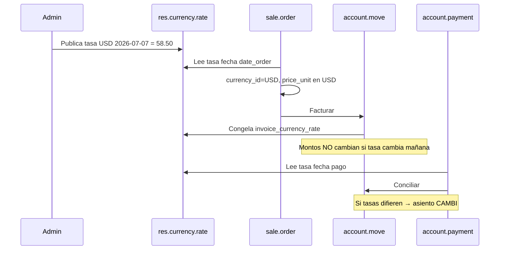

# MC-1 — Flujo de tipos de cambio

## Modelo de datos Odoo

```
res.currency (USD, DOP, EUR)
    └── res.currency.rate
            ├── name (date)
            ├── rate / inverse_company_rate
            └── company_id (multi-company)
```

| Campo | Uso |
|-------|-----|
| `rate` | Unidades de moneda compañía por 1 unidad moneda extranjera (según config) |
| `inverse_company_rate` | Inverso — UI muestra según preferencia |
| Fecha | Tasa aplicable desde esa fecha hasta la siguiente |

**Odoo 19 facturas:** `account.move.invoice_currency_rate` congela la tasa al validar/publicar.

---

## Dónde se administra

| Acción | Ruta UI | Modelo |
|--------|---------|--------|
| Ver monedas activas | Contabilidad → Configuración → Monedas | `res.currency` |
| Cargar tasa diaria | Moneda USD → pestaña Tasas | `res.currency.rate` |
| Tasa en factura | Campo "Tasa de cambio" (si moneda ≠ DOP) | `invoice_currency_rate` |
| Tasa 609 extranjero | Campo custom | `justech_do_foreign_exchange_rate` |

**Custom Justech:** No hay modelo propio de tasas. Política documentada: **manual** (`docs/COMMERCIAL_CONFIGURATION.md`).

---

## Flujo temporal



---

## Escenarios

### Tasa cambia mañana

| Documento | Efecto |
|-----------|--------|
| Cotización draft | Recálculo si se actualiza precios / refresca |
| Pedido confirmado | Precios en líneas ya fijados en moneda pedido |
| Factura posted | **Sin cambio** — tasa congelada |
| Pago nuevo | Usa tasa del día del pago → puede generar FX |

### Cotización de ayer

- Conserva moneda y precios mientras no se modifique.
- Al facturar, `invoice_currency_rate` típicamente usa tasa de **fecha factura** (Odoo 19), no fecha cotización — posible diferencia comercial vs. contable que el vendedor debe entender.

### Factura publicada

- Asientos en moneda compañía usando tasa congelada.
- `amount_currency` en líneas = monto en USD.
- `balance` en DOP = convertido a tasa factura.

---

## Actualización manual vs automática

| Método | Disponible | Justech |
|--------|------------|---------|
| Manual UI | ✅ | ✅ Recomendado v1 |
| Import CSV | ✅ Odoo estándar | No documentado |
| `currency_rate_live` (EE) | ✅ Módulo Odoo | No en manifest custom |
| Banco Central RD | ❌ No integrado | **Mejora propuesta** |
| DGII | N/A para tasa comercial diaria | Solo 609 |

### Integración Banco Central RD (propuesta)

Opciones sin implementar:
1. Activar `currency_rate_live` con proveedor custom REST BCRD.
2. Cron diario que cree `res.currency.rate` desde API pública BCRD.
3. Validación: alerta si tasa desactualizada > N días.

---

## APIs Odoo relevantes

```python
# Conversión estándar
currency._convert(amount, to_currency, company, date)

# Tasa en fecha
currency._get_conversion_rate(from_currency, to_currency, company, date)
```

**Withholding Hellenia** usa `_convert` en `payment_withholding_line.py` para balance en DOP.

---

## Riesgos detectados

| Riesgo | Severidad |
|--------|-----------|
| Tasas desactualizadas (manual olvidado) | Alto |
| Sin auditoría de quién cambió tasa | Medio |
| 609 sin tasa → validación DGII falla | Alto (solo compras exterior) |
| Cotización vs factura con tasas distintas | Medio comercial |

---

## Referencias

- `custom/hellenia_ux/views/account_move_invoice_form_phase28_views.xml`
- `custom/justech_l10n_do_reports/models/dgii_609_exporter.py` — `_exchange_rate()`
- `custom/hellenia_account/models/payment_withholding_line.py` — `_convert`
